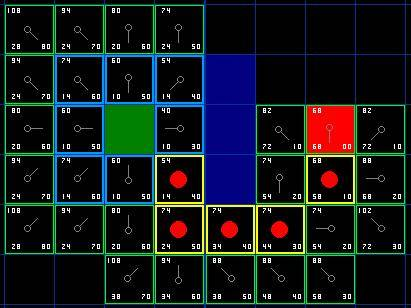

## 寻路系统

[TOC]

###  概述

即时战略游戏(Real-time Strategy, RTS)在游戏过程中存在大量的单位（从几十到上百），每一个单位都需要不停的寻路，以模拟出真实的单位行走效果，因此RTS游戏对寻路算法的需求是很高的。

RTS中的寻路系统一般需要满足有以下几个条件：

1. 效率高，因为RTS普遍地图大，单位多，所以处理效率很重要（本游戏中采用的地图大小为128*128，共计65536个网格），如果处理效率不高的话，将会导致严重的卡顿，使游戏体验变得极其糟糕。
2. 易编辑，以便于level design（不同单位的属性可能不一样，比如碰撞体积和行走代价的权重），因此要求寻路易于调整和修改。
3. 寻路效果真实，能够找出最优路径或者是看上去合理的路径。
4. 能够应对RTS游戏中动态变化的世界（例如行进路径上突然出现单位，这就要求单位能够及时做出避让）。

借鉴于大量经典RTS游戏（红色警戒、星际争霸、魔兽争霸3）的解决方案，我们采用A*寻路算法。

### A*算法

A*搜索算法，俗称A星算法，是一种在有多个节点路径的平面上求最低通过成本的搜索算法，大量用于游戏中的寻路。

A*算法利用到了启发式函数(Heuristic Function)，和另一个算法Dijkstra（A Star 的无启发函数版）相比可能会更有效率，因为启发函数设计得当，可以大大减少计算的数量。因为启发函数的估计往往不是精确的，所以A Star不一定能找出人类人之上的最优解，但是对于游戏来说，看上去合理就行。

### 瓦片地图

用A Star  作为寻路算法，仅仅是寻路系统的基本部分。作为系统，它需要有易编辑的特性。这就涉及到A Star中每个节点(Node)的表现方式。最基本的表现方式是瓦片(Tile)。

游戏中的地图往往会很大，如果用一整张图片作为地图背景的话，会占用非常大的运行内存，严重影响游戏的运行速度，为了节约资源，一般采用瓦片地图(Tile Map)重复组合的方式。

为什么采用瓦片地图呢：

1. 瓦片地图极其节约资源，一个尺寸为128*128，拥有65536个网格的瓦片地图，所需要的瓦片素材可能不到30个，整个地图依靠大量的重复组合生成场景，因此需要缓存的图片素材很少。
2. 瓦片地图缓存非常高效。即便是切换到了完全不同的游戏场景，游戏引擎也可以快速地使用之前缓存的相同的瓦片，而不是重新再加载一次。
3. 瓦片地图可以渐进加载。屏幕范围内及附近的瓦片可以优先加载，你可以进入当前区域或移动地图，即使当前地图的其它部分还没有加载完成。
4. 瓦片地图简单易用。描述地图瓦片的坐标系统很简单，使得很容易在各种系统中调用它。

如图，地图被切分成了一个个由32*32的瓦片组成的网格系统，为了表现出地形特点，我们将草地和沙地的属性设为Movable，将水域、树木、建筑的属性设为NotMovable，这样一来寻路时就会绕过这些无法通过的点。

### A*寻路过程

#### 搜索区域(The Search Area)

我们假设某人要从 A 点移动到 B 点，但是这两点之间被一堵墙隔开。如图，绿色是 A ，红色是 B ，中间蓝色是墙。

你应该注意到了，我们把要搜寻的区域划分成了正方形的格子。这是寻路的第一步，简化搜索区域，就像我们这里做的一样。这个特殊的方法把我们的搜索区域简化为了 2 维数组。数组的每一项代表一个格子，它的状态就是可走 (walkalbe) 和不可走

(unwalkable) 。通过计算出从 A 到 B需要走过哪些方格，就找到了路径。一旦路径找到了，人物便从一个方格的中心移动到另一个方格的中心，直至到达目的地。

方格的中心点我们成为“节点 (nodes) ”。如果你读过其他关于 A* 寻路算法的文章，你会发现人们常常都在讨论节点。为什么不直接描述为方格呢？因为我们有可能把搜索区域划为为其他多变形而不是正方形，例如可以是六边形，矩形，甚至可以是任意多变形。而节点可以放在任意多边形里面，可以放在多变形的中心，也可以放在多边形的边上。我们使用这个系统，因为它最简单。

#### 开始搜索(Starting the Search)

一旦我们把搜寻区域简化为一组可以量化的节点后，就像上面做的一样，我们下一步要做的便是查找最短路径。在 A* 中，我们从起点开始，检查其相邻的方格，然后向四周扩展，直至找到目标。

我们这样开始我们的寻路旅途：

1.    从起点 A 开始，并把它就加入到一个由方格组成的 open list( 开放列表 ) 中。这个 open list 有点像是一个购物单。当然现在 open list 里只有一项，它就是起点 A ，后面会慢慢加入更多的项。 Open list 里的格子是路径可能会是沿途经过的，也有可能不经过。基本上 open list 是一个待检查的方格列表。

2.    查看与起点 A 相邻的方格 ( 忽略其中墙壁所占领的方格，河流所占领的方格及其他非法地形占领的方格 ) ，把其中可走的 (walkable) 或可到达的 (reachable) 方格也加入到 open list 中。把起点 A 设置为这些方格的父亲 (parent node 或 parent square) 。当我们在追踪路径时，这些父节点的内容是很重要的。稍后解释。

3.    把 A 从 open list 中移除，加入到 close list( 封闭列表 ) 中， close list 中的每个方格都是现在不需要再关注的。

  如下图所示，深绿色的方格为起点，它的外框是亮蓝色，表示该方格被加入到了 close list 。与它相邻的黑色方格是需要被检查的，他们的外框是亮绿色。每个黑方格都有一个灰色的指针指向他们的父节点，这里是起点 A 。

下一步，我们需要从 open list 中选一个与起点 A 相邻的方格，按下面描述的一样或多或少的重复前面的步骤。但是到底选择哪个方格好呢？具有最小 F 值的那个。

#### 路径排序(Path Sorting)

计算出组成路径的方格的关键是下面这个等式：

F = G + H

这里，

G = 从起点 A 移动到指定方格的移动代价，沿着到达该方格而生成的路径。
H = 从指定的方格移动到终点 B 的估算成本，也就是A* 中的启发函数。这个通常被称为试探法，有点让人混淆。为什么这么叫呢，因为这是个猜测。直到我们找到了路径我们才会知道真正的距离，因为途中有各种各样的东西 ( 比如墙壁，水等 ) 。我们的启发函数简单地采用曼哈顿(Manhattan)距离来代替。

我们的路径是这么产生的：反复遍历 open list ，选择 F 值最小的方格。这个过程稍后详细描述。我们还是先看看怎么去计算上面的等式。

如上所述， G 是从起点A移动到指定方格的移动代价。在本例中，横向和纵向的移动代价为 10 ，对角线的移动代价为 14 。之所以使用这些数据，是因为实际的对角移动距离是 2 的平方根，或者是近似的 1.414 倍的横向或纵向移动代价。使用 10 和 14 就是为了简单起见。比例是对的，我们避免了开放和小数的计算。这并不是我们没有这个能力或是不喜欢数学。使用这些数字也可以使计算机更快。稍后你便会发现，如果不使用这些技巧，寻路算法将很慢。

既然我们是沿着到达指定方格的路径来计算 G 值，那么计算出该方格的 G 值的方法就是找出其父亲的 G 值，然后按父亲是直线方向还是斜线方向加上 10 或 14 。随着我们离开起点而得到更多的方格，这个方法会变得更加明朗。

有很多方法可以估算 H 值。这里我们使用 Manhattan 方法，计算从当前方格横向或纵向移动到达目标所经过的方格数，忽略对角移动，然后把总数乘以 10 。之所以叫做 Manhattan 方法，是因为这很像统计从一个地点到另一个地点所穿过的街区数，而你不能斜向穿过街区。重要的是，计算 H 时，要忽略路径中的障碍物。这是对剩余距离的估算值，而不是实际值，因此才称为试探法。

把 G 和 H 相加便得到 F 。我们第一步的结果如下图所示。每个方格都标上了 F ， G ， H 的值，就像起点右边的方格那样，左上角是 F ，左下角是 G ，右下角是 H 。

好，现在让我们看看其中的一些方格。在标有字母的方格， G = 10 。这是因为水平方向从起点到那里只有一个方格的距离。与起点直接相邻的上方，下方，左方的方格的 G 值都是 10 ，对角线的方格 G 值都是 14 。

H 值通过估算起点于终点 ( 红色方格 ) 的 Manhattan 距离得到，仅作横向和纵向移动，并且忽略沿途的墙壁。使用这种方式，起点右边的方格到终点有 3 个方格的距离，因此 H = 30 。这个方格上方的方格到终点有 4 个方格的距离 ( 注意只计算横向和纵向距离 ) ，因此 H = 40 。对于其他的方格，你可以用同样的方法知道 H 值是如何得来的。

每个方格的 F 值，再说一次，直接把 G 值和 H 值相加就可以了。

#### 继续搜索(Continuing the Search)

为了继续搜索，我们从 open list 中选择 F 值最小的 ( 方格 ) 节点，然后对所选择的方格作如下操作：

4.    把它从 open list 里取出，放到 close list 中。

5.    检查所有与它相邻的方格，忽略其中在 close list 中或是不可走 (unwalkable) 的方格 ( 比如墙，水，或是其他非法地形 ) ，如果方格不在open lsit 中，则把它们加入到 open list 中。

  把我们选定的方格设置为这些新加入的方格的父亲。

6.    如果某个相邻的方格已经在 open list 中，则检查这条路径是否更优，也就是说经由当前方格 ( 我们选中的方格 ) 到达那个方格是否具有更小的 G 值。如果没有，不做任何操作。

  相反，如果 G 值更小，则把那个方格的父亲设为当前方格 ( 我们选中的方格 ) ，然后重新计算那个方格的 F 值和 G 值。如果你还是很混淆，请参考下图。

Ok ，让我们看看它是怎么工作的。在我们最初的 9 个方格中，还有 8 个在 open list 中，起点被放入了 close list 中。在这些方格中，起点右边的格子的 F 值 40 最小，因此我们选择这个方格作为下一个要处理的方格。它的外框用蓝线打亮。

首先，我们把它从 open list 移到 close list 中 ( 这就是为什么用蓝线打亮的原因了 ) 。然后我们检查与它相邻的方格。它右边的方格是墙壁，我们忽略。它左边的方格是起点，在 close list 中，我们也忽略。其他 4 个相邻的方格均在 open list 中，我们需要检查经由这个方格到达那里的路径是否更好，使用 G 值来判定。让我们看看上面的方格。它现在的 G 值为 14 。如果我们经由当前方格到达那里， G 值将会为 20(其中 10 为到达当前方格的 G 值，此外还要加上从当前方格纵向移动到上面方格的 G 值 10) 。显然 20 比 14 大，因此这不是最优的路径。如果你看图你就会明白。直接从起点沿对角线移动到那个方格比先横向移动再纵向移动要好。

当把 4 个已经在 open list 中的相邻方格都检查后，没有发现经由当前方格的更好路径，因此我们不做任何改变。现在我们已经检查了当前方格的所有相邻的方格，并也对他们作了处理，是时候选择下一个待处理的方格了。

因此再次遍历我们的 open list ，现在它只有 7 个方格了，我们需要选择 F 值最小的那个。有趣的是，这次有两个方格的 F 值都 54 ，选哪个呢？没什么关系。从速度上考虑，选择最后加入 open list 的方格更快。这导致了在寻路过程中，当靠近目标时，优先使用新找到的方格的偏好。但是这并不重要。 ( 对相同数据的不同对待，导致两中版本的 A* 找到等长的不同路径 ) 。

我们选择起点右下方的方格，如下图所示。

这次，当我们检查相邻的方格时，我们发现它右边的方格是墙，忽略之。上面的也一样。

我们把墙下面的一格也忽略掉。为什么？因为如果不穿越墙角的话，你不能直接从当前方格移动到那个方格。你需要先往下走，然后再移动到那个方格，这样来绕过墙角。 ( 注意：穿越墙角的规则是可选的，依赖于你的节点是怎么放置的 )

这样还剩下 5 个相邻的方格。当前方格下面的 2 个方格还没有加入 open list ，所以把它们加入，同时把当前方格设为他们的父亲。在剩下的3 个方格中，有 2 个已经在 close list 中 ( 一个是起点，一个是当前方格上面的方格，外框被加亮的 ) ，我们忽略它们。最后一个方格，也就是当前方格左边的方格，我们检查经由当前方格到达那里是否具有更小的 G 值。没有。因此我们准备从 open list 中选择下一个待处理的方格。

不断重复这个过程，直到把终点也加入到了 open list 中，此时如下图所示。

注意，在起点下面 2 格的方格的父亲已经与前面不同了。之前它的 G 值是 28 并且指向它右上方的方格。现在它的 G 值为 20 ，并且指向它正上方的方格。这在寻路过程中的某处发生，使用新路径时 G 值经过检查并且变得更低，因此父节点被重新设置， G 和 F 值被重新计算。尽管这一变化在本例中并不重要，但是在很多场合中，这种变化会导致寻路结果的巨大变化。

那么我们怎么样去确定实际路径呢？很简单，从终点开始，按着箭头向父节点移动，这样你就被带回到了起点，这就是你的路径。如下图所示。从起点 A 移动到终点 B 就是简单从路径上的一个方格的中心移动到另一个方格的中心，直至目标。就是这么简单！

#### A* 算法总结(Summary of the A* Method)

Ok ，现在我们把所有步骤放在一起：

1. 把起点加入 open list 。
2. 重复如下过程：
   1. 遍历 open list ，查找 F 值最小的节点，把它作为当前要处理的节点。
   2. 把这个节点移到 close list 。
   3. 对当前方格的 8 个相邻方格的每一个方格？
      * 如果它是不可抵达的或者它在 close list 中，忽略它。否则，做如下操作。
      * 如果它不在 open list 中，把它加入 open list ，并且把当前方格设置为它的父亲，记录该方格的 F ， G 和 H 值。
      * 如果它已经在 open list 中，检查这条路径 ( 即经由当前方格到达它那里 ) 是否更好，用 G 值作参考。更小的 G 值表示这是更好的路径。如果是这样，把它的父亲设置为当前方格，并重新计算它的 G 和 F 值。如果你的 open list 是按 F 值排序的话，改变后你可能需要重新排序。
   4. 停止，当我们
      * 把终点加入到了 open list 中，此时路径已经找到了，或者
      * 查找终点失败，并且 open list 是空的，此时没有路径。
3. 保存路径。从终点开始，每个方格沿着父节点移动直至起点，这就是最终的路径。

### C++代码实现

头文件`PathFinder.h`

源文件`PathFinder.cpp`

#### 头文件常量

* `enum { UNOCCUPIED, OCCUPIED, START, TERMINAL, INOPEN, INCLOSE }`

  标记地图网格的性质，从左到右分别代表`未占据`、`已占据`、`起点`、`终点`、`在开放列表中`、`在封闭列表中`

* `const int DIRECTION[8][2] = { { -1,-1 },{ -1,0 },{ -1,1 },{ 0,-1 },{ 0,1 },{ 1,-1 },{ 1,0 },{ 1,1 } }`

  代表下一个网格的方向，从左到右分别是`左下`、`左`、`左上`、`下`、`上`、`右下`、`右`、`右上`

* `const int DISTANCE = 10`

  距离尺，相当于单位长度，这是为了把距离扩大成整数，避免浮点计算，以提高性能

#### Grid类

Grid类是GridPoint的派生类，其作用是标记寻路算法中的地图网格。

Grid类中的属性如下表所示：

| 变量名        | 说明              | 类型    | 结构    | 种类      | 初值      |
| ---------- | --------------- | ----- | ----- | ------- | ------- |
| m_flag     | 网格标志            | int   | 普通变量  | private | 0       |
| m_x        | x坐标             | int   | 普通变量  | private | 0       |
| m_y        | y坐标             | int   | 普通变量  | private | 0       |
| m_g        | G值（欧几里得距离）      | int   | 普通变量  | private | 0       |
| m_h        | H值（曼哈顿距离）       | int   | 普通变量  | private | 0       |
| m_f        | F值（行走代价）        | int   | 普通变量  | private | 0       |
| m_p_parent | 父节点（当前网格的上一个网格） | Grid* | 类对象指针 | private | nullptr |

Grid类中的方法如下：

* `Grid();`

  构造函数

* `int getFlag();`

  获取网格标志`m_flag`

* `void setFlag(int flag);`

  设置网格标志`m_flag`为`flag`

* `int getX();`

  获取网格X坐标`m_x`

* `void setX(int x);`

  设置网格X坐标`m_x`为`x`

* `int getY();`

  获取网格Y坐标`m_y`

* `void setY(int y);`

  设置网格Y坐标`m_y`为`y`

* `int getG();`

  获取G值`m_g`

* `void setG(int g);`

  设置G值`m_g`为`g`

* `int getH();`

  获取H值`m_h`

* `void setH(int h);`

  设置H值`m_h`为h

* `int getF();`

  获取F值`m_f`

* `void setF(int f);`

  设置F值`m_f`为`f`

* `Grid * getParent();`

  获取父节点`m_p_parent`

* `void setParent(Grid* parent);`

  设置父节点`m_p_parent`为`parent`

#### PathFinder类

PathFinder类是寻路算法的包装类，用于完成对一个单位的寻路。

PathFinder类中的属性如下表所示：

| 变量名            | 说明   | 类型                                | 结构      | 种类      | 初值   |
| -------------- | ---- | --------------------------------- | ------- | ------- | ---- |
| m_width        | 地图宽度 | int                               | 普通变量    | private | 无    |
| m_height       | 地图高度 | int                               | 普通变量    | private | 无    |
| m_map_grid     | 地图矩阵 | vector&lt;vector&lt;Grid&gt; &gt; | 二维类对象矩阵 | private | 无    |
| start_point    | 起点   | Grid*                             | 类对象指针   | private | 无    |
| terminal_point | 终点   | Grid*                             | 类对象指针   | private | 无    |
| open_list      | 开放列表 | vector&lt;Grid*&gt;               | 类对象指针列表 | private | 无    |
| close_list     | 封闭列表 | vector&lt;Grid*&gt;               | 类对象指针列表 | private | 无    |
| path           | 最终路径 | vector&lt;GridPoint&gt;           | 类对象列表   | private | 无    |

PathFinder类中的方法如下：

* `PathFinder(std::vector<std::vector<int>> & map_data, int x1, int y1, int x2, int y2);`

  构造函数。`map_data`为传入的地图矩阵数据，可通过的地方值为0，不可通过的地方为1，`(x1,y1)`是起点坐标，`(x2,y2)`是终点坐标。该方法执行后，`m_width`、`m_height`、`m_map_grid`、`start_point`、`terminal_point`的值会被确定下来。

* `Grid * selectNextGrid();`

  从当前的开放列表中选择F值最小的格点，作为下一步的格点。

* `bool isInOpenList(Grid & g);`

  判断是否位于开放列表中

* `void removeFromOpenList(Grid * g);`

  从开放列表中移除

* `bool isInCloseList(Grid & g);`

  判断是否位于封闭列表中

* `int calculateEuclideanDistance(Grid & g1, Grid & g2);`

  计算两点间的欧几里得距离

* `int calculateManhattanDistance(Grid & g1, Grid & g2);`

  计算两点间的曼哈顿距离

* `bool isAvailable(Grid & g);`

  判断该格点是否可用

* `bool checkCorner(Grid & g1, Grid & g2);`

  判断是否在转角（当一个格点成为障碍物时，不允许单位从他边上斜着穿过去，必须绕着走）

* `void checkSurroundGrid(Grid & g);`

  检查当前网格周围的八个网格的情况

* `void searchPath();`

  寻找路径

* `void generatePath();`

  根据封闭列表逆向生成路径

* `std::vector<GridPoint> getPath();`

  返回`path`

### 关于寻路算法的进一步思考

诚然A* 算法是RTS游戏中最为广泛采用的寻路算法，但是其本身也是有缺点的。

1. 如果地图很大的话，方块就会很多，这样A Star的节点就会大大增加，处理的时间相应地会增大。
2. 单位的移动只能是上下左右，最多加上斜行，总共八个方向，不够真实
3. 单位的体积大小不一样的话，大单位的图像可能会覆盖到“Not Movable”部分。

因此，A Star算法中有许多值得优化的地方。

1. 维护 Open List ：这是 A* 中最重要的部分。每次访问 Open list ，都要找出具有最小F 值的方格。此时需要遍历整个open list 。这个很简单，但对于很长的路径会很慢。这个方法可以通过维护一个排好序的表来改进，每次当你需要找到具有最小 F 值的方格时，仅取出表的第一项即可。

2. 对于小地图，这可以很好的工作，但这不是最快的方案，因为在插入open list时需要查找插入的位置。此时可以采用二叉堆的东西，这种方法在多数场合下会快 2—3 倍，对于更长的路径速度成几何级数增长 (10 倍甚至更快 ) 。

3. 其他单位：在一次寻路过程中，其他单位会被当成静止的阻挡物。为了做到大量单位同时寻路的结果，我们将数个单位的寻路分开在几个不同的帧中进行，由于游戏的帧数很高，因此玩家并不会感觉到，但是这种方法大大减轻了驯鹿的压力，因为大量单位同时寻路的代价是很高的。

4. 一些速度方面的提示：寻路的资源消耗是很大的，因此可以通过一些办法来优化：

   * 使用小地图或者更少的寻路者。
   * 千万不要同时给多个寻路者寻路。取而代之的是把它们放入队列中，分散到几个游戏周期中。如果游戏以每秒 40 周期的速度运行，没人能察觉到。但是如果同时有大量的寻路者在寻路的话，他们会马上就发现游戏慢下来了。
   * 考虑在地图中使用更大的方格。这减少了寻路时需要搜索的方格数量。可以设计多套寻路方案，根据路径的长度而使用在不同场合。对长路径使用大方格，当你接近目标时使用小方格。
   * 对于很长的路径，考虑使用路径点系统，或者可以预先计算路径并加入游戏中。
   * 预先处理地图，指出哪些区域是不可到达的。这些区域称为“孤岛”。实际上，他们可以是岛屿，或者是被墙壁等包围而不可到达的任意区域。 A* 的下限是，你告诉他搜寻通往哪些区域的路径时，他会搜索整个地图，直到所有可以抵达的方格都通过 open list 或 close list 得到了处理。这会浪费大量的 CPU 时间。这可以通过预先设定不可到达的区域来解决。在某种数组中记录这些信息，在寻路前检查它。它可以提前识别寻路算法会忽略的死路径，这又进一步提高了速度。

5. 不同的地形损耗：在此游戏中，地形只有 2 种：可抵达的和不可抵达的。但是如果有些可抵达的地形，移动代价会更高些，沼泽，山丘，地牢的楼梯等都是可抵达的地形，但是移动代价比平地就要高。类似的，道路的移动代价就比它周围的地形低。在计算给定方格的 G 值时加上地形的代价就很容易解决了这个问题。简单的给这些方格加上一些额外的代价就可以了。 A\*算法用来查找代价最低的路径，应该很容易处理这些。在这个游戏中，地形只有可达和不可达两种， A\*会搜寻最短和最直接的路径。但是在有地形代价的环境中，代价最低的的路径可能会很长。就像沿着公路绕过沼泽而不是直接穿越它。

   另一个需要考虑的是专家所谓的“ influence Mapping ”，就像上面描述的可变成本地形一样，可以创建一个额外的计分系统，把它应用到寻路的 AI 中。假设有这样一张地图，地图上有个通道穿过山丘，有大批的寻路者要通过这个通道，电脑每次产生一个通过那个通道的路径都会变得很拥挤。如果需要，可以产生一个influence map ，它惩罚那些会发生大屠杀的方格。这会让电脑选择更安全的路径，也可以帮助它避免因为路径短（当然也更危险）而持续把队伍或寻路者送往某一特定路径。

6. 平滑路径：A Star自动找出花费最小的，最短的路径，但它不会自动找出最平滑的路径。有几个方法解决这个问题。在你计算路径时，可以惩罚那些改变方向的方格，把它的 G 值增加一个额外的开销。另一种选择是，遍历你生成的路径，查找那些用相邻的方格替代会使路径更平滑的地方。

