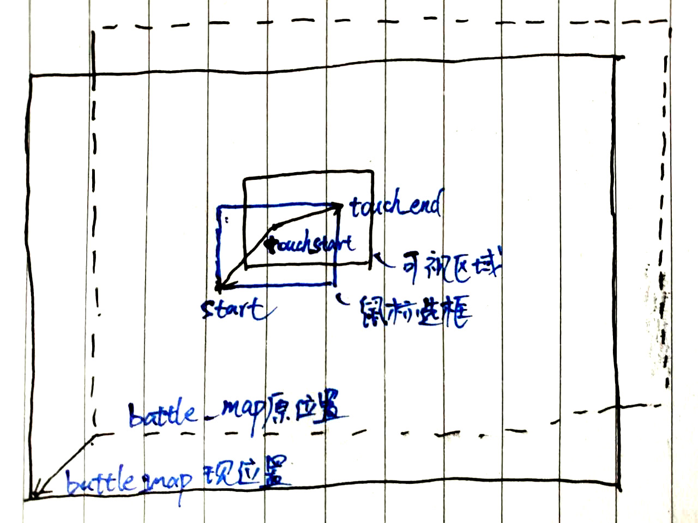
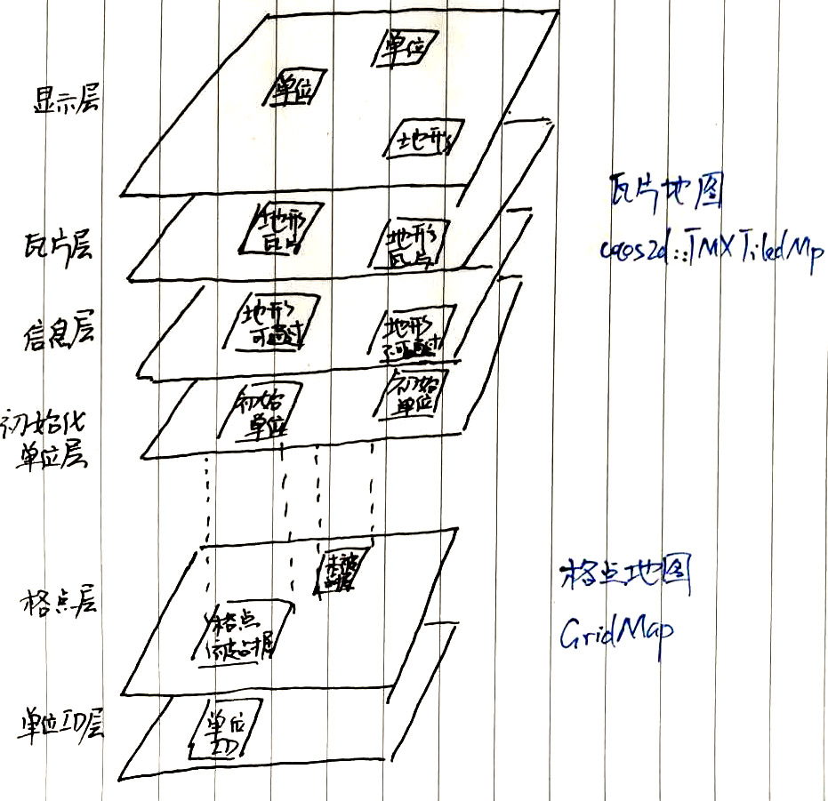
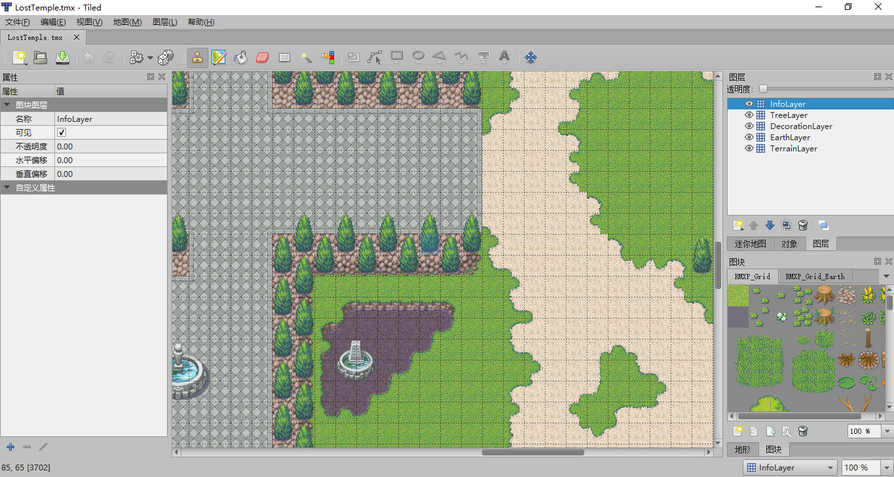
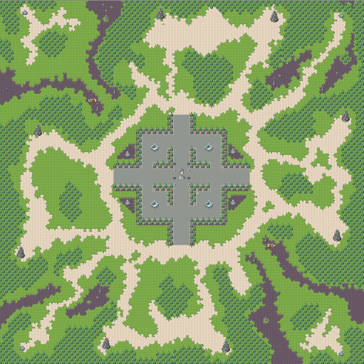
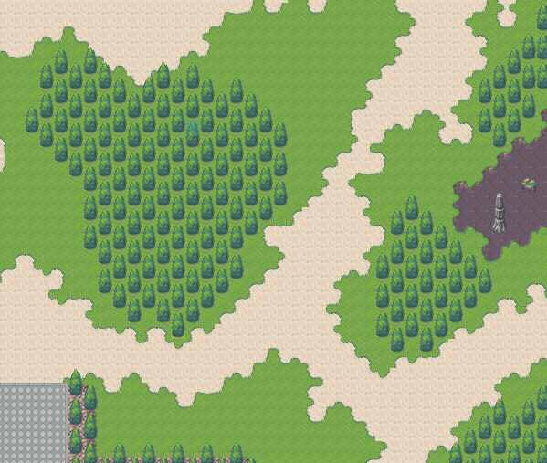
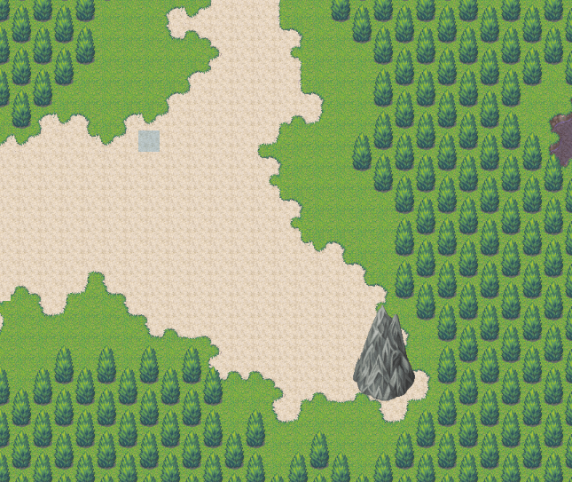
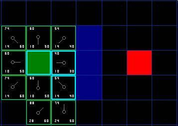

# *FudanCraft需求与设计报告*

[TOC]

# 设计思路

系统总体框图如下所示：


核心的数据结构类图如下所示：


# Cocos2d-x游戏引擎

## 概述

## 内存管理机制

Cocos2d-x采用**根类** **`Ref `**，实现Cocos2d-x 类对象的**引用计数记录**。引擎中的所有类都派生自Ref。这种实现类似于`std::shared_ptr`，但是由于引擎由Objective-C发展而来，为了历史兼容性，选择通过实现不同于标准库的的内存管理方式来吸引更多Objective-C程序员。

### 引用计数

Cocos2d-x 提供引用计数管理内存。

调用 **`retain()`** 方法：令其引用计数增1，表示获取该对象的引用权。

调用 **`release()`** 方法：在引用结束的时候，令其引用计数值减1，表示释放该对象的引用权。

调用 **`autorelease()`** 方法 ：将对象放入自动释放池。

当释放池自身被释放的时候，它就会对池中的所有对象执行一次`release()`方法，实现灵活的垃圾回收。

Cocos2d-x 提供 **AutoreleasePool**，管理自动释放对象。

当释放池自身被释放的时候，它就会对池中的所有对象执行一次`release()`方法。

### 内存管理

#### 工厂方法

在Cocos2d-x中，提供了大量的工厂方法创建对象。通过工厂化方法创建以实现对象的自动释放。如 Label 的 `create()`方法实现如下：

```c++
 Label* Label::create()
 {
     auto ret = new Label();
     if (ret)
         ret->autorelease();
     return ret;
 }
```

即创建了一个Label的对象，并对该对象执行`autorelease()`。表示该对象是自动释放的。使用工厂方法创建对象时，虽然引用计数也为1，但是由于对象已经被放入了释放池，因此调用者没有对该对象的引用权，除非我们人为地调用了`retain()`来获取引用权，否则，不需要主动释放对象。

#### Node 的 addChild() / removeChild 方法

在Cocos2d-x中，所有继承自Node类，在调用 `addChild()` 方法添加子节点时，自动调用了retain。 对应的通过 `removeChild()`，移除子节点时，自动调用了`release()`。

调用`addChild()`方法添加子节点，节点对象执行`retain()`。子节点被加入到节点容器中，父节点销毁时，会销毁节点容器释放子节点。对子节点执行`release()`。如果想提前移除子节点我们可以调用`removeChild()`。

在Cocos2d-x内存管理中，大部分情况下通过调用 `addChild()`/`removeChild()` 的方式自动完成了`retain()`,`release()`调用。不需再调用`retain()`，`release()`。

# 开始界面

## 开始界面相关的数据结构

开始界面是游戏开始的用户界面，主要在 `HelloWorldScene.h`和`HelloWorldScene.cpp`文件中实现，其中主菜单逻辑主要在`class HelloWorld`类中实现，游戏菜单逻辑主要在`class StartMenu`类中实现，服务器端菜单逻辑主要在`class ServerMenu`类中实现，客户端菜单逻辑主要在`class ClientMenu`类中实现，鸣谢及分工界面再`class CreditsScene`中实现。

### HelloWorld类

HelloWorld类是主菜单逻辑，直接继承自`cocos2d::Layer`，是一个完整的cocos2d图层，便于初始化、更新和场景切换。同时在这里进行背景音乐以及音效的预加载。

StartMenu类的重要方法如下：

*   `static HelloWorld* create();`按照cocos2d内存管理方式创建HelloWorld对象，返回指向新对象的指针
*   `virtual bool init();`初始化主菜单场景和内部的各个控件


*   `void menuCloseCallback(cocos2d::Ref* pSender);`关闭游戏的回调函数
*   ` void menuCreditsCallback(cocos2d::Ref* pSender);` 打开致谢与分工界面的回调函数
*   `void menuStartCallback(cocos2d::Ref* pSender);`打开游戏菜单界面的回调函数

#### 界面成员

在游戏界面中，我们添加了如下成员：

| 变量名           | 类型                     | 说明           |
| ------------- | ---------------------- | ------------ |
| background    | cocos2d::Sprite        | 背景图片         |
| start_label   | cocos2d::MenuItemImage | start game按钮 |
| credits_label | cocos2d::MenuItemImage | credits按钮    |
| quit_label    | cocos2d::MenuItemImage | quit按钮       |
| menu          | cocos2d::Menu          | 按钮菜单集合       |


### StartMenu类

StartMenu类是主菜单逻辑，直接继承自`cocos2d::Layer`，实现开始游戏后的客户端与服务端选择

StartMenu类的重要方法如下：

*   `static StartMenu* create();`按照cocos2d内存管理方式创建StartMenu对象，返回指向新对象的指针
*   `virtual bool init();`初始化游戏菜单场景和内部的各个控件


*   `void menuServerCallback(cocos2d::Ref* pSender);`以服务端身份进行游戏的回调函数
*   ` void menuClientCallback(cocos2d::Ref* pSender);` 以客户端身份进行游戏的回调函数
*   `void menuBackCallback(cocos2d::Ref* pSender);`返回上一菜单的回调函数

#### 界面成员

在游戏界面中，我们添加了如下成员：

| 变量名          | 类型                     | 说明                |
| ------------ | ---------------------- | ----------------- |
| background   | cocos2d::Sprite        | 背景图片              |
| server_label | cocos2d::MenuItemImage | start as server按钮 |
| client_label | cocos2d::MenuItemImage | start as client按钮 |
| back_label   | cocos2d::MenuItemImage | back按钮            |
| menu         | cocos2d::Menu          | 按钮菜单集合            |

### ServerMenu类

ServerMenu类是主菜单逻辑，直接继承自`cocos2d::Layer`,`cocos2d::ui::EditBoxDelegate`，实现开始游戏后的服务端创建。

ServerMenu重要的成员如下：

| 变量名               | 类型             | 结构   | 种类      | 初值      | 含义       |
| ----------------- | -------------- | ---- | ------- | ------- | -------- |
| connection _msg\_ | cocos2d::Label | 普通变量 | private | nullptr | 连接信息     |
| socket_server     | SocketServer*  | 指针   | private | nullptr | 服务端套接字实例 |
| socket_client     | SocketClient*  | 指针   | private | nullptr | 客户端套接字实例 |

ServerMenu类的重要方法如下：

*   `static ServerMenu* create();`按照cocos2d内存管理方式创建ServerMenu对象，返回指向新对象的指针
*   `virtual bool init();`初始化游戏菜单场景和内部的各个控件


*   `void menuStartServerCallback(cocos2d::Ref* pSender);` 打开服务器的回调函数
*   ` void menuStartGameCallback(cocos2d::Ref* pSender);` 开始游戏回调函数
*   `void menuBackCallback(cocos2d::Ref* pSender);`返回上一菜单的回调函数
*   `void editBoxReturn(cocos2d::ui::EditBox* editBox) override;`输入框的回调函数
*   `void connectionSchdeule(float f);`连接情况的自动更新函数

#### 界面成员

在游戏界面中，我们添加了如下成员：

| 变量名              | 类型                     | 说明                |
| ---------------- | ---------------------- | ----------------- |
| inputbox         | cocos2d::ui::EditBox   | 端口输入框             |
| background       | cocos2d::Sprite        | 背景图片              |
| start_label      | cocos2d::MenuItemImage | start as server按钮 |
| start_game_label | cocos2d::MenuItemImage | start as client按钮 |
| back_label       | cocos2d::MenuItemImage | back按钮            |
| menu             | cocos2d::Menu          | 按钮菜单集合            |
| connection_msg_  | cocos2d::Label         | 连接情况显示标签          |
| port_            | int                    | 保存的端口号            |

#### 按钮逻辑

当按下`Start Server`按钮时，游戏将判断是否已建立服务端，如果没有建立服务端则根据端口号建立服务端，然后再建立本机的客户端，并将客户端连接至服务端。

当按下`Start Game`按钮时，游戏将判断是否已建立服务端，如果已建立则触发各个服务端的开启游戏操作，服务端将向每个客户端发出开始游戏的消息，之后将进入游戏场景。

当按下`Back`按钮时将返回上一层。

### ClientMenu类

ClientMenu类是主菜单逻辑，直接继承自`cocos2d::Layer`,`cocos2d::ui::EditBoxDelegate`，实现开始游戏后的客户端创建。

ClientMenu重要的成员如下：

| 变量名               | 类型             | 结构   | 种类      | 初值      | 含义           |
| ----------------- | -------------- | ---- | ------- | ------- | ------------ |
| connection _msg\_ | cocos2d::Label | 普通变量 | private | nullptr | 连接信息         |
| timer             | int            | 普通变量 | private | 0       | 计时器，用于更新连接信息 |
| socket_client     | SocketClient*  | 指针   | private | nullptr | 客户端套接字实例     |

ClientMenu类的重要方法如下：

*   `static ClientMenu* create();`按照cocos2d内存管理方式创建ClientMenu对象，返回指向新对象的指针
*   `virtual bool init();`初始化游戏菜单场景和内部的各个控件


*   `void menuStartGameCallback(cocos2d::Ref* pSender);` 加入游戏的回调函数
*   `void menuBackCallback(cocos2d::Ref* pSender);`返回上一菜单的回调函数
*   `void wait_start();`等待连接开始的函数
*   `void startSchedule(float f);`连接情况的自动更新函数

#### 界面成员

在游戏界面中，我们添加了如下成员：

| 变量名             | 类型                     | 说明       |
| --------------- | ---------------------- | -------- |
| ip_box          | cocos2d::ui::EditBox   | ip地址输入框  |
| port_box        | cocos2d::ui::EditBox   | 端口号输入框   |
| background      | cocos2d::Sprite        | 背景图片     |
| start_label     | cocos2d::MenuItemImage | join按钮   |
| back_label      | cocos2d::MenuItemImage | back按钮   |
| menu            | cocos2d::Menu          | 按钮菜单集合   |
| connection_msg_ | cocos2d::Label         | 连接情况显示标签 |
| port_           | int                    | 保存的端口号   |

#### 按钮逻辑

当按下`Join Game`按钮时，游戏将判断是否已连接至服务端，如果已建立则触发定时更新连接情况，等待服务器发回开始游戏信息；而当连接错误（未能连接到正确服务器）时，将显示连接失败信息。

当按下`Back`按钮时将返回上一层。

### CreditsScene类

CreditsScene类是主菜单逻辑，直接继承自`cocos2d::Layer`,用于展示致谢名单

CreditsScene重要的成员如下：

| 变量名   | 类型              | 结构   | 种类      | 初值      | 含义   |
| ----- | --------------- | ---- | ------- | ------- | ---- |
| label | cocos2d::Label* | 指针   | private | nullptr | 展示名单 |

CreditsScene类的重要方法如下：

*   `static CreditsScene* create();`按照cocos2d内存管理方式创建CreditsScene对象，返回指向新对象的指针
*   `virtual bool init();`初始化游戏菜单场景和内部的各个控件


*   `void menuBackCallback(cocos2d::Ref* pSender);`返回上一菜单的回调函数
*   `void scheduleMove(float f);`实现文字的自动滚动

#### 界面成员

在游戏界面中，我们添加了如下成员：

| 变量名             | 类型                    | 说明       |
| --------------- | --------------------- | -------- |
| credits_content | std::string           | 分工与致谢字符串 |
| label           | cocos2d::Label        | 分工与致谢标签  |
| back_label      | cocos2d::MenuItemFont | back按钮   |
| menu            | cocos2d::Menu         | 按钮菜单集合   |

#### 逻辑

每帧都将致谢标签向上移动，并检测如果标签移出屏幕外后，将其移至底部继续更新。

当按下`Back`按钮时将返回上一层。

## 声音引擎

cocos2d 提供了名为SimpleAudioEngine的声音引擎，方便添加背景音乐以及声效。

### 使用方法

声音引擎为全局静态变量，不需要手动创建和析构，加入头文件即可直接使用。

需注意，在windows平台下支持的音乐格式只有`.wav`和`.mid`，***不支持`.mp3`***

#### 头文件

首先要添加`#include "SimpleAudioEngine.h"`，之后编可以使用声音引擎。

#### 预加载

背景音乐及声音特效均需要预加载，在预加载之后才能播放，这样可以减少播放时的延时。在游戏中，我选择了在游戏主界面进行预加载，最大化利用资源，并且不会造成太大卡顿。具体实现函数见下：

```c++
CocosDenshion::SimpleAudioEngine::getInstance()->preloadBackgroundMusic("audio/mainv.wav");
CocosDenshion::SimpleAudioEngine::getInstance()->preloadEffect("audio/bomb1.wav");
```

这两个语句分别实现了背景音乐及音效的预加载。

#### 播放

背景音乐的播放使用

```c++
CocosDenshion::SimpleAudioEngine::getInstance()->playBackgroundMusic("audio/mainv.wav");
```

而音效的播放使用

```c++
CocosDenshion::SimpleAudioEngine::getInstance()->playEffect("audio/battlefieldcontrol.wav");
```

# 战场场景

战场场景是FudanCraft游戏的核心部分，也是和用户交互的主要界面。

## 战场场景需求分析

作为一个交互性、娱乐性、竞技性较强的RTS游戏，FudanCraft的战场场景需要实现以下一些几项主要功能：

* 将战场地图和战场地图上地图单位的实时运动情况展现给用户；
* 允许用户通过鼠标移动或键盘按键移动视角，观察整个地图，并灵活切换视角，观察基地等关键位置；
* 允许用户通过鼠标的点击、拖框等操作完成选中单位、移动单位和下达攻击命令等游戏操作；
* 提供菜单，允许用户通过点击菜单创建单位；
* 显示金钱增减、单位被攻击、摧毁和最后的胜利提示等重要的游戏消息；
* 播放动感的背景音乐，给用户提供良好的视听体验


游戏场景的具体操作方法和交互模式在用户手册中有详细描述。

## 战场场景相关的数据结构

战场场景的逻辑主要在`class BattleScene`类中实现，与战场场景相关的类还有`class ControlPanel`等。

### BattleScene类

定义在BattleScene.h中，实现在BattleScene.cpp中。

BattleScene类是战场场景的主要部分，包含战场地图、鼠标操作、金钱显示、游戏消息显示等功能部件，BattleScene类实现了这些功能部件的初始化和调度。

BattleScene直接继承自`cocos2d::Layer`，是一个完整的cocos2d图层，便于初始化、更新和场景切换。BattleScene类中重要的属性如下表所示：

| 变量名            | 类型                    | 结构   | 种类      | 初值      | 含义     |
| -------------- | --------------------- | ---- | ------- | ------- | ------ |
| player_id      | int                   | 普通变量 | private | 0       |        |
| socket_server  | SocketServer*         | 指针   | private | nullptr | 服务器套接字 |
| socket_client  | SocketClient*         | 指针   | private | nullptr | 客户端套接字 |
| battle_map     | cocos2d::TMXTiledMap* | 指针   | private | nullptr | 瓦片地图   |
| grid_map       | GridMap*              | 指针   | private | nullptr | 格点地图   |
| unit_manger    | UnitManager*          | 指针   | private | nullptr | 单位管理器  |
| control_panel_ | ControlPanel*         | 指针   | private | nullptr | 控制面板   |
| mouse_rect     | MouseRect*            | 指针   | private | nullptr | 鼠标选框   |
| money          | Money*                | 指针   | private | nullptr | 金钱     |
| notice         | Notice*               | 指针   | private | nullptr | 游戏提示   |
| msg_set        | GameMessageSet        | 类对象  | public  | 未初始化    | 游戏消息集  |

Battle类的重要方法如下：

* `static BattleScene* create(SocketClient* _socket_client, SocketServer* _socket_server);`按照cocos2d内存管理方式创建BattleScene对象，返回指向新对象的指针
* `virtual bool init(SocketClient* _socket_client, SocketServer* _socket_server);`初始化战场场景和内部的各个控件


* `void win();`通知战场场景游戏胜利结束，显示消息并禁止后续操作
* `void lose();`通知战场场景游戏以失败结束，显示消息并禁止后续操作
* `void update(float f) override;`战场场景的更新函数
* `bool onTouchBegan(cocos2d::Touch*, cocos2d::Event*)override;`触摸开始事件回调函数
* `void onTouchMoved(cocos2d::Touch*, cocos2d::Event*)override;`触摸移动事件回调函数
* `void onTouchEnded(cocos2d::Touch*, cocos2d::Event*)override;`触摸结束事件回调函数
* `void onKeyPressed(cocos2d::EventKeyboard::KeyCode, cocos2d::Event *) override;按键事件回调函数`
* `void scrollMap();`地图滚动函数
* `void focusOnBase();`将视角集中到当前用户的基地
* `void destroyReward(int destroyed_type);`获取击毁地方单位的奖励
* `void menuBackCallback(cocos2d::Ref* pSender);`

### MouseRect类

定义在BattleScene.h中，实现在BattleScene.cpp中。

MouseRect类是用户通过触摸移动或按住拖动鼠标的操作，在地图上拖动出矩形这一功能的抽象。MouseRect需要实现在地图移动和视角变化时灵活变化形状的功能。

MouseRect继承自`cocos2d::DrawNode`，`cocos2d::DrawNode`是cocos2d引擎提供的基础绘图类，可以灵活地画出空心、实心矩形多边形等基础形状。MouseRect的主要属性有：

| 变量名         | 类型             | 结构   | 种类     | 初值   | 含义     |
| ----------- | -------------- | ---- | ------ | ---- | ------ |
| touch_start | cocos2d::Point | 类对象  | public | 未初始化 | 触摸开始点  |
| touch_end   | cocos2d::Point | 类对象  | public | 未初始化 | 触摸结束点  |
| start       | cocos2d::Point | 类对象  | public | 未初始化 | 选框开始端点 |
| end         | cocos2d::Point | 类对象  | public | 未初始化 | 选框结束端点 |

MouseRect的重要方法有：

* `void update(float f) override;`鼠标矩形的更新函数

### Money类

定义在BattleScene.h中，实现在BattleScene.cpp中。

Money类用于存储和管理用户当前持有的金钱，并在战场场景中更新和显示金钱的数值。

Money类继承自`cocos2d::LabelBMFont`，便于金钱数值的显示和快速更新。

Money类的重要属性如下：

| 变量名     | 类型   | 结构   | 种类      | 初值                | 含义     |
| ------- | ---- | ---- | ------- | ----------------- | ------ |
| money   | int  | 普通变量 | private | 0                 | 当前金钱数值 |
| timer   | int  | 普通变量 | private | 0                 | 计时器    |
| inc_prd | int  | 普通变量 | private | 宏MONEY_INC_PERIOD | 金钱增加周期 |
| inc_amt | int  | 普通变量 | private | 宏MONEY_INC_AMOUNT | 金钱增加数量 |

Money类的重要方法如下：

* `void update(float f) override;`金钱自动更新函数，使金钱每隔一段时间增加一定数值
* `bool init() override;`金钱初始化函数，初始化金钱为某一固定数值，读取BM字体集，并进行显示
* `void updateMoneyDisplay();`更新金钱的显示
* `bool checkMoney(int cost) const;`检查金钱是否足够
* `void spendMoney(int cost);`花掉数值等于cost的金钱，即金钱数量减少cost
* `void increaseMoney(int amount);`金钱数量增加amount

### Notice类

定义在BattleScene.h中，实现在BattleScene.cpp中。

Notice类用于显示重要的游戏提示。Notice类实现了游戏提示的更新、定时消失和固定显示。

Notice类继承自`cocos2d::LabelBMFont`，便于游戏提示的显示和快速更新。

Notice类的重要属性如下：

| 变量名      | 类型   | 结构   | 种类      | 初值   | 含义     |
| -------- | ---- | ---- | ------- | ---- | ------ |
| ntc_life | int  | 普通变量 | private | 0    | 提示显示寿命 |
| timer    | int  | 普通变量 | private | 0    | 计时器    |

Notice类的重要方法如下：

* `void update(float f) override;`游戏提示的更新函数，实现游戏提示的定时消失
* `void displayNotice(std::string ntc, int _ntc_life);`显示提示函数，显示字符串ntc对应的游戏提示，定时_ntc_life后消失
* `void displayNotice(std::string ntc);`显示提示函数的重载，显示字符串ntc对应的游戏提示，固定显示不消失
* `bool init() override;`游戏提示初始化，初始提示为"Welcome to FudanCraft!"，读取BM字体集，并进行显示

### ControlPanel类

ControlPanel类用以实现单位的生产按键，并做简单的金钱检测。

ControlPanel类继承自`cocos2d::Menu`，实现按钮功能，并方便扩充更多单位的制作。

ControlPanel的重要属性如下：

| 变量名     | 类型                      | 结构   | 种类      | 初值      | 含义     |
| ------- | ----------------------- | ---- | ------- | ------- | ------ |
| fighter | cocos2d::MenuItemImage* | 指针   | private | nullptr | 飞机生产按钮 |
| tank    | cocos2d::MenuItemImage* | 指针   | private | nullptr | 坦克生产按钮 |
| soldier | cocos2d::MenuItemImage* | 指针   | private | nullptr | 士兵生产按钮 |

ControlPanel的重要方法如下：

*   `bool init() override;`初始化按键
*   `void setFighterCallback(std::function<void(Ref*)>);`设置战斗机按键回调函数
*   `void setTankCallback(std::function<void(Ref*)>);`设置坦克按键回调函数
*   `void setSoldierCallback(std::function<void(Ref*)>);`设置士兵按键回调函数


## 战场场景相关的重要算法

### 视角移动与地图滚动的实现

视角移动非常重要，在RTS游戏中，许多精彩的操作都需要使用快速的视角移动与地图滚动来实现。

在本游戏中，实现了通过摁键盘的WSAD以及鼠标移动至屏幕边缘来移动视角，同时增加了摁空格键将主基地移动至屏幕中央的功能，方便组织防守。

#### 移动的实现

视角的移动是通过改变地图在屏幕上的坐标来实现，通过改变相对坐标来实现地图的滚动。

#### 鼠标滚动的实现

在鼠标滚动的实现中，通过`cocos2d::EventListenerMouse::onMouseMove`来获取鼠标的坐标，并将其存入`crusor_position`中。同时在`void BattleScene::update(float f)`函数中调用`void BattleScene::scrollMap()`进行屏幕的滚动。而在鼠标位置侦测中，采用了2倍速方式，即鼠标离边缘越近速度越快，同时支持八个方向的滚动。


如图，通过判断鼠标坐标和不同边的距离将屏幕划分成了25个区域。当鼠标在白色区域里时，屏幕不滚动；当鼠标在粉色和青色范围内，分别实现向相应方向的一倍速滚屏；当鼠标在绿色和橙色范围内时，实现向相应方向的二倍速移动；而在蓝色区域内时，实现相应的向一个方向一倍速移动而向另一个方向二倍速移动。

#### 空格跳转至基地的实现

空格的侦测通过`cocos2d::EventListenerKeyboard::onKeyPressed`来获取，当感知到空格键的按下后，将调用`void BattleScene::focusOnBase()`函数来将基地设为当前焦点。从而实现摁下空格跳转至基地。

### 鼠标选框的实现

鼠标选框是RTS游戏中常见的交互方式，是指用户按压鼠标或触摸板并移动时，在屏幕上拖出一个矩形框，对框中的单位进行选中操作。需要注意的是，鼠标选框应该依附在地图上，随着地图移动；当视角变化、地图滚动时，鼠标选框应随之变形，进而覆盖更大的范围。

鼠标选框的功能主要在MouseRect类中实现，接收BattleScene类传递的鼠标（触摸）消息，依附在TMXTiledMap类的对象battle_map战场地图上显示。

具体的顺序图如下所示：

```mermaid
sequenceDiagram
	User->>+BattleScene: Start Game
    BattleScene->>+MouseRect: Initialize  
    MouseRect-->>-BattleScene: Pointer to new object
    BattleScene->>TiledMap: Add child
    User->>BattleScene: Touch start
    BattleScene->>+MouseRect: Set touch start point
    User->>BattleScene: Touch move
    BattleScene->>MouseRect: Set touch end point
    MouseRect->>+TiledMap: Check battle map position
    TiledMap-->>-MouseRect: Return battle map position
    MouseRect->>MouseRect: Update
    User->>BattleScene: Touch end
    BattleScene->>MouseRect: Query select rect
    MouseRect->>BattleScene: Return select rect
    User->>-BattleScene: Quit Game
    
```

当鼠标按压移动时，BattleScene会将MouseRect添加到自动更新update队列中。cocos2d引擎的场景导演会定时调用`MouseRect::update()`更新函数，在更新函数中MouseRect会查询战场地图的位置，实现鼠标选框的变形显示，具体关系如下图所示：



当视角移动、地图滚动时，鼠标选框的端点应该是当前鼠标拖动向量和地图滚动向量的差，在update()函数中定时进行运算，就可以实现鼠标选框的连续变化。

# 地图

地图是RTS游戏的关键部分，单位的创建、移动都与地图密切相关。在FudanCraft中，实际上有两层地图：一层是用于显示的瓦片地图，直接采用了`coocos2d::TMXTiledMap`；另一层是用于运算的逻辑（格点）地图，主要由`class GridMap`类实现。两层地图结合，实现了单位运动的实时显示、碰撞检测、寻路查找等功能。

## 地图需求分析

作为一个复杂性较强的RTS游戏，FudanCraft的地图需要满足以下几项用户需求：

* 提供较大的地图，使得3到4个用户同时进行游戏时都有自由的游戏空间，可以进行大型、激烈的战斗
* 提供复杂的地形，模拟真实的战场情况，使得单位在地图上运动的方式更加复杂多变，提高游戏的挑战性和娱乐性
* 地图上要提供初始的基地、单位等信息，用于场景和单位的初始化，使得游戏初期就能进行激烈的交锋

## 地图的设计思路

由于FudanCraft游戏的地图较大，在显示层我们采用了cocos2d引擎提供的瓦片地图类`cocos2d::TMXTiledMap`。瓦片地图是将整个地图划分为若干个小块，采用小纹理图片连续贴图，这样可以大大提高显示的性能。

在逻辑层，我们设计了与瓦片地图对应的格点地图GridMap，将地图划分为128x128个大小相等的正方形，每个正方形对应瓦片地图中的一个瓦片。每个单位在移动时可以连续地平滑移动，但都会静止在一个格点的中央附近。每个格点同时只能被一个单位占据，这样就避免了单位的重叠。单位的移动、攻击、搜索敌人等操作也都是通过格点地图进行的。格点地图的实现主要在GridMap类中，将在地图的相关算法一节中详细叙述。瓦片地图与格点地图的关系如下图所示：




瓦片地图用于显示，提供了各种瓦片的信息，地形能否通过的信息以及初始化单位的信息；格点地图用于运算，储存了格点是否被占据的信息以及占据单位ID的信息。

## 地图设计

### 概述

本游戏地图采用Tiled Map Editor进行制作。

### 软件信息

* **软件名** ：Tiled Map Editor
* **版本号** ：Tiled for Windows (64bit) - snapshot Version 2017.05.26
* **官网地址** ：http://www.mapeditor.org/
* **软件界面**：

### 地图信息

* **单个网格大小**：32px\*32px
* **地图尺寸**：128*128 (4096px\*4096px)
* **用到的素材图片**：
  * *RMXP_Grid.png* (256px\*15520px)
  * *RMXP_Grid_Earth.png* (256px\*96px)
* **地图层次**（从上到下）：
  * *InfoLayer*：信息层，为了方便，我们把所有的地图信息放在这个层，规定哪些网格可以通过，哪些网格不允许通过。这些都是通过地图块的自定义属性`int z_index`来判断的，若为0，则可以通过，反之无法通过。
  * *TreeLayer*：树木层，这一层用来放置树木和建筑。
  * *DecorationLayer*：装饰层，放置地图中央的石板广场。
  * *EarthLayer*：泥土层，放置沙地。
  * *TerrainLayer*：地形层，放置草地、水域及其接壤的地方。

### 地图设计

整个地图的设计参考RTS游戏*《魔兽争霸三：冰封王座》*中的地图*Lost Temple*，基本上为1:1复刻，只不过去除了高度信息。

* 原地图：

  

* 本游戏采用的地图：

  

地图上设有四个出生点，即游戏支持的最大在线人数为4.

* 地图图赏

  

  

  

  

## 地图相关的数据结构

### GridPoint类

定义在GridMap.h中，实现在GridMap.cpp中。

GridPoint类是一个简单结构，用来表示格点坐标，提供加、减、相等等运算符重载，类似于`cocos2d::Point`，但Point的坐标是浮点数，而GridPoint的格点坐标用整数表示。GridPoint类的属性如下：

| 变量名  | 类型   | 结构   | 种类     | 初值   | 含义       |
| ---- | ---- | ---- | ------ | ---- | -------- |
| x    | int  | 普通变量 | public | 0    | 格点的整数横坐标 |
| y    | int  | 普通变量 | public | 0    | 格点的整数纵坐标 |

重要的方法如下：

* `bool operator==(const GridPoint& gp2) const;`相等运算符重载
* `friend GridPoint operator+(const GridPoint& gp1, const GridPoint& gp2);加运算符重载`
* `friend GridPoint operator-(const GridPoint& gp1, const GridPoint& gp2);`减运算符重载
* `GridPoint getDirectionVector();`获得方向向量

### GridPath类型

定义在GridMap.h中。

GridPath类型表示一系列格点坐标构成的格点路径，用于单位的寻路移动。实际上是`std::vector<GridPoint>`的一个重定义，即`typedef std::vector<GridPoint>  GridPath;`。

### GridSize类

定义在GridMap.h中，实现在GridMap.cpp中。

GridSize类用于表示一个格点矩形的大小，类似于`cocos2d::Size`，但Size的长宽是浮点数，而GridSize的长宽用整数表示。GridSize类的属性如下：

| 变量名    | 类型   | 结构   | 种类     | 初值   | 含义      |
| ------ | ---- | ---- | ------ | ---- | ------- |
| width  | int  | 普通变量 | public | 0    | 格点矩形的宽度 |
| height | int  | 普通变量 | public | 0    | 格点矩形的高度 |

重要方法如下：

* `friend GridSize operator/(const GridSize& gz, int s);`除运算符重载，将长宽都整除系数s

### GridRect类

定义在GridMap.h中，实现在GridMap.cpp中。

GridRect类用于表示一个格点矩形，类似于`cocos2d::Rect`，但GridRect的端点和大小是用GridPoint 和GridSize表示的。GridRect类的属性如下：

| 变量名  | 类型        | 结构   | 种类     | 初值              |
| ---- | --------- | ---- | ------ | --------------- |
| gp   | GridPoint | 类对象  | public | GridPoint(0, 0) |
| size | GridSize  | 类对象  | public | GridSize(0, 0)  |

重要方法如下：

* `GridRect(GridPoint _gp = GridPoint(), GridSize _size = GridSize()) : gp(_gp), size(_size) {}`构造函数，由左下角的端点和矩形大小构造一个矩形

### GridMap类

定义在GridMap.h中，实现在GridMap.cpp中。

GridMap类是格点地图，用于寻路、格点占据判断、临近单位搜索、临近空位搜索等逻辑运算。GridMap类的属性如下：

| 变量名         | 类型                              | 结构   | 种类      | 初值   | 含义                |
| ----------- | ------------------------------- | ---- | ------- | ---- | ----------------- |
| gmap        | std::vector\<std::vector\<int>> | 类对象  | private | 未初始化 | 格点层，记录格点是否被占据     |
| umap        | std::vector\<std::vector\<int>> | 类对象  | private | 未初始化 | 单位ID层，记录占据格点的单位ID |
| map_width   | int                             | 普通变量 | private | 未初始化 | 地图宽度（格点数）         |
| map_height  | int                             | 普通变量 | private | 未初始化 | 地图高度（格点数）         |
| grid_width  | int                             | 普通变量 | private | 未初始化 | 格点宽度（像素）          |
| grid_height | int                             | 普通变量 | private | 未初始化 | 格点高度（像素）          |
| offset_vec  | cocos2d::Vec2                   | 类对象  | private | 未初始化 | 偏移向量              |

重要方法如下：

* `bool checkPointInMap(const GridPoint& gp) const;`检查格点gp是否在格点地图范围内，避免越界
* `bool checkPosition(const GridPoint& gp);`检查格点gp是否被占据
* `bool checkPosition(const GridRect& grec);`检查格点矩形grec是否被占据
* `bool occupyPosition(int id, const GridPoint& pos, bool occupy_grid = true);`尝试占据格点pos
* `bool occupyPosition(int id, const GridRect& grec, bool occupy_grid = true);`尝试占据格点矩形grec
* `void leavePosition(const GridPoint& pos, bool occupy_grid = true);`离开格点pos
* `void leavePosition(const GridRect& grec, bool occupy_grid = true);`离开格点矩形grec
* `int getUnitIDAt(const GridPoint& gp) const;`获取格点gp处单位ID
* `std::vector<int> getUnitIDAt(const GridRect& range) const;`获取格点矩形range范围内所有单位ID
* `cocos2d::Point getPoint(const GridPoint& gp);`得到格点gp对应的点坐标
* `GridPoint getGridPoint(const cocos2d::Point& p);`得到点p对应的格点坐标
* `cocos2d::Point getPointWithOffset(const GridPoint& gp);`得到格点gp对应的点坐标（考虑格点带来的偏移）
* `GridPoint getGridPointWithOffset(const cocos2d::Point& p);`得到点p对应的格点坐标（考虑格点带来的偏移）
* `std::vector<std::vector<int>>& getLogicalGridMap();`得到格点层的逻辑地图
* `GridPoint findFreePositionNear( const GridPoint& gp);`查找距格点gp最近的空闲的格点
* `bool hasApproached(const cocos2d::Point& cur_fp, const GridPoint& dest_gp);`检查点cur_fp是否靠近格点dest_gp中央

## 地图相关的重要算法

### 格点的检查、占据与离开

格点层gmap是一个128x128的二维整形vector对象，记录了每个格点是否被占据的信息，被占据的格点记为1，没有被占据的格点记为0。单位ID层umap也是一个128x128的二维整形vector对象，记录了占据每个格点的单位ID，没有被占据的格点数值为0。GridMap类提供了检查格点、占据格点和离开格点的一系列API，与单位类Unit交互，实现了碰撞检测、障碍物信息查询等功能。

格点检查函数checkPosition()包括一系列重载函数，用于检测格点是否可以占据，如果输入变量是一个GridPoint类型的格点gp，首先要检测gp是否越界，如果不越界则检查gmap中对应坐标的位置是否为0，如果为0则该格点当前没有被占据，返回真；否则说明该格点已经被占据，返回假；如果gp越界，则直接返回假。如果输入变量是一个GridRect类型的格点矩形grec，则需要逐一检查grec内部每一个格点是否被占据，如果都没有被占据才返回真，否则返回假。

格点占据函数occupyPosition()也包括两个重载函数，分为两种情况，由bool参数occupy_grid确定：如果occupy_grid为真，则既占据gmap也占据umap；如果occupy_grid为假，则只占据umap而不占据gmap。这是因为有些单位在移动过程中并不真正地占据格点，比如战斗机单位，但需要在umap中添加ID以便于搜索敌人、自动攻击等功能的实现。默认occupy_grid参数为真。格点占据函数的流程图如下所示：


如果输入参数是GridRect类型的grec，那么程序会先调用checkPosition(grec)检查这个格点矩形是否被占据，如果没有被占据则逐一占据这个矩形中的所有格点。

格点离开函数leavePosition()也是一系列重载函数，与occupyPosition()相反，用于消除gmap和umap上占据的格点。也分为occupy_grid为真和为假的两种情况。

### 邻近空位搜索算法

单位创建和寻路搜索过程中，常常出现当前设定的目标位置已被占据，无法到达的情况，这时候就需要搜索目标位置附近的空闲位置。在	`GridPoint GridMap::findFreePositionNear(const GridPoint& origin_gp)`函数中实现了格点origin_gp邻近空闲位置的搜索功能。

如果要找到离origin_gp最近的空闲格点，需要按照圆周逐一遍历origin_gp附近的格点，并逐渐增大圆周的半径。但这种方法需要用到复杂的浮点运算，效率不高；而邻近空位搜索算法的调用频率较高，不适合用这种方法。

也可以采用列表的方法，把邻近格点的偏移向量保存在一个数组或vector中，如{{0, 0}, {0, 1}, {1, 0}, {0, -1}, {-1, 0}, ......}。但这种方法保存的格点偏移向量数量有限，如果在这些格点中没有找到空闲位置，程序就无法做出正确的反应。而在RTS游戏中，常常出现巨大的障碍物或很多单位聚在一起的情况，如果无法找到空位单位的移动就会出现问题，因此对邻近空位搜索算法的可靠性要求较高。

我们最后采用的是一种“菱形查找”的方法。按照菱形的轮廓逐一遍历origin_gp周围的格点，并逐渐增大菱形的尺寸。具体的遍历顺序如下图所示：

|         |           |           |           |         |         |        |
| ------- | --------- | --------- | --------- | ------- | ------- | ------ |
|         |           |           | (0, 3)    |         |         |        |
|         |           | (-1, 2)   | (0, 2)    | (1, 2)  |         |        |
|         | (-2, 1)   | (-1, 1)   | (0, 1)    | (1, 1)  | (2, 1)  |        |
| (-3, 0) | (-2, 0)   | (-1, 0)   | origin_gp | (1,  0) | (2, 0)  | (3, 0) |
|         | (-2,  -1) | (-1,  -1) | (0, -1)   | (1, -1) | (2, -1) |        |
|         |           | (-1,  -2) | (0, -2)   | (1, -2) |         |        |
|         |           |           | (0, -3)   |         |         |        |

用数学的方法表示就是遍历满足|x| + |y| = i的所有(x, y)，i = 1, 2, 3, ...，检查origin_gp + (x, y)是否空闲。菱形查找得到的空闲点可能不是离origin_gp最近的，但可以正确查找到距origin_gp较近的空闲位置，并且查找效率较高，查找的范围无限大。最后在游戏中使用的效果较好。

# 单位

单位是FudanCraft游戏的重要组成部分，也是很有特色的内容。单位的实现主要分为三部分：单位本身、单位的附加效果、单位管理器。

## 单位的需求分析

* 单位需要接受鼠标操作或网络模块传递的信息，实现创建、移动、攻击等基本功能
* 单位要有寻路能力，可以自动避开障碍地形，多单位共同移动时不会重合，途中遇到障碍物时会自动重新寻路，沿最短路径到达指定地点
* 多单位可以共同移动、寻路、攻击，实现大军团作战的效果，使游戏对抗更加激烈
* 需要有多种特色单位，单位的移动、攻击方式各具特色，实现多兵种协同作战
* 还有具有特殊功能的建筑，使游戏的玩法复杂多变，富有特色
* 各种单位的生命值、攻击力、价格等数值设定互不相同，使游戏的策略性更强
* 单位还具有追踪敌人、自动搜索敌人、自动攻击等高级功能，减少用户的操作负担
* 单位的有血条显示、攻击弹道等附加效果，使用户能够清楚地了解单位的状态
* 单位受伤、被击毁、基地被摧毁都产生游戏提示，提醒用户进行防御
* 单位创建、被摧毁、基地被攻击产生音效，提示用户的同时提升用户的视听感受

## 单位相关的数据结构

单位相关的数据结构类图如下所示：


### Unit类

定义在Unit.h中，实现在Unit.cpp中。

Unit类是各种单位的基类，预留了单位的各项数值属性，设置了创建、移动、攻击等基础接口，实现了寻路和重新寻路策略， 完成了自动搜索敌人、自动攻击等高级功能的实现，添加了血条、粒子效果、提示、音效等和用户交互的控件。Unit类的重要属性如下：

| 变量名            | 类型                   | 结构   | 种类      | 初值             | 含义               |
| -------------- | -------------------- | ---- | ------- | -------------- | ---------------- |
| id             | int                  | 普通变量 | public  | 未初始化           | 单位ID             |
| camp           | int                  | 普通变量 | public  | 0              | 阵营               |
| z_index        | int                  | 普通变量 | public  | 未初始化           | z轴高度             |
| unit_manager   | UnitManager*         | 指针   | public  | nullptr        | 单位管理器            |
| timer          | int                  | 普通变量 | private | 0              | 计时器              |
| state          | int                  | 普通变量 | private | 0              | 单位状态             |
| moving         | bool                 | 普通变量 | private | false          | 移动标志位            |
| tracing        | bool                 | 普通变量 | private | false          | 追踪标志位            |
| stalling       | bool                 | 普通变量 | private | false          | 延迟寻路标志位          |
| auto_atking    | bool                 | 普通变量 | private | false          | 自动攻击标志位          |
| target_id      | int                  | 普通变量 | private | 0              | 攻击目标单位的ID        |
| grid_path      | GridPath             | 类对象  | private | vector默认初始化    | 格点路径             |
| final_dest     | GridPoint            | 类对象  | private | GridPoint默认初始化 | 最终目的地格点          |
| cur_pos        | GridPoint            | 类对象  | private | GridPoint默认初始化 | 当前所处格点           |
| cur_dest       | GridPoint            | 类对象  | private | GridPoint默认初始化 | 当前目的地格点          |
| target_lastpos | GridPoint            | 类对象  | private | GridPoint默认初始化 | 上次查询到的攻击目标单位所处格点 |
| size           | GridSize             | 类对象  | private | GridSize默认初始化  | 单位所占的格点矩形大小      |
| cur_rect       | GridRect             | 类对象  | private | GridRect默认初始化  | 单位当前所占的格点矩形      |
| rfp_cnt        | int                  | 普通变量 | private | 0              | 重新寻路计数器          |
| roc_cnt        | int                  | 普通变量 | private | 0              | 重新占据格点计数器        |
| stl_cnt        | int                  | 普通变量 | private | -1             | 延迟寻路计数器          |
| type           | int                  | 普通变量 | private | 未初始化           | 单位类型             |
| cd             | int                  | 普通变量 | private | 未初始化           | 单位攻击延时           |
| hp             | int                  | 普通变量 | private | 未初始化           | 单位生命值            |
| mobile         | bool                 | 普通变量 | private | false          | 单位能否移动           |
| atk            | int                  | 普通变量 | private | 未初始化           | 单位攻击力            |
| atk_range      | int                  | 普通变量 | private | 未初始化           | 单位攻击范围           |
| hp_max         | int                  | 普通变量 | private | 未初始化           | 单位生命最大值          |
| cd_max         | int                  | 普通变量 | private | 未初始化           | 单位攻击延时           |
| move_speed     | float                | 普通变量 | private | 未初始化           | 单位移动速度           |
| auto_atk_freq  | int                  | 普通变量 | private | 未初始化           | 自动攻击频率           |
| auto_atk_range | GridSize             | 类对象  | private | GridSize默认初始化  | 自动攻击范围           |
| tiled_map      | cocos2d::TMXTiledMap | 指针   | private | nullptr        | 瓦片地图             |
| grid_map       | GridMap*             | 指针   | private | nullptr        | 格点地图             |
| hpbar          | Bar*                 | 指针   | private | nullptr        | 血条               |
| flag           | coco2d::DrawNode*    | 指针   | private | nullptr        | 旗帜               |

重要方法有：

* `virtual void setProperties();`设置单位属性
* `virtual void update(float f) override;`单位的更新函数
* `virtual void initBars();`初始化血条等状态条
* `void displayHPBar(int _disp_time = 0);`显示血条
* `virtual void addToMaps(const GridPoint & crt_gp, cocos2d::TMXTiledMap* _tiled_map, GridMap* _grid_map);`添加单位到瓦片地图和格点地图
* `void setGridPath(const MsgGridPath& _grid_path);`用网络传来的消息设置格点路径
* `virtual void motivate();`命令单位移动
* `void abandonTracing();`放弃追踪当前目标
* `bool hasArrivedAtDest();`判断是否到达当前目的格点
* `bool underAttack(int damage);`单位受到伤害
* `void tryToFindPath();`尝试进行寻路
* `virtual void move();`移动函数
* `virtual void attack();`攻击函数
* `void stall();`延时寻路函数
* `void trace();`追踪函数
* `void auto_atk();`自动攻击函数
* `void searchForNearbyEnemy();`搜索附近的敌人
* `virtual GridPath findPath(const GridPoint& dest) const;`寻路函数
* `GridPath optimizePath(const GridPath& orig_paht) const;`优化路径函数

### UnitManager类

定义在Unit.h中，实现在Unit.cpp中。

UnitManager类是单位管理器，用于统一管理当前战斗场景中的所有单位，完成战斗场景、单位和网络模块之间的消息通信，提供发送消息、创建单位、选中、移动单位、查找单位位置、查找基地位置等各种接口。UnitManager类的重要属性如下：

| 变量名           | 类型                         | 结构   | 种类      | 初值           | 含义         |
| ------------- | -------------------------- | ---- | ------- | ------------ | ---------- |
| player_id     | int                        | 普通变量 | public  | 未初始化         | 玩家ID       |
| msgs          | GameMessageSet*            | 指针   | public  | nullptr      | 游戏消息集      |
| id_map        | cocos2d::Map\<int, Unit*\> | 类对象  | private | Map类默认初始化    | ID和单位对应表   |
| selected_ids  | std::vector\<int\>         | 类对象  | private | vector类默认初始化 | 选中单位ID列表   |
| base_map      | std::map\<int, int\>       | 类对象  | private | map类默认初始化    | 阵营基地对照表    |
| tiled_map     | cocos2d::TMXTiledMap*      | 指针   | private | nullptr      | 瓦片地图       |
| grid_map      | GridMap*                   | 指针   | private | nullptr      | 格点地图       |
| socket_client | SocketClient               | 指针   | private | nullptr      | 客户端套接字     |
| battle_scene  | BattleScene*               | 指针   | private | nullptr      | 战场场景       |
| next_id       | int                        | 普通变量 | private | 1            | 下一个创建单位的ID |
| base_id       | int                        | 普通变量 | private | 1            | 本阵营基地的ID   |
| base          | Base*                      | 指针   | private | nullptr      | 本阵营基地的指针   |
| base_pos      | GridPoint                  | 类对象  | private | {0, 0}       | 本阵营基地的位置   |
| gen           | std::default_random_engine | 类对象  | private | 未初始化         | 随机数        |
| notice        | Notice*                    | 指针   | private | nullptr      | 游戏         |

UnitManager类的重要方法如下：

* `void updateUnitsState();`通过网络收发游戏消息，更新单位状态
* `void deleteUnit(int id);`删除单位
* `void checkWinOrLose(int destroyed_base_id);`检查游戏胜利或失败
* `void genAttackEffect(int unit_id0, int unit_id1);`产生攻击特效
* `GridPoint getUnitPosition(int unit_id);`通过单位ID得到单位所处的格点坐标
* `GridPoint getBasePosition();`得到本阵营基地的格点坐标
* `void genCreateMessage(int _unit_type, const GridPoint& _crt_gp);`产生创建新单位的消息
* `void initiallyCreateUnits();`创建初始单位
* `void selectUnits(cocos2d::Point select_point);`用鼠标选框选中单位
* `void selectUnits(cocos2d::Rect select_rect);`用鼠标点击命令单位
* `Unit* createNewUnit(int id, int camp, int uint_type, GridPoint crt_gp);`创建新单位

### Bar类

定义在Unit.h中，实现在Unit.cpp中。

Bar类是游戏中的状态条，用于显示游戏中单位的状态。显示给用户的状态条是一个长条形的矩形，矩形内部的填充比例与状态的数值对应。游戏中用到的状态条有两种，一种是血条，用于显示单位当前的血量与最大血量的比值；一种是制造进度条，用于显示基地制造单位的进度。

Bar类直接继承自`cocos2d::DrawNodw`，便于状态条的绘图和显示。Bar类的重要属性有

| 变量名          | 类型               | 结构   | 种类      | 初值               | 含义      |
| ------------ | ---------------- | ---- | ------- | ---------------- | ------- |
| timer        | int              | 普通变量 | private | 0                | 计时器     |
| disp_time    | int              | 普通变量 | private | 0                | 状态条显示时间 |
| length       | int              | 普通变量 | private | 32               | 状态条长度   |
| height       | int              | 普通变量 | private | 4                | 状态条高度   |
| kept_visible | int              | 普通变量 | private | false            | 锁定可见    |
| color        | cocos2d::Color4F | 类对象  | private | {0.8, 0, 0, 0.8} | 状态条     |

Bar类的重要方法有：

* `void update(float f) override;`状态条更新函数
* `void updateBarDisplay(float rate, int _disp_time = 0);`更新状态条显示
* `void setLength(float _length);`设置状态条长度
* `void setColor(const cocos2d::Color4F& _color);`设置状态条颜色
* `void stopKeepingVisible();`取消状态条锁定显示

### Fighter类

定义在AdvancedUnit.h中，实现在AdvancedUnit.cpp中。

Fighter类是高级单位战斗机，继承自基类Unit，它的移动方式比较特殊，移动过程中可以无视地形和格点的占据情况。Fighter类重写的方法如下：

* `void setProperties() override;`配置战斗机的数值属性，包括生命值、攻击力等
* `void motivate() override;`战斗机开始移动之前，要先“起飞”，离开当前所占据的格点
* `void move() override;`战斗机在移动过程中，不占据格点层地图，只更新单位ID层地图
* `GridPath findPath(const GridPoint& dest) const override;`战斗机的寻路只需直接返回目的地坐标

### Tank类

定义在AdvancedUnit.h中，实现在AdvancedUnit.cpp中。

Tank类是高级单位坦克，继承自基类Unit，它的攻击方式较为特殊，攻击附带溅射，即攻击目标附近一定范围的敌方单位也会收到伤害。Tank类的特殊属性如下：

| 变量名          | 类型       | 结构   | 种类      | 初值            | 含义   |
| ------------ | -------- | ---- | ------- | ------------- | ---- |
| splash_range | GridSize | 类对象  | private | GridSize默认初始化 | 溅射范围 |

Tank类重写的方法如下：

* `void setProperties() override;`配置坦克的属性，包括生命值、攻击力等
* `void attack() override;`坦克攻击，对以目标单位为中心大小为splash_range矩形内的敌方单位造成伤害

### Soldier类

定义在AdvancedUnit.h中，实现在AdvancedUnit.cpp中。

Soldier类是高级单位步兵，继承自基类Unit，它没有什么特殊能力。

Soldier类重写的方法如下：

* `void setProperties() override;`配置步兵的属性，包括生命值、攻击力等

### Base类

定义在Building.h中，实现在Building.cpp中。

Base类是高级建筑基地，继承自基类Unit。可以在基地中生产其他高级单位，一段时间内只能生产一个单位，生产完成后再进行生产列表上下一个单位的生产。生产出的单位将出现在基地附近的空闲位置。Base类的特殊属性有：

| 变量名          | 类型                   | 结构   | 种类      | 初值          | 含义         |
| ------------ | -------------------- | ---- | ------- | ----------- | ---------- |
| producing    | bool                 | 普通变量 | private | false       | 正在生产标志位    |
| cur_prod     | int                  | 普通变量 | private | 未初始化        | 当前生产单位类型   |
| prod_process | int                  | 普通变量 | private | 未初始化        | 当前生产进度     |
| prod_period  | int                  | 普通变量 | private | 未初始化        | 生产周期       |
| period_map   | std::map\<int, int\> | 类对象  | private | map默认初始化    | 各类型单位生产周期表 |
| prod_list    | std::vector\<int\>   | 类对象  | private | vector默认初始化 | 待生产单位列表    |
| prod_bar     | Bar*                 | 指针   | private | nullptr     | 生产进度条      |

Base类重写和新增的方法如下：

* `void setProperties() override;`配置基地的属性，包括生命值、大小等
* `void addToMaps(const GridPoint & crt_gp, cocos2d::TMXTiledMap* _tiled_map, GridMap* _grid_map) override;`将基地添加到地图，因为基地的面积较大，在格点地图上不是占据一个格点，而是占据一个格点矩形
* `void update(float f) override;`基地的更新函数，基地不会移动、索敌或攻击，只会生产单位
* `void initBars() override;`状态条初始化，不仅要初始化血条，还要初始化生产进度条
* `void displayProdBar();`显示生产进度条
* `void startProduce(int unit_type);`将类型为unit_type的单位添加到生产列表中

### Tower类

定义在Building.h中，实现在Building.cpp中。

Base类是高级建筑防御塔，继承自基类Unit，防御塔不能移动或追踪敌方单位，但能够自动攻击附近很大范围的敌方单位。Tower类重写的方法有：

* `void setProperties() override;`配置防御塔的属性，包括生命值、攻击力等
* `void update(float f) override;`防御塔更新函数，防御塔不会移动、索敌，但会自动攻击

## 单位的重要算法

### 游戏消息的产生和解析

为了实现多用户同时游戏，完成各个客户端之间的同步，FudanCraft中设计了一套游戏消息系统。消息的格式定义如下：

| 消息分量      | 类型                   | 含义              |
| --------- | -------------------- | --------------- |
| cmd_code  | GameMessage::CmdCode | 游戏消息的命令代码       |
| unit_0    | int                  | 游戏消息提到的第一个单位ID  |
| unit_1    | int                  | 游戏消息提到的第二个单位ID  |
| damage    | int                  | 造成伤害的数值         |
| camp      | int                  | 游戏消息提到的第一个单位的阵营 |
| unit_type | int                  | 游戏消息提到的第一个单位的类型 |
| grid_path | MsgGamePath          | 游戏消息传递的格点路径     |

需要注意的是，根据游戏消息命令代码的不同，其中的一些消息分量可能是无效的。

其中命令代码的内容和含义如下所示：

| 命令代码 | 含义                                       |
| ---- | ---------------------------------------- |
| CRT  | 阵营camp在grid\_path[0]处创建了一个类型为unit\_type的新单位，新单位的id为unit\_0 |
| ATK  | 阵营camp的ID为unit\_0的单位对ID为unit\_1的造成了damage点伤害 |
| UDP  | 阵营camp的ID为unit\_0的单位将运动路径更新为grid\_path   |

游戏消息主要由Unit类产生，在UnitManager::updateUnitsState()函数里进行解析和处理。

### 单位的创建、管理和删除

单位的创建、管理和删除完全是通过单位管理器UnitManager进行的。

首先，UnitManager会读取瓦片地图中对象层“InitialUnits”的信息，用于创建本客户端的初始单位。每个客户端的UnitManager各自产生初始单位创建消息，再通过服务器进行汇总、分发，再下一个关键帧进行分析，就完成类初始单位的创建。

每个单位创建时都要给它分配独一无二的ID，这个ID是由UnitManager产生的。在UnitManager初始化时，BattleScene将player_id传递给UnitManager。UnitManager将player_id作为第一个单位的ID，之后每创建一个单位，就将下一个单位的ID设为此单位ID加上MAX_PLAYER_NUM。MAX_PLAYER_NUM是在fudancraft.h中定义的一个宏，表示最大允许同时游戏的用户数量。由于每个用户的player_id都不相同，只要用户数量不超过MAX_PLAYER_NUM，那么各个客户端创建的单位ID都不会冲突。

ID和单位之间的对应关系存储在UnitManager类的id_map中，id_map是一个cocos2d::Map\<int, Unit*\>类型的对象。所有对单位的操作都要先通过`idmap.at(unit_id)`方法查id_map得到Unit的指针，再通过指针进行操作。如果单位不存在，那么at()函数会返回一个nullptr。后续操作之前应该先对指针是否为空进行判断，这样就可以避免单位删除后造成的野指针问题。

单位的删除较为简单，只需要将单位从id_map中删除，如果选中的话要从selected_ids的列表中移出，最后从瓦片地图和格点地图上移除即可。

### 单位的选中与操作

BattleScene场景已经将用户的鼠标操作包装成地图上的选框矩形或点击的点，UnitManager会接收BattleScene传递的消息并对单位进行选中或发送移动或索敌攻击的命令。这是通过UnitManager类的两个重载函数`void selectUnits(cocos2d::Point select_point);`和`void selectUnits(cocos2d::Rect select_rect);`实现的，具体流程图如下:


# 网络

## 网络通讯策略

### 帧同步

#### 策略

传统的RTS游戏许多都使用帧同步来作为游戏的同步方式，如红色警戒系列、魔兽争霸系列等。

本游戏的网络通讯使用帧同步策略，帧同步的大致方式可以这样解释：

在客户端来说，操作和执行模块是分开的，而操作指令并不会直接传给执行模块，而是首先由网络客户端传给服务端，服务端将全部指令汇总到一起后，再传回网络客户端，网络客户端再将指令传给执行模块。

通过这种策略可以保证所有客户端画面的绝对一致。而信息并不是时刻都在传递，而是每五帧（一个关键帧）传递一次。也就是说在每个关键帧时刻，游戏都在按照五帧前的命令在执行，而这五帧的命令将传到服务器，五帧后再执行。这样会导致有一个关键帧的延时，但是在帧率60的情况下，五帧的延时并不会对人造成能感知的延迟。

实现可参考下图


#### 不足

帧同步有一个最大的问题就是如果有一个客户端卡顿，则全部游戏者都会卡顿，因为服务器要等到收到该帧全部数据后才会向每个客户端发送消息，所以游戏延时会以最长延时为准。

此外，由于传统的帧同步传递的是操作消息而不是状态消息，这样会导致长时间游戏时单位出现偏差。但是在这个游戏中我们进行了一定的改进，传递的是处理过的操作信息，如某单位移动到某某格点，将连续的坐标分为离散的格点，从而避免了直接传递相对坐标造成的累计误差。

此外，帧同步需要有一个游戏作为服务端，其他全部游戏都和服务端通讯，这样会对服务端带来较大的压力，而且一旦服务端掉线则全部游戏都将无法运行。而对于消息来说，我们采用了Google Protocol Buffer来作为序列化工具，大大的减少了消息传递长度。从而保证了星型结构对网络不会带来太大压力。

## 服务器端消息处理策略


如图所示，服务器端采用简单的等待接收消息，等到接收全部消息内容后，再将消息组合、发回所有客户端。之后进入循环中。


### 读策略流程图

```flow
st=>start: start
op1=>operation: handle connection
op2=>operation: read header
op3=>operation: read body
io=>inputoutput: wait for read process

st->op1->op2->op3->io->op1
```

## Google Protocol Buffer

### 简介

Google Protocol Buffer简称Protobuf，是Google公司出品的跨平台跨语言的序列化方式，用于将舒徐序列化和解序列化。相比于json或者XML可大大减小消息长度和解析时间。更多内容可以参考Google官方网站。

在此次游戏中，我们将游戏消息的数据结构序列化成`std::string`之后通过socket进行传送与接收。

### 应用

在本游戏中，我们通过Protobuf来进行游戏消息的传递，其中实现`GameMessage.pb.h`和`GameMessage.pb.cc`两个文件中。这两个文件由Protobuf工具直接生成，在项目中通过添加包含库可以直接使用。

在游戏中我们对游戏消息进行了包装，分别为GameMessageSet.GameMessage以及内部成员，其中GameMessageSet为GameMessage的集合，而GameMessage里则包含游戏每次操作的数据，分别如下：

```
 CmdCode cmd_code;
 int32 unit_0;
 int32 unit_1;
 int32 damage;
 GridPath grid_path;
 int32 camp;
 int32 unit_type;
```

cmd_code为操作命令的一个枚举量，unit为命令施加方和接收方（可为空），damage为伤害（可为空），grid_path为移动时的路径集合（可为空），camp为单位阵营，unit_type为单位种类。

### 接口简单介绍

#### 消息的生成

例如对本游戏而言，使用GameMessage类，则简单示例代码如下：

```c++
//消息的生成
GameMessage game_message;
game_message.set_cmd_code(::GameMessage::CRT);
game_message.set_unit_0(22);
game_message.set_unit_1(33);
//消息的序列化，序列化成std::string
auto str = game_message.SerializeAsString();
//消息的反序列化
GameMessageSet game_message_recv;
game_message_recv.ParseFromString(str);
//消息的获取
cout<<game_message_recv.cmd_code()<<endl;
cout<<game_message_recv.unit_0()<<endl;
```

更多API请参考[Google Protobuf](https://developers.google.com/protocol-buffers/docs)官方网站。

## Boost::Asio

### 选择原因

游戏中需要通过Socket来进行通讯，而cocos2d中只有http库，并不能满足多种多样的网络通讯需求，于是我决定自己通过Socket编程来实现所需功能。而标准c++中并没有socket库，查资料可得，网络上大家多数推荐的c++socket库有以下几个：qtsocket,winSock,boost::asio等。经多方面权衡，最终选择了boost::asio作为socket编程模块。

### Asio简介

Boost::Asio是boost库中的跨平台socket模块，其可以脱离boost独立运行，同时支持同步、异步等socket通讯方式，采用c++11标准编写。更多信息请参见boost官方网站。

### 实现

通过asio库我实现了游戏中的server和client部分，其中server负责消息的收取、组合、转发，而client负责消息的收发。在游戏开始时有一台主机可以选择成为服务端，其他游戏以客户端身份加入然后进行游戏。具体流程图已在帧同步部分阐明。

### 包含文件

除了GameMessage相关的文件外，有：
`socket_message.h`, `SocketClient.h`,`SocketClient.cpp`,`SocketServer.h`,`SocketServer.cpp`
其中第一个文件是socket传输中一个简单的带header的协议文件，其余四个是socket通讯直接需要用到的。

在`SocketClient.h`中定义了客户端所需要的函数，其目的主要是与服务器进行通讯，基于Boost库中的Asio实现，利用异步收发、将字符串传入与传出。

在`SocketServer.h`中定义了服务端所需函数，同样是基于Asio库实现，通过异步与多个客户端进行连接，将每个客户端发出的信息组合后返回全部客户端。

#### SocketClient 接口

*注：未列出接口未网络传输内部实现所需，与应用无关*

*   `static SocketClient* create(std::string ip="127.0.0.1",int port = 8008)`: 构造函数，返回一个指向client的指针。
*   `int total()const` : 获取总玩家数量
*   `int camp()const`: 获取阵营参数
*   `void send_string(std::string s)`: 发送游戏数据
*   `std::string get_string()` :用于接收返回信息，使用此函数时应阻塞其他进程，使得如果由网络原因造成的延时现象时，游戏逻辑应为其等待
*   `void close()`:关闭当前client，在析构前调用
*   `bool started() const`:返回游戏是否开始
*   `bool error()const`:返回连接状况
*   `int camp() const`:返回当前阵营
*   `int total() const`:返回全部游戏玩家数

#### SocketServer 接口

*注：未列出接口未网络传输内部实现所需，与应用无关*

*   `static SocketServer* create(int port=8008)`: 构造函数，返回一个指向server的指针
*   `void button_start()`: 用于client连接后开始游戏。即向全部client发送开始信息
*   `void close()`:关闭server，在析构前调用
*   `std::vector<TcpConnection::pointer> get_connection() const`:获取当前全部连接（供测试用）
*   `bool error()const`:返回当前server连接状况
*   `int connection_num()`:返回连接总数

#### socket_message接口及实现

为了实现在网络传输中发送任意长度的socket信息，采用了一个简单的协议来完成。即在要发送的信息前加入一个四个字节长度的消息头来标识消息的总长度。

*   `const char* data() const`: 获取全部消息
*   `char* data()`: 获取可改变的消息
*   `size_t length() const`:获取消息长度
*   `const char* body() const`:获取消息内容
*   `char* body()`:获取可改变的消息内容
*   `size_t body_length() const`:获取内容长度
*   `void body_length(size_t new_length)`:设置内容长度
*   `bool decode_header()`:解码头，从而获取内容长度
*   `void encode_header()`:编码头（将内容长度写在消息头）

内部实现较简单，从而可以实现变长消息的收发

#### SocketClient实现

SocketClient实现主要完成了两方面：阻塞同步发送与异步接收。

##### 发送

在发送时需要保证信息的到达，故采用了Asio中的`std::size_t write(SyncWriteStream& s, const ConstBufferSequence& buffers)`函数。此函数是包装后的socket发送，可以保证发送的最终能成功到达接收端，同时阻塞发送，使得在大数据的情况下不会有发送延时问题导致的错误接收顺序。

##### 接收

接收使用了异步接收，调用了Asio库中的`async_read`函数，从而做到异步接收。

```c++
template<
    typename AsyncReadStream,
    typename MutableBufferSequence,
    typename ReadHandler>
void async_read(
    AsyncReadStream & s,
    const MutableBufferSequence & buffers,
    ReadHandler handler);
```

在异步接收时，将一次异步接收分为两次实现，首先接收前4个字节，读出整个消息长度，然后再读整个消息的内容，从而实现变长消息的接收。而在一个完整消息读取完毕后，将所读消息存入消息队列中，供外部读取所用。

在完成读取和接收消息的同步时，采用了周老师所介绍的条件变量方式，总而避免了多线程之间错误的锁定导致的死锁。

#### SocketServer的实现

SocketServer主要实现了一下方面，异步的建立连接、连接管理、分连接的收发。

而其中又有一个TcpConnection的类负责每个连接的管理，每个连接都由一个TcpConnection类来进行管理，从而实现对每个连接的收发，以及实现连接连接失败后将自身从SocketServer类中的connection_容器中除去。

##### SocketServer的功能

通过异步建立连接后，将每个连接存入一个vector中进行管理，在调用`button_start()`之后，进入消息循环，在循环中首先分别读取全部连接收到的消息，然后再将消息通过` GameMessageWrap::combine_message(const std::vector<std::string>& msg)`对消息进行合并，再分别调用连接中的发送接口将合并后的小写发送给每个连接。

##### TcpConnection的功能

TcpConnection实现的功能和[SocketClient](#SocketClient 实现)实现的功能类似，同样是利用队列进行的异步读取与同步发送。

#### SocketServer的使用

SocketServer在内部使用多线程进行消息的循环，在调用`button_start()`后即可进入自动消息接收合并转发，无需外界干预。

### 使用方式

当游戏作为客户端时，只需要初始化SocketClient即可，而当游戏作为主机端时，需要首先初始化SocketServer，再初始化SocketClient。这样保证全部游戏的数据都面向SocketClient，而SocketServer只处于一种托管状态。

具体示例如下：

```c++
// server side
auto socket_server = SocketServer::create(8008);
auto socket_client = SocketClient::create("127.0.0.1",8008);
// wait for other client connect to the server
socket_server->button_start();
socket_client->send_string("");//some string from protubuf
std::string ret = socket_client->get_string();//send ret to somewhere, the ret is a combination of all client
```

注意其中发送信息是非阻塞执行，而接收是阻塞执行，所以如果一旦有一个client由于网络等原因造成延时时，所有客户端都将收到影响，这也是有帧同步的性质所决定的。

# 寻路

## 寻路系统

###  概述

即时战略游戏(Real-time Strategy, RTS)在游戏过程中存在大量的单位（从几十到上百），每一个单位都需要不停的寻路，以模拟出真实的单位行走效果，因此RTS游戏对寻路算法的需求是很高的。

RTS中的寻路系统一般需要满足有以下几个条件：

1. 效率高，因为RTS普遍地图大，单位多，所以处理效率很重要（本游戏中采用的地图大小为128*128，共计65536个网格），如果处理效率不高的话，将会导致严重的卡顿，使游戏体验变得极其糟糕。
2. 易编辑，以便于level design（不同单位的属性可能不一样，比如碰撞体积和行走代价的权重），因此要求寻路易于调整和修改。
3. 寻路效果真实，能够找出最优路径或者是看上去合理的路径。
4. 能够应对RTS游戏中动态变化的世界（例如行进路径上突然出现单位，这就要求单位能够及时做出避让）。

借鉴于大量经典RTS游戏（红色警戒、星际争霸、魔兽争霸3）的解决方案，我们采用A*寻路算法。

### A*算法

A*搜索算法，俗称A星算法，是一种在有多个节点路径的平面上求最低通过成本的搜索算法，大量用于游戏中的寻路。

A*算法利用到了启发式函数(Heuristic Function)，和另一个算法Dijkstra（A Star 的无启发函数版）相比可能会更有效率，因为启发函数设计得当，可以大大减少计算的数量。因为启发函数的估计往往不是精确的，所以A Star不一定能找出人类人之上的最优解，但是对于游戏来说，看上去合理就行。

### 瓦片地图

用A Star  作为寻路算法，仅仅是寻路系统的基本部分。作为系统，它需要有易编辑的特性。这就涉及到A Star中每个节点(Node)的表现方式。最基本的表现方式是瓦片(Tile)。

游戏中的地图往往会很大，如果用一整张图片作为地图背景的话，会占用非常大的运行内存，严重影响游戏的运行速度，为了节约资源，一般采用瓦片地图(Tile Map)重复组合的方式。

为什么采用瓦片地图呢：

1. 瓦片地图极其节约资源，一个尺寸为128*128，拥有65536个网格的瓦片地图，所需要的瓦片素材可能不到30个，整个地图依靠大量的重复组合生成场景，因此需要缓存的图片素材很少。
2. 瓦片地图缓存非常高效。即便是切换到了完全不同的游戏场景，游戏引擎也可以快速地使用之前缓存的相同的瓦片，而不是重新再加载一次。
3. 瓦片地图可以渐进加载。屏幕范围内及附近的瓦片可以优先加载，你可以进入当前区域或移动地图，即使当前地图的其它部分还没有加载完成。
4. 瓦片地图简单易用。描述地图瓦片的坐标系统很简单，使得很容易在各种系统中调用它。


如图，地图被切分成了一个个由32*32的瓦片组成的网格系统，为了表现出地形特点，我们将草地和沙地的属性设为Movable，将水域、树木、建筑的属性设为NotMovable，这样一来寻路时就会绕过这些无法通过的点。

### A*寻路过程

#### 搜索区域(The Search Area)

我们假设某人要从 A 点移动到 B 点，但是这两点之间被一堵墙隔开。如图，绿色是 A ，红色是 B ，中间蓝色是墙。


你应该注意到了，我们把要搜寻的区域划分成了正方形的格子。这是寻路的第一步，简化搜索区域，就像我们这里做的一样。这个特殊的方法把我们的搜索区域简化为了 2 维数组。数组的每一项代表一个格子，它的状态就是可走 (walkalbe) 和不可走

(unwalkable) 。通过计算出从 A 到 B需要走过哪些方格，就找到了路径。一旦路径找到了，人物便从一个方格的中心移动到另一个方格的中心，直至到达目的地。

方格的中心点我们成为“节点 (nodes) ”。如果你读过其他关于 A* 寻路算法的文章，你会发现人们常常都在讨论节点。为什么不直接描述为方格呢？因为我们有可能把搜索区域划为为其他多变形而不是正方形，例如可以是六边形，矩形，甚至可以是任意多变形。而节点可以放在任意多边形里面，可以放在多变形的中心，也可以放在多边形的边上。我们使用这个系统，因为它最简单。

#### 开始搜索(Starting the Search)

一旦我们把搜寻区域简化为一组可以量化的节点后，就像上面做的一样，我们下一步要做的便是查找最短路径。在 A* 中，我们从起点开始，检查其相邻的方格，然后向四周扩展，直至找到目标。

我们这样开始我们的寻路旅途：

1.    从起点 A 开始，并把它就加入到一个由方格组成的 open list( 开放列表 ) 中。这个 open list 有点像是一个购物单。当然现在 open list 里只有一项，它就是起点 A ，后面会慢慢加入更多的项。 Open list 里的格子是路径可能会是沿途经过的，也有可能不经过。基本上 open list 是一个待检查的方格列表。

2.    查看与起点 A 相邻的方格 ( 忽略其中墙壁所占领的方格，河流所占领的方格及其他非法地形占领的方格 ) ，把其中可走的 (walkable) 或可到达的 (reachable) 方格也加入到 open list 中。把起点 A 设置为这些方格的父亲 (parent node 或 parent square) 。当我们在追踪路径时，这些父节点的内容是很重要的。稍后解释。

3.    把 A 从 open list 中移除，加入到 close list( 封闭列表 ) 中， close list 中的每个方格都是现在不需要再关注的。

  如下图所示，深绿色的方格为起点，它的外框是亮蓝色，表示该方格被加入到了 close list 。与它相邻的黑色方格是需要被检查的，他们的外框是亮绿色。每个黑方格都有一个灰色的指针指向他们的父节点，这里是起点 A 。


下一步，我们需要从 open list 中选一个与起点 A 相邻的方格，按下面描述的一样或多或少的重复前面的步骤。但是到底选择哪个方格好呢？具有最小 F 值的那个。

#### 路径排序(Path Sorting)

计算出组成路径的方格的关键是下面这个等式：

F = G + H

这里，

G = 从起点 A 移动到指定方格的移动代价，沿着到达该方格而生成的路径。
H = 从指定的方格移动到终点 B 的估算成本，也就是A* 中的启发函数。这个通常被称为试探法，有点让人混淆。为什么这么叫呢，因为这是个猜测。直到我们找到了路径我们才会知道真正的距离，因为途中有各种各样的东西 ( 比如墙壁，水等 ) 。我们的启发函数简单地采用曼哈顿(Manhattan)距离来代替。

我们的路径是这么产生的：反复遍历 open list ，选择 F 值最小的方格。这个过程稍后详细描述。我们还是先看看怎么去计算上面的等式。

如上所述， G 是从起点A移动到指定方格的移动代价。在本例中，横向和纵向的移动代价为 10 ，对角线的移动代价为 14 。之所以使用这些数据，是因为实际的对角移动距离是 2 的平方根，或者是近似的 1.414 倍的横向或纵向移动代价。使用 10 和 14 就是为了简单起见。比例是对的，我们避免了开放和小数的计算。这并不是我们没有这个能力或是不喜欢数学。使用这些数字也可以使计算机更快。稍后你便会发现，如果不使用这些技巧，寻路算法将很慢。

既然我们是沿着到达指定方格的路径来计算 G 值，那么计算出该方格的 G 值的方法就是找出其父亲的 G 值，然后按父亲是直线方向还是斜线方向加上 10 或 14 。随着我们离开起点而得到更多的方格，这个方法会变得更加明朗。

有很多方法可以估算 H 值。这里我们使用 Manhattan 方法，计算从当前方格横向或纵向移动到达目标所经过的方格数，忽略对角移动，然后把总数乘以 10 。之所以叫做 Manhattan 方法，是因为这很像统计从一个地点到另一个地点所穿过的街区数，而你不能斜向穿过街区。重要的是，计算 H 时，要忽略路径中的障碍物。这是对剩余距离的估算值，而不是实际值，因此才称为试探法。

把 G 和 H 相加便得到 F 。我们第一步的结果如下图所示。每个方格都标上了 F ， G ， H 的值，就像起点右边的方格那样，左上角是 F ，左下角是 G ，右下角是 H 。


好，现在让我们看看其中的一些方格。在标有字母的方格， G = 10 。这是因为水平方向从起点到那里只有一个方格的距离。与起点直接相邻的上方，下方，左方的方格的 G 值都是 10 ，对角线的方格 G 值都是 14 。

H 值通过估算起点于终点 ( 红色方格 ) 的 Manhattan 距离得到，仅作横向和纵向移动，并且忽略沿途的墙壁。使用这种方式，起点右边的方格到终点有 3 个方格的距离，因此 H = 30 。这个方格上方的方格到终点有 4 个方格的距离 ( 注意只计算横向和纵向距离 ) ，因此 H = 40 。对于其他的方格，你可以用同样的方法知道 H 值是如何得来的。

每个方格的 F 值，再说一次，直接把 G 值和 H 值相加就可以了。

#### 继续搜索(Continuing the Search)

为了继续搜索，我们从 open list 中选择 F 值最小的 ( 方格 ) 节点，然后对所选择的方格作如下操作：

4.    把它从 open list 里取出，放到 close list 中。

5.    检查所有与它相邻的方格，忽略其中在 close list 中或是不可走 (unwalkable) 的方格 ( 比如墙，水，或是其他非法地形 ) ，如果方格不在open lsit 中，则把它们加入到 open list 中。

  把我们选定的方格设置为这些新加入的方格的父亲。

6.    如果某个相邻的方格已经在 open list 中，则检查这条路径是否更优，也就是说经由当前方格 ( 我们选中的方格 ) 到达那个方格是否具有更小的 G 值。如果没有，不做任何操作。

  相反，如果 G 值更小，则把那个方格的父亲设为当前方格 ( 我们选中的方格 ) ，然后重新计算那个方格的 F 值和 G 值。如果你还是很混淆，请参考下图。


Ok ，让我们看看它是怎么工作的。在我们最初的 9 个方格中，还有 8 个在 open list 中，起点被放入了 close list 中。在这些方格中，起点右边的格子的 F 值 40 最小，因此我们选择这个方格作为下一个要处理的方格。它的外框用蓝线打亮。

首先，我们把它从 open list 移到 close list 中 ( 这就是为什么用蓝线打亮的原因了 ) 。然后我们检查与它相邻的方格。它右边的方格是墙壁，我们忽略。它左边的方格是起点，在 close list 中，我们也忽略。其他 4 个相邻的方格均在 open list 中，我们需要检查经由这个方格到达那里的路径是否更好，使用 G 值来判定。让我们看看上面的方格。它现在的 G 值为 14 。如果我们经由当前方格到达那里， G 值将会为 20(其中 10 为到达当前方格的 G 值，此外还要加上从当前方格纵向移动到上面方格的 G 值 10) 。显然 20 比 14 大，因此这不是最优的路径。如果你看图你就会明白。直接从起点沿对角线移动到那个方格比先横向移动再纵向移动要好。

当把 4 个已经在 open list 中的相邻方格都检查后，没有发现经由当前方格的更好路径，因此我们不做任何改变。现在我们已经检查了当前方格的所有相邻的方格，并也对他们作了处理，是时候选择下一个待处理的方格了。

因此再次遍历我们的 open list ，现在它只有 7 个方格了，我们需要选择 F 值最小的那个。有趣的是，这次有两个方格的 F 值都 54 ，选哪个呢？没什么关系。从速度上考虑，选择最后加入 open list 的方格更快。这导致了在寻路过程中，当靠近目标时，优先使用新找到的方格的偏好。但是这并不重要。 ( 对相同数据的不同对待，导致两中版本的 A* 找到等长的不同路径 ) 。

我们选择起点右下方的方格，如下图所示。



这次，当我们检查相邻的方格时，我们发现它右边的方格是墙，忽略之。上面的也一样。

我们把墙下面的一格也忽略掉。为什么？因为如果不穿越墙角的话，你不能直接从当前方格移动到那个方格。你需要先往下走，然后再移动到那个方格，这样来绕过墙角。 ( 注意：穿越墙角的规则是可选的，依赖于你的节点是怎么放置的 )

这样还剩下 5 个相邻的方格。当前方格下面的 2 个方格还没有加入 open list ，所以把它们加入，同时把当前方格设为他们的父亲。在剩下的3 个方格中，有 2 个已经在 close list 中 ( 一个是起点，一个是当前方格上面的方格，外框被加亮的 ) ，我们忽略它们。最后一个方格，也就是当前方格左边的方格，我们检查经由当前方格到达那里是否具有更小的 G 值。没有。因此我们准备从 open list 中选择下一个待处理的方格。

不断重复这个过程，直到把终点也加入到了 open list 中，此时如下图所示。


注意，在起点下面 2 格的方格的父亲已经与前面不同了。之前它的 G 值是 28 并且指向它右上方的方格。现在它的 G 值为 20 ，并且指向它正上方的方格。这在寻路过程中的某处发生，使用新路径时 G 值经过检查并且变得更低，因此父节点被重新设置， G 和 F 值被重新计算。尽管这一变化在本例中并不重要，但是在很多场合中，这种变化会导致寻路结果的巨大变化。

那么我们怎么样去确定实际路径呢？很简单，从终点开始，按着箭头向父节点移动，这样你就被带回到了起点，这就是你的路径。如下图所示。从起点 A 移动到终点 B 就是简单从路径上的一个方格的中心移动到另一个方格的中心，直至目标。就是这么简单！


#### A* 算法总结(Summary of the A* Method)

Ok ，现在我们把所有步骤放在一起：

1. 把起点加入 open list 。
2. 重复如下过程：
   1. 遍历 open list ，查找 F 值最小的节点，把它作为当前要处理的节点。
   2. 把这个节点移到 close list 。
   3. 对当前方格的 8 个相邻方格的每一个方格？
      * 如果它是不可抵达的或者它在 close list 中，忽略它。否则，做如下操作。
      * 如果它不在 open list 中，把它加入 open list ，并且把当前方格设置为它的父亲，记录该方格的 F ， G 和 H 值。
      * 如果它已经在 open list 中，检查这条路径 ( 即经由当前方格到达它那里 ) 是否更好，用 G 值作参考。更小的 G 值表示这是更好的路径。如果是这样，把它的父亲设置为当前方格，并重新计算它的 G 和 F 值。如果你的 open list 是按 F 值排序的话，改变后你可能需要重新排序。
   4. 停止，当我们
      * 把终点加入到了 open list 中，此时路径已经找到了，或者
      * 查找终点失败，并且 open list 是空的，此时没有路径。
3. 保存路径。从终点开始，每个方格沿着父节点移动直至起点，这就是最终的路径。

### C++代码实现

头文件`PathFinder.h`

源文件`PathFinder.cpp`

#### 头文件常量

* `enum { UNOCCUPIED, OCCUPIED, START, TERMINAL, INOPEN, INCLOSE }`

  标记地图网格的性质，从左到右分别代表`未占据`、`已占据`、`起点`、`终点`、`在开放列表中`、`在封闭列表中`

* `const int DIRECTION[8][2] = { { -1,-1 },{ -1,0 },{ -1,1 },{ 0,-1 },{ 0,1 },{ 1,-1 },{ 1,0 },{ 1,1 } }`

  代表下一个网格的方向，从左到右分别是`左下`、`左`、`左上`、`下`、`上`、`右下`、`右`、`右上`

* `const int DISTANCE = 10`

  距离尺，相当于单位长度，这是为了把距离扩大成整数，避免浮点计算，以提高性能

#### Grid类

Grid类是GridPoint的派生类，其作用是标记寻路算法中的地图网格。

Grid类中的属性如下表所示：

| 变量名        | 说明              | 类型    | 结构    | 种类      | 初值      |
| ---------- | --------------- | ----- | ----- | ------- | ------- |
| m_flag     | 网格标志            | int   | 普通变量  | private | 0       |
| m_x        | x坐标             | int   | 普通变量  | private | 0       |
| m_y        | y坐标             | int   | 普通变量  | private | 0       |
| m_g        | G值（欧几里得距离）      | int   | 普通变量  | private | 0       |
| m_h        | H值（曼哈顿距离）       | int   | 普通变量  | private | 0       |
| m_f        | F值（行走代价）        | int   | 普通变量  | private | 0       |
| m_p_parent | 父节点（当前网格的上一个网格） | Grid* | 类对象指针 | private | nullptr |

Grid类中的方法如下：

* `Grid();`

  构造函数

* `int getFlag();`

  获取网格标志`m_flag`

* `void setFlag(int flag);`

  设置网格标志`m_flag`为`flag`

* `int getX();`

  获取网格X坐标`m_x`

* `void setX(int x);`

  设置网格X坐标`m_x`为`x`

* `int getY();`

  获取网格Y坐标`m_y`

* `void setY(int y);`

  设置网格Y坐标`m_y`为`y`

* `int getG();`

  获取G值`m_g`

* `void setG(int g);`

  设置G值`m_g`为`g`

* `int getH();`

  获取H值`m_h`

* `void setH(int h);`

  设置H值`m_h`为h

* `int getF();`

  获取F值`m_f`

* `void setF(int f);`

  设置F值`m_f`为`f`

* `Grid * getParent();`

  获取父节点`m_p_parent`

* `void setParent(Grid* parent);`

  设置父节点`m_p_parent`为`parent`

#### PathFinder类

PathFinder类是寻路算法的包装类，用于完成对一个单位的寻路。

PathFinder类中的属性如下表所示：

| 变量名            | 说明   | 类型                                | 结构      | 种类      | 初值   |
| -------------- | ---- | --------------------------------- | ------- | ------- | ---- |
| m_width        | 地图宽度 | int                               | 普通变量    | private | 无    |
| m_height       | 地图高度 | int                               | 普通变量    | private | 无    |
| m_map_grid     | 地图矩阵 | vector&lt;vector&lt;Grid&gt; &gt; | 二维类对象矩阵 | private | 无    |
| start_point    | 起点   | Grid*                             | 类对象指针   | private | 无    |
| terminal_point | 终点   | Grid*                             | 类对象指针   | private | 无    |
| open_list      | 开放列表 | vector&lt;Grid*&gt;               | 类对象指针列表 | private | 无    |
| close_list     | 封闭列表 | vector&lt;Grid*&gt;               | 类对象指针列表 | private | 无    |
| path           | 最终路径 | vector&lt;GridPoint&gt;           | 类对象列表   | private | 无    |

PathFinder类中的方法如下：

* `PathFinder(std::vector<std::vector<int>> & map_data, int x1, int y1, int x2, int y2);`

  构造函数。`map_data`为传入的地图矩阵数据，可通过的地方值为0，不可通过的地方为1，`(x1,y1)`是起点坐标，`(x2,y2)`是终点坐标。该方法执行后，`m_width`、`m_height`、`m_map_grid`、`start_point`、`terminal_point`的值会被确定下来。

* `Grid * selectNextGrid();`

  从当前的开放列表中选择F值最小的格点，作为下一步的格点。

* `bool isInOpenList(Grid & g);`

  判断是否位于开放列表中

* `void removeFromOpenList(Grid * g);`

  从开放列表中移除

* `bool isInCloseList(Grid & g);`

  判断是否位于封闭列表中

* `int calculateEuclideanDistance(Grid & g1, Grid & g2);`

  计算两点间的欧几里得距离

* `int calculateManhattanDistance(Grid & g1, Grid & g2);`

  计算两点间的曼哈顿距离

* `bool isAvailable(Grid & g);`

  判断该格点是否可用

* `bool checkCorner(Grid & g1, Grid & g2);`

  判断是否在转角（当一个格点成为障碍物时，不允许单位从他边上斜着穿过去，必须绕着走）

* `void checkSurroundGrid(Grid & g);`

  检查当前网格周围的八个网格的情况

* `void searchPath();`

  寻找路径

* `void generatePath();`

  根据封闭列表逆向生成路径

* `std::vector<GridPoint> getPath();`

  返回`path`

### 关于寻路算法的进一步思考

诚然A* 算法是RTS游戏中最为广泛采用的寻路算法，但是其本身也是有缺点的。

1. 如果地图很大的话，方块就会很多，这样A Star的节点就会大大增加，处理的时间相应地会增大。
2. 单位的移动只能是上下左右，最多加上斜行，总共八个方向，不够真实
3. 单位的体积大小不一样的话，大单位的图像可能会覆盖到“Not Movable”部分。

因此，A Star算法中有许多值得优化的地方。

1. 维护 Open List ：这是 A* 中最重要的部分。每次访问 Open list ，都要找出具有最小F 值的方格。此时需要遍历整个open list 。这个很简单，但对于很长的路径会很慢。这个方法可以通过维护一个排好序的表来改进，每次当你需要找到具有最小 F 值的方格时，仅取出表的第一项即可。

2. 对于小地图，这可以很好的工作，但这不是最快的方案，因为在插入open list时需要查找插入的位置。此时可以采用二叉堆的东西，这种方法在多数场合下会快 2—3 倍，对于更长的路径速度成几何级数增长 (10 倍甚至更快 ) 。

3. 其他单位：在一次寻路过程中，其他单位会被当成静止的阻挡物。为了做到大量单位同时寻路的结果，我们将数个单位的寻路分开在几个不同的帧中进行，由于游戏的帧数很高，因此玩家并不会感觉到，但是这种方法大大减轻了驯鹿的压力，因为大量单位同时寻路的代价是很高的。

4. 一些速度方面的提示：寻路的资源消耗是很大的，因此可以通过一些办法来优化：

   * 使用小地图或者更少的寻路者。
   * 千万不要同时给多个寻路者寻路。取而代之的是把它们放入队列中，分散到几个游戏周期中。如果游戏以每秒 40 周期的速度运行，没人能察觉到。但是如果同时有大量的寻路者在寻路的话，他们会马上就发现游戏慢下来了。
   * 考虑在地图中使用更大的方格。这减少了寻路时需要搜索的方格数量。可以设计多套寻路方案，根据路径的长度而使用在不同场合。对长路径使用大方格，当你接近目标时使用小方格。
   * 对于很长的路径，考虑使用路径点系统，或者可以预先计算路径并加入游戏中。
   * 预先处理地图，指出哪些区域是不可到达的。这些区域称为“孤岛”。实际上，他们可以是岛屿，或者是被墙壁等包围而不可到达的任意区域。 A* 的下限是，你告诉他搜寻通往哪些区域的路径时，他会搜索整个地图，直到所有可以抵达的方格都通过 open list 或 close list 得到了处理。这会浪费大量的 CPU 时间。这可以通过预先设定不可到达的区域来解决。在某种数组中记录这些信息，在寻路前检查它。它可以提前识别寻路算法会忽略的死路径，这又进一步提高了速度。

5. 不同的地形损耗：在此游戏中，地形只有 2 种：可抵达的和不可抵达的。但是如果有些可抵达的地形，移动代价会更高些，沼泽，山丘，地牢的楼梯等都是可抵达的地形，但是移动代价比平地就要高。类似的，道路的移动代价就比它周围的地形低。在计算给定方格的 G 值时加上地形的代价就很容易解决了这个问题。简单的给这些方格加上一些额外的代价就可以了。 A\*算法用来查找代价最低的路径，应该很容易处理这些。在这个游戏中，地形只有可达和不可达两种， A\*会搜寻最短和最直接的路径。但是在有地形代价的环境中，代价最低的的路径可能会很长。就像沿着公路绕过沼泽而不是直接穿越它。

   另一个需要考虑的是专家所谓的“ influence Mapping ”，就像上面描述的可变成本地形一样，可以创建一个额外的计分系统，把它应用到寻路的 AI 中。假设有这样一张地图，地图上有个通道穿过山丘，有大批的寻路者要通过这个通道，电脑每次产生一个通过那个通道的路径都会变得很拥挤。如果需要，可以产生一个influence map ，它惩罚那些会发生大屠杀的方格。这会让电脑选择更安全的路径，也可以帮助它避免因为路径短（当然也更危险）而持续把队伍或寻路者送往某一特定路径。

6. 平滑路径：A Star自动找出花费最小的，最短的路径，但它不会自动找出最平滑的路径。有几个方法解决这个问题。在你计算路径时，可以惩罚那些改变方向的方格，把它的 G 值增加一个额外的开销。另一种选择是，遍历你生成的路径，查找那些用相邻的方格替代会使路径更平滑的地方。

