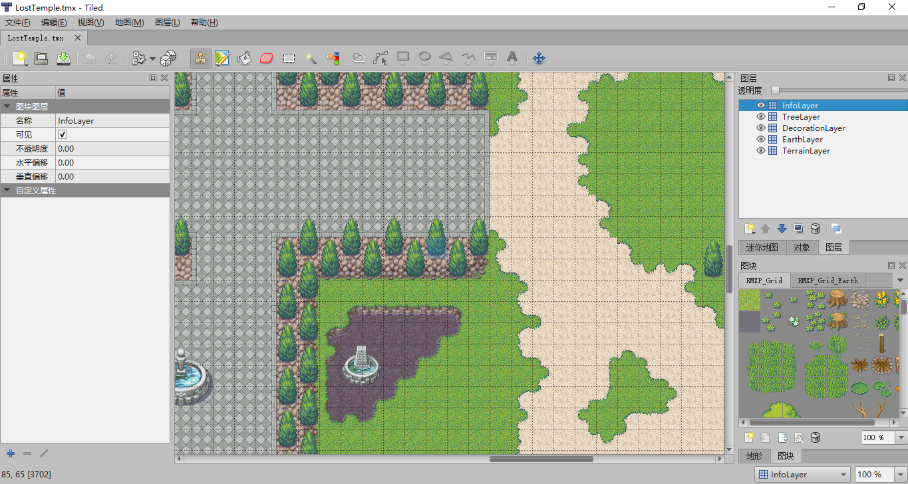
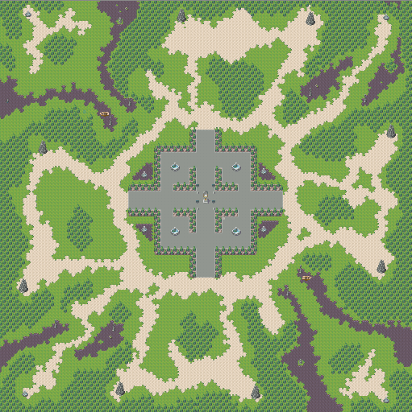
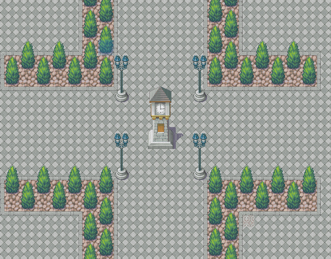
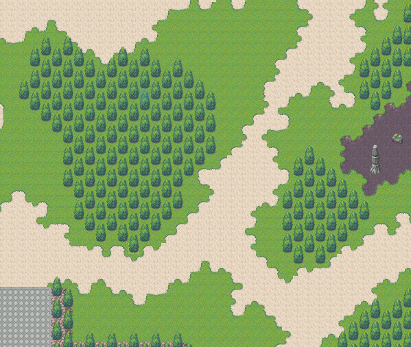
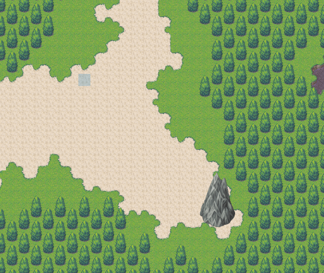
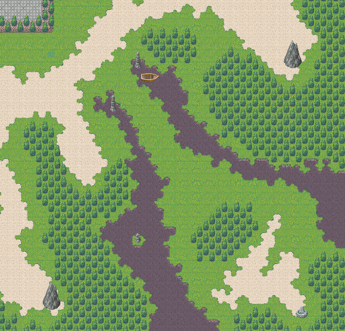

## 地图设计

[TOC]

### 概述

本游戏地图采用Tiled Map Editor进行制作。

### 软件信息

* **软件名** ：Tiled Map Editor
* **版本号** ：Tiled for Windows (64bit) - snapshot Version 2017.05.26
* **官网地址** ：http://www.mapeditor.org/
* **软件界面**：

### 地图信息

* **单个网格大小**：32px\*32px
* **地图尺寸**：128*128 (4096px\*4096px)
* **用到的素材图片**：
  * *RMXP_Grid.png* (256px\*15520px)
  * *RMXP_Grid_Earth.png* (256px\*96px)
* **地图层次**（从上到下）：
  * *InfoLayer*：信息层，为了方便，我们把所有的地图信息放在这个层，规定哪些网格可以通过，哪些网格不允许通过。这些都是通过地图块的自定义属性`int z_index`来判断的，若为0，则可以通过，反之无法通过。
  * *TreeLayer*：树木层，这一层用来放置树木和建筑。
  * *DecorationLayer*：装饰层，放置地图中央的石板广场。
  * *EarthLayer*：泥土层，放置沙地。
  * *TerrainLayer*：地形层，放置草地、水域及其接壤的地方。

### 地图设计

整个地图的设计参考RTS游戏*《魔兽争霸三：冰封王座》*中的地图*Lost Temple*，基本上为1:1复刻，只不过去除了高度信息。

* 原地图：

  

* 本游戏采用的地图：

  

地图上设有四个出生点，即游戏支持的最大在线人数为4.

* 地图图赏

  

  

  

  