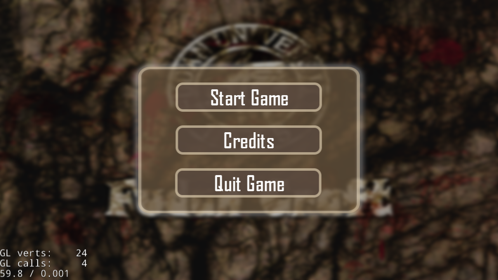
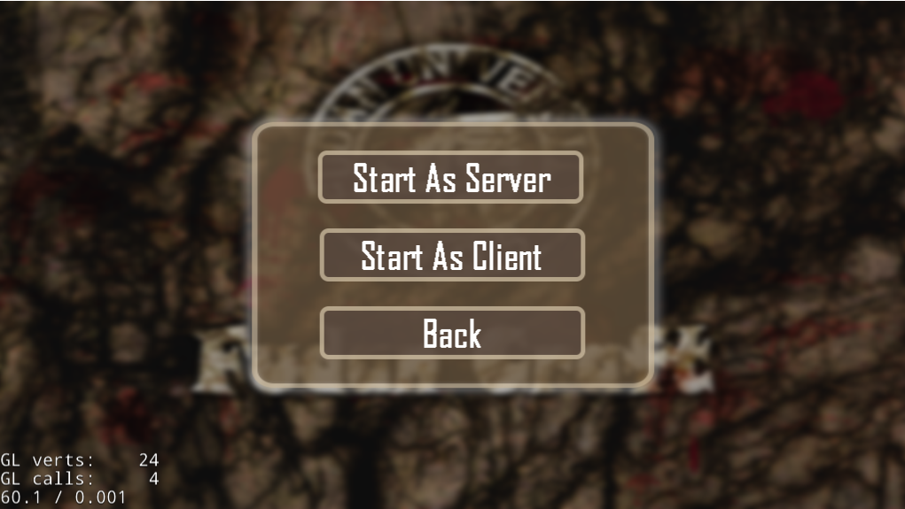
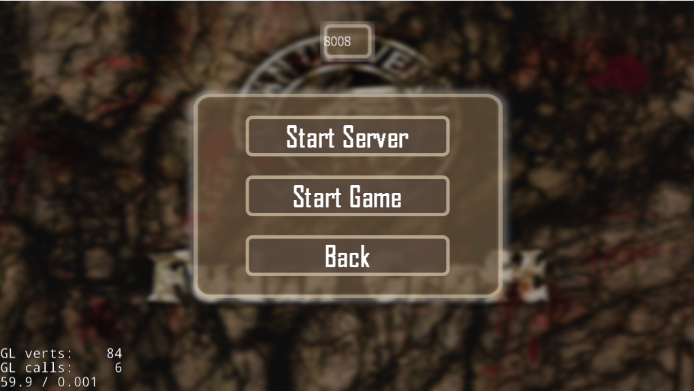
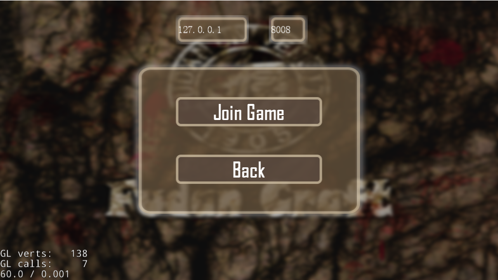
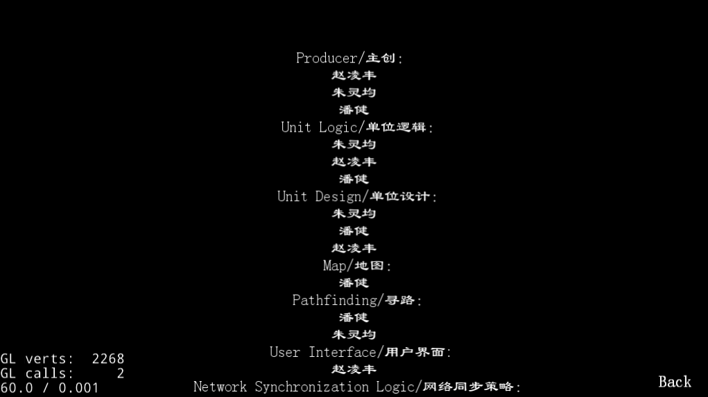
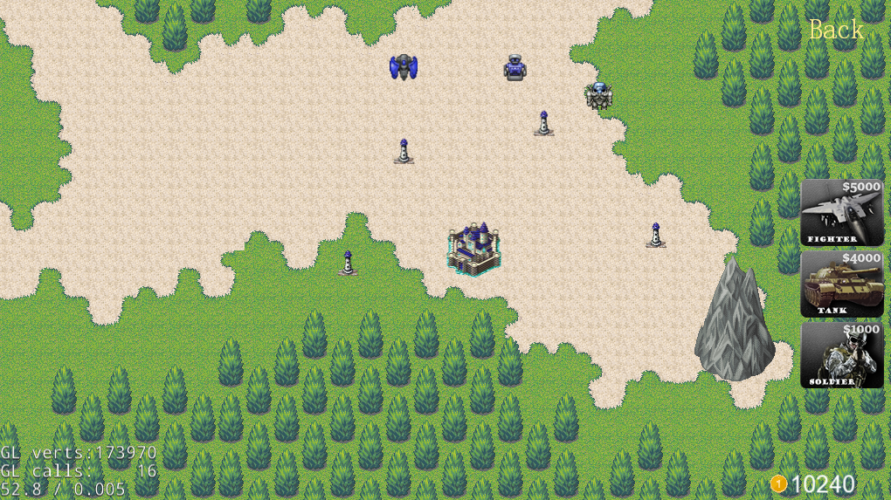
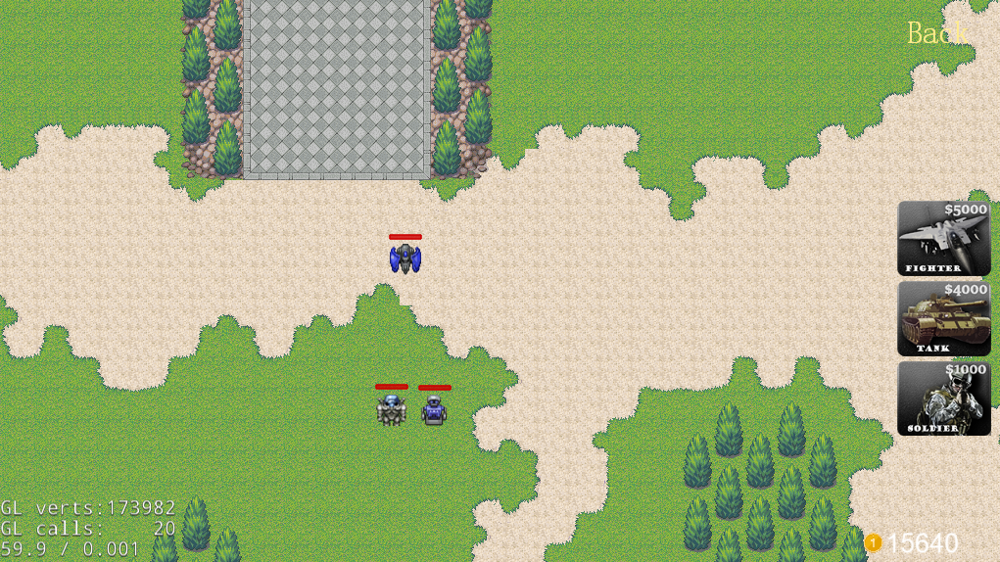
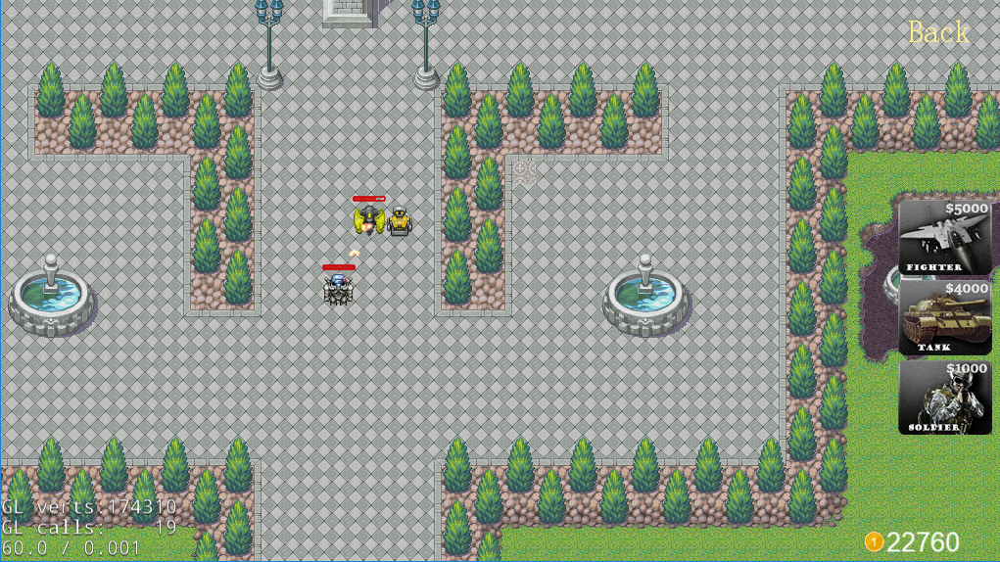
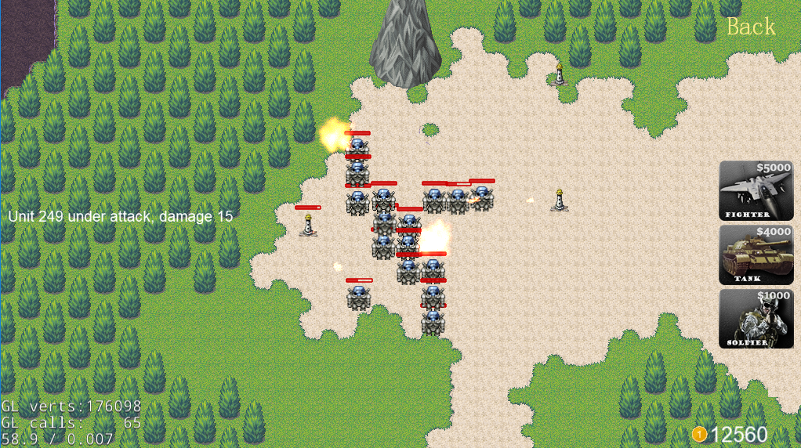

# FudanCraft用户手册

[TOC]

## 概述

### 游戏信息

* **游戏名**：FudanCraft
* **版本号**：v0.4.0
* **安装包大小**：107MB
* **更新日期**：2017/06/10

### 软硬件环境要求

* **运行平台**：Windows
* **所需硬盘空间** ：150MB
* **推荐配置**：可流畅运行于现有的大部分PC

### 安装与配置

下载游戏安装包到硬盘，解压后即可运行，无需特别配置运行环境

## 游戏简介

### 游戏框架

FudanCraft是一款即时战略游戏，地图布局为128\*128正方形的瓦片地图（目前尚不支持自定义地图），支持多人在线对战（最多四人），在游戏中玩家需充分利用基地持续产生的资源和击杀对方单位获得的资源，生产自己的单位，搭配不同兵种，运用大量的操作，在保护己方基地不被破坏的前提下，摧毁敌人的基地，从而取得最终的胜利。

### 游戏引擎

FudanCraft采用时下最流行的开源2D游戏引擎Cocos 2dx编写，引擎版本为3.14.1

* **Cocos 2dx 官网**： [http://www.cocos2d-x.org/](http://www.cocos2d-x.org/)
* **Cocos 2dx Github主页**： [https://github.com/cocos2d/cocos2d-x](https://github.com/cocos2d/cocos2d-x)

瓦片地图编辑使用Tiled Map Editor， 版本为 snapshop Version 2017.05.26

* **Tiled Map Editor 官网**： [http://www.mapeditor.org/](http://www.mapeditor.org/)
* **Tiled Map Editor Github主页**： [https://github.com/bjorn/tiled](https://github.com/bjorn/tiled)

### 资源

* **金钱**

  金钱是游戏中唯一的资源。游戏开始时，每个玩家会有10000的初始金钱，基地以固定的速率为玩家提供20/秒的金钱。每击杀一个敌方单位，玩家将获得该单位造价50%的金钱奖励。合理分配你的金钱，它将成为你取胜的跟本。

### 单位

* **步兵**

         

  > 基本作战单位，忠诚的勇士，低廉的造价使得玩家能迅速组建出一支庞大的步兵战队。虽然攻击力有限，但是灵巧的身手造就了他们卓越的出手速度。虽然身体略显单薄，但是他们绝对是你最值得信赖的队友。

  | 造价   | 最大生命值 | 攻击力  | 移动速度 | 攻击间隔 | 攻击范围 |
  | ---- | ----- | ---- | ---- | ---- | ---- |
  | 1000 | 80    | 5    | 2.0  | 10   | 100  |

* **坦克**

         

  > 强大的机械单位，阵地战中的绝对霸主。强大的防御装甲使它在战场上无惧于任何敌人的炮火，虽然总是被人嘲笑开火过程繁琐而冗长，但是无情的炮火能够对聚集在一起的敌人造成毁灭性的打击。妥善使用你的坦克，它将对战局的走向起主导作用。

  | 造价   | 最大生命值 | 攻击力  | 移动速度 | 攻击间隔 | 攻击范围 |
  | ---- | ----- | ---- | ---- | ---- | ---- |
  | 4000 | 250   | 10   | 2.5  | 45   | 150  |

* **战斗机**

   

  > 灵活的空中单位，即便造价昂贵，但它仍被大量的运用于战场上。高额的攻击力和超快的移动速度使人很难抗拒它的魅力，超大的攻击范围使得战斗机可以随时与对手保持安全距离。在战局焦灼时，可以试试派出一支战斗机编队，它们会为你带来意想不到的收获。

  | 造价   | 最大生命值 | 攻击力  | 移动速度 | 攻击间隔 | 攻击范围 |
  | ---- | ----- | ---- | ---- | ---- | ---- |
  | 5000 | 100   | 10   | 4.5  | 20   | 250  |

### 建筑

* **基地**

   

  > 玩家的大本营，能为玩家提供源源不断的金钱。虽然基地的防御很高，但是暴露在大量敌军的火力中时，仍然会在短时间内被摧毁。时刻记得保护你的基地，否则你将为之付出代价。

  * **生命值**：800

* **防御塔**

   

  > 基础防御建筑，对于少量部队，防御塔的火力是毁灭性的。在大部队离家的时候，防御塔能够保证玩家的基地不被偷袭。尽管防御塔无惧于任何单位的偷袭，但是依然不要忘记保护他们，没有了防御塔，基地的防御将形同虚设。

  * **生命值**：300
  * **攻击力**：15
  * **攻击间隔**：20
  * **攻击范围**：300

## 游戏界面

### 菜单界面

* **Start Game** ：开始游戏

  

  * **Start As Server** ：作为主机开始游戏

    

    * **Edit Port** ：设置主机端口（默认8008）
    * **Start Server** ：启动服务器
    * **Start Game** ：开始游戏（注意等待所有玩家连接成功，屏幕下方会显示当前连接的玩家数量）
    * **Back** ：返回上一级菜单

  * **Start As Client** ：作为客户机加入游戏

    

    * **Edit IP** ：编辑主机IP地址
    * **Edit Port** ：编辑主机端口
    * **Join Game** ：加入游戏（务必在注意开启服务之后才能加入游戏，屏幕下方会显示与主机的连接状况）
    * **Back** ：返回上一级菜单

  * **Back** ：返回上一级菜单

* **Credits**

  

  * **Back** ：返回上一级菜单

* **Quit Game** ：退出游戏

### 战斗界面

* **开始界面**

  

* **多单位寻路**

  

* **战斗画面**

  

* **攻击基地**

  

## 游戏玩法

* 选择单位

  * 点选

    > 鼠标左键点击一个友方单位，这个单位会被选中。

  * 框选

    > 按住鼠标左键不懂拖拽鼠标，屏幕上会出现绿色的矩形选框，松开鼠标，矩形框内所有的友方单位会被选中。

* 取消选择单位

  > 鼠标框选任意大小的空白地面，将会取消当前选中的单位。

* 移动

  > 鼠标左键单击空白地面，所有当前被选中的都会朝该地点移动。

* 攻击

  * 手动攻击

    > 鼠标左键单击敌方单位或建筑，所有当前被选中的都会移动到目标附近并对其进行攻击。

  * 自动攻击

    > 当有敌方单位进入攻击范围内，将会进行自动攻击。

* 屏幕移动和切换

  * 鼠标移动屏幕（推荐）

    > 鼠标移动到屏幕边缘，屏幕会朝该方向移动（越靠近边缘越快）。

  * 键盘移动屏幕（不推荐）

    > wasd对应上左下右，但移动速度较慢。

  * 键盘切换屏幕

    > 按空格键可以迅速将屏幕切回基地。

## 版权信息

本游戏由朱灵均、赵凌丰、潘健三人共同开发和维护，版权归三人共同拥有。未经本人允许，仍何人不得以盈利为目的对该游戏进行传播、改编和抄袭。违者应自行承担相关法律后果。

## 联系我们

如果你在使用过程中发现任何bug，或者对我们的游戏有任何建议，请访问本项目的[GitHub主页](https://github.com/PJ-FDU/fudancraft)提交issue，谢谢！