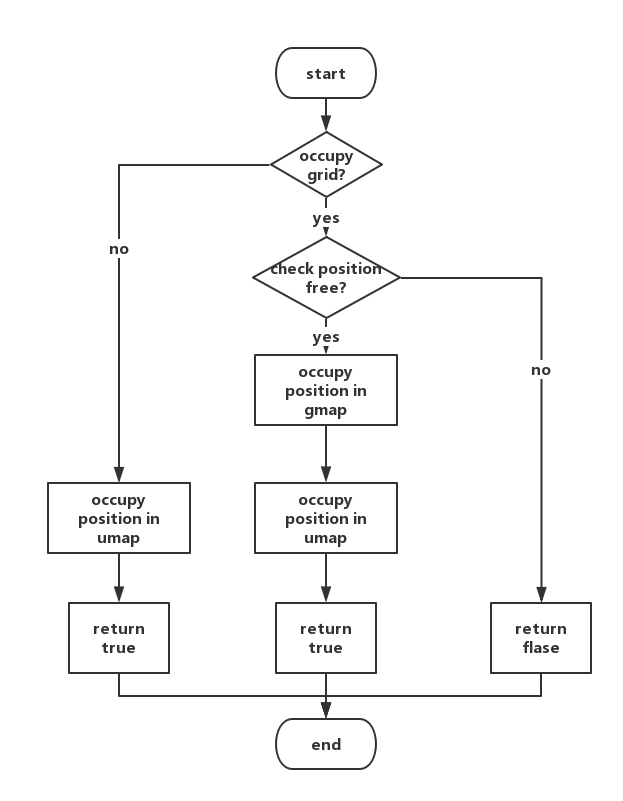

## 概述

## 内存管理机制

Cocos2d-x采用**根类** **`Ref `**，实现Cocos2d-x 类对象的**引用计数记录**。引擎中的所有类都派生自Ref。这种实现类似于`std::shared_ptr`，但是由于引擎由Objective-C发展而来，为了历史兼容性，选择通过实现不同于标准库的的内存管理方式来吸引更多Objective-C程序员。

### 引用计数

Cocos2d-x 提供引用计数管理内存。

调用 **`retain()`** 方法：令其引用计数增1，表示获取该对象的引用权。

调用 **`release()`** 方法：在引用结束的时候，令其引用计数值减1，表示释放该对象的引用权。
<<<<<<< HEAD
=======

调用 **`autorelease()`** 方法 ：将对象放入自动释放池。

当释放池自身被释放的时候，它就会对池中的所有对象执行一次`release()`方法，实现灵活的垃圾回收。

Cocos2d-x 提供 **AutoreleasePool**，管理自动释放对象。

当释放池自身被释放的时候，它就会对池中的所有对象执行一次`release()`方法。

### 内存管理

#### 工厂方法

在Cocos2d-x中，提供了大量的工厂方法创建对象。通过工厂化方法创建以实现对象的自动释放。如 Label 的 `create()`方法实现如下：

```c++
 Label* Label::create()
 {
     auto ret = new Label();
     if (ret)
         ret->autorelease();
     return ret;
 }
```

即创建了一个Label的对象，并对该对象执行`autorelease()`。表示该对象是自动释放的。使用工厂方法创建对象时，虽然引用计数也为1，但是由于对象已经被放入了释放池，因此调用者没有对该对象的引用权，除非我们人为地调用了`retain()`来获取引用权，否则，不需要主动释放对象。

#### Node 的 addChild() / removeChild 方法

在Cocos2d-x中，所有继承自Node类，在调用 `addChild()` 方法添加子节点时，自动调用了retain。 对应的通过 `removeChild()`，移除子节点时，自动调用了`release()`。

调用`addChild()`方法添加子节点，节点对象执行`retain()`。子节点被加入到节点容器中，父节点销毁时，会销毁节点容器释放子节点。对子节点执行`release()`。如果想提前移除子节点我们可以调用`removeChild()`。

在Cocos2d-x内存管理中，大部分情况下通过调用 `addChild()`/`removeChild()` 的方式自动完成了`retain()`,`release()`调用。不需再调用`retain()`，`release()`。

## 更新调度机制
>>>>>>> b7ad811719d971e04a0b6ec2549d328fc51bb124

调用 **`autorelease()`** 方法 ：将对象放入自动释放池。

当释放池自身被释放的时候，它就会对池中的所有对象执行一次`release()`方法，实现灵活的垃圾回收。

Cocos2d-x 提供 **AutoreleasePool**，管理自动释放对象。

当释放池自身被释放的时候，它就会对池中的所有对象执行一次`release()`方法。

### 内存管理

#### 工厂方法

在Cocos2d-x中，提供了大量的工厂方法创建对象。通过工厂化方法创建以实现对象的自动释放。如 Label 的 `create()`方法实现如下：

```c++
 Label* Label::create()
 {
     auto ret = new Label();
     if (ret)
         ret->autorelease();
     return ret;
 }
```

即创建了一个Label的对象，并对该对象执行`autorelease()`。表示该对象是自动释放的。使用工厂方法创建对象时，虽然引用计数也为1，但是由于对象已经被放入了释放池，因此调用者没有对该对象的引用权，除非我们人为地调用了`retain()`来获取引用权，否则，不需要主动释放对象。

#### Node 的 addChild() / removeChild 方法

在Cocos2d-x中，所有继承自Node类，在调用 `addChild()` 方法添加子节点时，自动调用了retain。 对应的通过 `removeChild()`，移除子节点时，自动调用了`release()`。

调用`addChild()`方法添加子节点，节点对象执行`retain()`。子节点被加入到节点容器中，父节点销毁时，会销毁节点容器释放子节点。对子节点执行`release()`。如果想提前移除子节点我们可以调用`removeChild()`。

在Cocos2d-x内存管理中，大部分情况下通过调用 `addChild()`/`removeChild()` 的方式自动完成了`retain()`,`release()`调用。不需再调用`retain()`，`release()`。

# 战场场景

战场场景是FudanCraft游戏的核心部分，也是和用户交互的主要界面。

## 战场场景需求分析

作为一个交互性、娱乐性、竞技性较强的RTS游戏，FudanCraft的战场场景需要实现以下一些几项主要功能：

* 将战场地图和战场地图上地图单位的实时运动情况展现给用户；
* 允许用户通过鼠标移动或键盘按键移动视角，观察整个地图，并灵活切换视角，观察基地等关键位置；
* 允许用户通过鼠标的点击、拖框等操作完成选中单位、移动单位和下达攻击命令等游戏操作；
* 提供菜单，允许用户通过点击菜单创建单位；
* 显示金钱增减、单位被攻击、摧毁和最后的胜利提示等重要的游戏消息；
* 播放动感的背景音乐，给用户提供良好的视听体验


游戏场景的具体操作方法和交互模式在用户手册中有详细描述。

## 战场场景相关的数据结构

战场场景的逻辑主要在`class BattleScene`类中实现，与战场场景相关的类还有`class ControlPanel`等。

### BattleScene类

BattleScene类是战场场景的主要部分，包含战场地图、鼠标操作、金钱显示、游戏消息显示等功能部件，BattleScene类实现了这些功能部件的初始化和调度。

BattleScene直接继承自`cocos2d::Layer`，是一个完整的cocos2d图层，便于初始化、更新和场景切换。BattleScene类中重要的属性如下表所示：

| 变量名            | 类型                    | 结构   | 种类      | 初值      | 含义     |
| -------------- | --------------------- | ---- | ------- | ------- | ------ |
| player_id      | int                   | 普通变量 | private | 0       |        |
| socket_server  | SocketServer*         | 指针   | private | nullptr | 服务器套接字 |
| socket_client  | SocketClient*         | 指针   | private | nullptr | 客户端套接字 |
| battle_map     | cocos2d::TMXTiledMap* | 指针   | private | nullptr | 瓦片地图   |
| grid_map       | GridMap*              | 指针   | private | nullptr | 格点地图   |
| unit_manger    | UnitManager*          | 指针   | private | nullptr | 单位管理器  |
| control_panel_ | ControlPanel*         | 指针   | private | nullptr | 控制面板   |
| mouse_rect     | MouseRect*            | 指针   | private | nullptr | 鼠标选框   |
| money          | Money*                | 指针   | private | nullptr | 金钱     |
| notice         | Notice*               | 指针   | private | nullptr | 游戏提示   |
| msg_set        | GameMessageSet        | 类对象  | public  | 未初始化    | 游戏消息集  |

Battle类的重要方法如下：

* `static BattleScene* create(SocketClient* _socket_client, SocketServer* _socket_server);`按照cocos2d内存管理方式创建BattleScene对象，返回指向新对象的指针
* `virtual bool init(SocketClient* _socket_client, SocketServer* _socket_server);`初始化战场场景和内部的各个控件


* `void win();`通知战场场景游戏胜利结束，显示消息并禁止后续操作
* `void lose();`通知战场场景游戏以失败结束，显示消息并禁止后续操作
* `void update(float f) override;`战场场景的更新函数
* `bool onTouchBegan(cocos2d::Touch*, cocos2d::Event*)override;`触摸开始事件回调函数
* `void onTouchMoved(cocos2d::Touch*, cocos2d::Event*)override;`触摸移动事件回调函数
* `void onTouchEnded(cocos2d::Touch*, cocos2d::Event*)override;`触摸结束事件回调函数
* `void onKeyPressed(cocos2d::EventKeyboard::KeyCode, cocos2d::Event *) override;按键事件回调函数`
* `void scrollMap();`地图滚动函数
* `void focusOnBase();`将视角集中到当前用户的基地
* `void destroyReward(int destroyed_type);`获取击毁地方单位的奖励
* `void menuBackCallback(cocos2d::Ref* pSender);`

### MouseRect类

MouseRect类是用户通过触摸移动或按住拖动鼠标的操作，在地图上拖动出矩形这一功能的抽象。MouseRect需要实现在地图移动和视角变化时灵活变化形状的功能。

MouseRect继承自`cocos2d::DrawNode`，`cocos2d::DrawNode`是cocos2d引擎提供的基础绘图类，可以灵活地画出空心、实心矩形多边形等基础形状。MouseRect的主要属性有：

| 变量名         | 类型             | 结构   | 种类     | 初值   | 含义     |
| ----------- | -------------- | ---- | ------ | ---- | ------ |
| touch_start | cocos2d::Point | 类对象  | public | 未初始化 | 触摸开始点  |
| touch_end   | cocos2d::Point | 类对象  | public | 未初始化 | 触摸结束点  |
| start       | cocos2d::Point | 类对象  | public | 未初始化 | 选框开始端点 |
| end         | cocos2d::Point | 类对象  | public | 未初始化 | 选框结束端点 |

MouseRect的重要方法有：

* `void update(float f) override;`鼠标矩形的更新函数

### Money类

Money类用于存储和管理用户当前持有的金钱，并在战场场景中更新和显示金钱的数值。

Money类继承自`cocos2d::LabelBMFont`，便于金钱数值的显示和快速更新。

Money类的重要属性如下：

| 变量名     | 类型   | 结构   | 种类      | 初值                | 含义     |
| ------- | ---- | ---- | ------- | ----------------- | ------ |
| money   | int  | 普通变量 | private | 0                 | 当前金钱数值 |
| timer   | int  | 普通变量 | private | 0                 | 计时器    |
| inc_prd | int  | 普通变量 | private | 宏MONEY_INC_PERIOD | 金钱增加周期 |
| inc_amt | int  | 普通变量 | private | 宏MONEY_INC_AMOUNT | 金钱增加数量 |

Money类的重要方法如下：

* `void update(float f) override;`金钱自动更新函数，使金钱每隔一段时间增加一定数值
* `bool init() override;`金钱初始化函数，初始化金钱为某一固定数值，读取BM字体集，并进行显示
* `void updateMoneyDisplay();`更新金钱的显示
* `bool checkMoney(int cost) const;`检查金钱是否足够
* `void spendMoney(int cost);`花掉数值等于cost的金钱，即金钱数量减少cost
* `void increaseMoney(int amount);`金钱数量增加amount

### Notice类

Notice类用于显示重要的游戏提示。Notice类实现了游戏提示的更新、定时消失和固定显示。

Notice类继承自`cocos2d::LabelBMFont`，便于游戏提示的显示和快速更新。

Notice类的重要属性如下：

| 变量名      | 类型   | 结构   | 种类      | 初值   | 含义     |
| -------- | ---- | ---- | ------- | ---- | ------ |
| ntc_life | int  | 普通变量 | private | 0    | 提示显示寿命 |
| timer    | int  | 普通变量 | private | 0    | 计时器    |

Notice类的重要方法如下：

* `void update(float f) override;`游戏提示的更新函数，实现游戏提示的定时消失
* `void displayNotice(std::string ntc, int _ntc_life);`显示提示函数，显示字符串ntc对应的游戏提示，定时_ntc_life后消失
* `void displayNotice(std::string ntc);`显示提示函数的重载，显示字符串ntc对应的游戏提示，固定显示不消失
* `bool init() override;`游戏提示初始化，初始提示为"Welcome to FudanCraft!"，读取BM字体集，并进行显示

### ControlPanel类

ControlPanel类用以实现单位的生产按键，并做简单的金钱检测。

ControlPanel类继承自`cocos2d::Menu`，实现按钮功能，并方便扩充更多单位的制作。

ControlPanel的重要属性如下：

| 变量名     | 类型                      | 结构   | 种类      | 初值      | 含义     |
| ------- | ----------------------- | ---- | ------- | ------- | ------ |
| fighter | cocos2d::MenuItemImage* | 指针   | private | nullptr | 飞机生产按钮 |
| tank    | cocos2d::MenuItemImage* | 指针   | private | nullptr | 坦克生产按钮 |
| soldier | cocos2d::MenuItemImage* | 指针   | private | nullptr | 士兵生产按钮 |

ControlPanel的重要方法如下：

*   `bool init() override;`初始化按键
*   `void setFighterCallback(std::function<void(Ref*)>);`设置战斗机按键回调函数
*   `void setTankCallback(std::function<void(Ref*)>);`设置坦克按键回调函数
*   `void setSoldierCallback(std::function<void(Ref*)>);`设置士兵按键回调函数


<<<<<<< HEAD
=======

>>>>>>> b7ad811719d971e04a0b6ec2549d328fc51bb124
## 战场场景相关的重要算法

### 视角移动与地图滚动的实现

视角移动非常重要，在RTS游戏中，许多精彩的操作都需要使用快速的视角移动与地图滚动来实现。

在本游戏中，实现了通过摁键盘的WSAD以及鼠标移动至屏幕边缘来移动视角，同时增加了摁空格键将主基地移动至屏幕中央的功能，方便组织防守。

#### 移动的实现

视角的移动是通过改变地图在屏幕上的坐标来实现，通过改变相对坐标来实现地图的滚动。

#### 鼠标滚动的实现

在鼠标滚动的实现中，通过`cocos2d::EventListenerMouse::onMouseMove`来获取鼠标的坐标，并将其存入`crusor_position`中。同时在`void BattleScene::update(float f)`函数中调用`void BattleScene::scrollMap()`进行屏幕的滚动。而在鼠标位置侦测中，采用了2倍速方式，即鼠标离边缘越近速度越快，同时支持八个方向的滚动。


如图，通过判断鼠标坐标和不同边的距离将屏幕划分成了25个区域。当鼠标在白色区域里时，屏幕不滚动；当鼠标在粉色和青色范围内，分别实现向相应方向的一倍速滚屏；当鼠标在绿色和橙色范围内时，实现向相应方向的二倍速移动；而在蓝色区域内时，实现相应的向一个方向一倍速移动而向另一个方向二倍速移动。

#### 空格跳转至基地的实现

空格的侦测通过`cocos2d::EventListenerKeyboard::onKeyPressed`来获取，当感知到空格键的按下后，将调用`void BattleScene::focusOnBase()`函数来将基地设为当前焦点。从而实现摁下空格跳转至基地。

### 鼠标选框的实现

鼠标选框是RTS游戏中常见的交互方式，是指用户按压鼠标或触摸板并移动时，在屏幕上拖出一个矩形框，对框中的单位进行选中操作。需要注意的是，鼠标选框应该依附在地图上，随着地图移动；当视角变化、地图滚动时，鼠标选框应随之变形，进而覆盖更大的范围。

鼠标选框的功能主要在MouseRect类中实现，接收BattleScene类传递的鼠标（触摸）消息，依附在TMXTiledMap类的对象battle_map战场地图上显示。

具体的顺序图如下所示：

```mermaid
sequenceDiagram
	User->>+BattleScene: Start Game
    BattleScene->>+MouseRect: Initialize  
    MouseRect-->>-BattleScene: Pointer to new object
    BattleScene->>TiledMap: Add child
    User->>BattleScene: Touch start
    BattleScene->>+MouseRect: Set touch start point
    User->>BattleScene: Touch move
    BattleScene->>MouseRect: Set touch end point
    MouseRect->>+TiledMap: Check battle map position
    TiledMap-->>-MouseRect: Return battle map position
    MouseRect->>MouseRect: Update
    User->>BattleScene: Touch end
    BattleScene->>MouseRect: Query select rect
    MouseRect->>BattleScene: Return select rect
    User->>-BattleScene: Quit Game
    
```

当鼠标按压移动时，BattleScene会将MouseRect添加到自动更新update队列中。cocos2d引擎的场景导演会定时调用`MouseRect::update()`更新函数，在更新函数中MouseRect会查询战场地图的位置，实现鼠标选框的变形显示，具体关系如下图所示：


当视角移动、地图滚动时，鼠标选框的端点应该是当前鼠标拖动向量和地图滚动向量的差，在update()函数中定时进行运算，就可以实现鼠标选框的连续变化。

# 地图

地图是RTS游戏的关键部分，单位的创建、移动都与地图密切相关。在FudanCraft中，实际上有两层地图：一层是用于显示的瓦片地图，直接采用了`coocos2d::TMXTiledMap`；另一层是用于运算的逻辑（格点）地图，主要由`class GridMap`类实现。两层地图结合，实现了单位运动的实时显示、碰撞检测、寻路查找等功能。

## 地图需求分析

作为一个复杂性较强的RTS游戏，FudanCraft的地图需要满足以下几项用户需求：

* 提供较大的地图，使得3到4个用户同时进行游戏时都有自由的游戏空间，可以进行大型、激烈的战斗
* 提供复杂的地形，模拟真实的战场情况，使得单位在地图上运动的方式更加复杂多变，提高游戏的挑战性和娱乐性
* 地图上要提供初始的基地、单位等信息，用于场景和单位的初始化，使得游戏初期就能进行激烈的交锋

## 地图的设计思路

由于FudanCraft游戏的地图较大，在显示层我们采用了cocos2d引擎提供的瓦片地图类`cocos2d::TMXTiledMap`。瓦片地图是将整个地图划分为若干个小块，采用小纹理图片连续贴图，这样可以大大提高显示的性能。

在逻辑层，我们设计了与瓦片地图对应的格点地图GridMap，将地图划分为128x128个大小相等的正方形，每个正方形对应瓦片地图中的一个瓦片。每个单位在移动时可以连续地平滑移动，但都会静止在一个格点的中央附近。每个格点同时只能被一个单位占据，这样就避免了单位的重叠。单位的移动、攻击、搜索敌人等操作也都是通过格点地图进行的。格点地图的实现主要在GridMap类中，将在地图的相关算法一节中详细叙述。瓦片地图与格点地图的关系如下图所示：


瓦片地图用于显示，提供了各种瓦片的信息，地形能否通过的信息以及初始化单位的信息；格点地图用于运算，储存了格点是否被占据的信息以及占据单位ID的信息。

## 地图相关的数据结构

### GridPoint类

GridPoint类是一个简单结构，用来表示格点坐标，提供加、减、相等等运算符重载，类似于`cocos2d::Point`，但Point的坐标是浮点数，而GridPoint的格点坐标用整数表示。GridPoint类的属性如下：

| 变量名  | 类型   | 结构   | 种类     | 初值   | 含义       |
| ---- | ---- | ---- | ------ | ---- | -------- |
| x    | int  | 普通变量 | public | 0    | 格点的整数横坐标 |
| y    | int  | 普通变量 | public | 0    | 格点的整数纵坐标 |

重要的方法如下：

* `bool operator==(const GridPoint& gp2) const;`相等运算符重载
* `friend GridPoint operator+(const GridPoint& gp1, const GridPoint& gp2);加运算符重载`
* `friend GridPoint operator-(const GridPoint& gp1, const GridPoint& gp2);`减运算符重载
* `GridPoint getDirectionVector();`获得方向向量

### GridPath类型

GridPath类型表示一系列格点坐标构成的格点路径，用于单位的寻路移动。实际上是`std::vector<GridPoint>`的一个重定义，即`typedef std::vector<GridPoint>  GridPath;`。

### GridSize类

GridSize类用于表示一个格点矩形的大小，类似于`cocos2d::Size`，但Size的长宽是浮点数，而GridSize的长宽用整数表示。GridSize类的属性如下：

| 变量名    | 类型   | 结构   | 种类     | 初值   | 含义      |
| ------ | ---- | ---- | ------ | ---- | ------- |
| width  | int  | 普通变量 | public | 0    | 格点矩形的宽度 |
| height | int  | 普通变量 | public | 0    | 格点矩形的高度 |

重要方法如下：

* `friend GridSize operator/(const GridSize& gz, int s);`除运算符重载，将长宽都整除系数s

### GridRect类

GridRect类用于表示一个格点矩形，类似于`cocos2d::Rect`，但GridRect的端点和大小是用GridPoint 和GridSize表示的。GridRect类的属性如下：

| 变量名  | 类型        | 结构   | 种类     | 初值              |
| ---- | --------- | ---- | ------ | --------------- |
| gp   | GridPoint | 类对象  | public | GridPoint(0, 0) |
| size | GridSize  | 类对象  | public | GridSize(0, 0)  |

重要方法如下：

* `GridRect(GridPoint _gp = GridPoint(), GridSize _size = GridSize()) : gp(_gp), size(_size) {}`构造函数，由左下角的端点和矩形大小构造一个矩形

### GridMap类

GridMap类是格点地图，用于寻路、格点占据判断、临近单位搜索、临近空位搜索等逻辑运算。GridMap类的属性如下：

| 变量名         | 类型                              | 结构   | 种类      | 初值   | 含义                |
| ----------- | ------------------------------- | ---- | ------- | ---- | ----------------- |
| gmap        | std::vector\<std::vector\<int>> | 类对象  | private | 未初始化 | 格点层，记录格点是否被占据     |
| umap        | std::vector\<std::vector\<int>> | 类对象  | private | 未初始化 | 单位ID层，记录占据格点的单位ID |
| map_width   | int                             | 普通变量 | private | 未初始化 | 地图宽度（格点数）         |
| map_height  | int                             | 普通变量 | private | 未初始化 | 地图高度（格点数）         |
| grid_width  | int                             | 普通变量 | private | 未初始化 | 格点宽度（像素）          |
| grid_height | int                             | 普通变量 | private | 未初始化 | 格点高度（像素）          |
| offset_vec  | cocos2d::Vec2                   | 类对象  | private | 未初始化 | 偏移向量              |

重要方法如下：

* `bool checkPointInMap(const GridPoint& gp) const;`检查格点gp是否在格点地图范围内，避免越界
* `bool checkPosition(const GridPoint& gp);`检查格点gp是否被占据
* `bool checkPosition(const GridRect& grec);`检查格点矩形grec是否被占据
* `bool occupyPosition(int id, const GridPoint& pos, bool occupy_grid = true);`尝试占据格点pos
* `bool occupyPosition(int id, const GridRect& grec, bool occupy_grid = true);`尝试占据格点矩形grec
* `void leavePosition(const GridPoint& pos, bool occupy_grid = true);`离开格点pos
* `void leavePosition(const GridRect& grec, bool occupy_grid = true);`离开格点矩形grec
* `int getUnitIDAt(const GridPoint& gp) const;`获取格点gp处单位ID
* `std::vector<int> getUnitIDAt(const GridRect& range) const;`获取格点矩形range范围内所有单位ID
* `cocos2d::Point getPoint(const GridPoint& gp);`得到格点gp对应的点坐标
* `GridPoint getGridPoint(const cocos2d::Point& p);`得到点p对应的格点坐标
* `cocos2d::Point getPointWithOffset(const GridPoint& gp);`得到格点gp对应的点坐标（考虑格点带来的偏移）
* `GridPoint getGridPointWithOffset(const cocos2d::Point& p);`得到点p对应的格点坐标（考虑格点带来的偏移）
* `std::vector<std::vector<int>>& getLogicalGridMap();`得到格点层的逻辑地图
* `GridPoint findFreePositionNear( const GridPoint& gp);`查找距格点gp最近的空闲的格点
* `bool hasApproached(const cocos2d::Point& cur_fp, const GridPoint& dest_gp);`检查点cur_fp是否靠近格点dest_gp中央

## 地图相关的重要算法

### 格点的检查、占据与离开

格点层gmap是一个128x128的二维整形vector对象，记录了每个格点是否被占据的信息，被占据的格点记为1，没有被占据的格点记为0。单位ID层umap也是一个128x128的二维整形vector对象，记录了占据每个格点的单位ID，没有被占据的格点数值为0。GridMap类提供了检查格点、占据格点和离开格点的一系列API，与单位类Unit交互，实现了碰撞检测、障碍物信息查询等功能。

格点检查函数checkPosition()包括一系列重载函数，用于检测格点是否可以占据，如果输入变量是一个GridPoint类型的格点gp，首先要检测gp是否越界，如果不越界则检查gmap中对应坐标的位置是否为0，如果为0则该格点当前没有被占据，返回真；否则说明该格点已经被占据，返回假；如果gp越界，则直接返回假。如果输入变量是一个GridRect类型的格点矩形grec，则需要逐一检查grec内部每一个格点是否被占据，如果都没有被占据才返回真，否则返回假。

格点占据函数occupyPosition()也包括两个重载函数，分为两种情况，由bool参数occupy_grid确定：如果occupy_grid为真，则既占据gmap也占据umap；如果occupy_grid为假，则只占据umap而不占据gmap。这是因为有些单位在移动过程中并不真正地占据格点，比如战斗机单位，但需要在umap中添加ID以便于搜索敌人、自动攻击等功能的实现。默认occupy_grid参数为真。格点占据函数的流程图如下所示：



如果输入参数是GridRect类型的grec，那么程序会先调用checkPosition(grec)检查这个格点矩形是否被占据，如果没有被占据则逐一占据这个矩形中的所有格点。

格点离开函数leavePosition()也是一系列重载函数，与occupyPosition()相反，用于消除gmap和umap上占据的格点。也分为occupy_grid为真和为假的两种情况。

### 邻近空位搜索算法

单位创建和寻路搜索过程中，常常出现当前设定的目标位置已被占据，无法到达的情况，这时候就需要搜索目标位置附近的空闲位置。在	`GridPoint GridMap::findFreePositionNear(const GridPoint& origin_gp)`函数中实现了格点origin_gp邻近空闲位置的搜索功能。

如果要找到离origin_gp最近的空闲格点，需要按照圆周逐一遍历origin_gp附近的格点，并逐渐增大圆周的半径。但这种方法需要用到复杂的浮点运算，效率不高；而邻近空位搜索算法的调用频率较高，不适合用这种方法。

也可以采用列表的方法，把邻近格点的偏移向量保存在一个数组或vector中，如{{0, 0}, {0, 1}, {1, 0}, {0, -1}, {-1, 0}, ......}。但这种方法保存的格点偏移向量数量有限，如果在这些格点中没有找到空闲位置，程序就无法做出正确的反应。而在RTS游戏中，常常出现巨大的障碍物或很多单位聚在一起的情况，如果无法找到空位单位的移动就会出现问题，因此对邻近空位搜索算法的可靠性要求较高。

我们最后采用的是一种“菱形查找”的方法。按照菱形的轮廓逐一遍历origin_gp周围的格点，并逐渐增大菱形的尺寸。具体的遍历顺序如下图所示：

|         |           |           |           |         |         |        |
| ------- | --------- | --------- | --------- | ------- | ------- | ------ |
|         |           |           | (0, 3)    |         |         |        |
|         |           | (-1, 2)   | (0, 2)    | (1, 2)  |         |        |
|         | (-2, 1)   | (-1, 1)   | (0, 1)    | (1, 1)  | (2, 1)  |        |
| (-3, 0) | (-2, 0)   | (-1, 0)   | origin_gp | (1,  0) | (2, 0)  | (3, 0) |
|         | (-2,  -1) | (-1,  -1) | (0, -1)   | (1, -1) | (2, -1) |        |
|         |           | (-1,  -2) | (0, -2)   | (1, -2) |         |        |
|         |           |           | (0, -3)   |         |         |        |

用数学的方法表示就是遍历满足|x| + |y| = i的所有(x, y)，i = 1, 2, 3, ...，检查origin_gp + (x, y)是否空闲。菱形查找得到的空闲点可能不是离origin_gp最近的，但可以正确查找到距origin_gp较近的空闲位置，并且查找效率较高，查找的范围无限大。最后在游戏中使用的效果较好。

# 单位

单位是FudanCraft游戏的重要组成部分，也是很有特色的内容。单位的实现主要分为三部分：单位本身、单位的附加效果、单位管理器。

## 单位的需求分析

* 单位需要接受鼠标操作或网络模块传递的信息，实现创建、移动、攻击等基本功能
* 单位要有寻路能力，可以自动避开障碍地形，多单位共同移动时不会重合，途中遇到障碍物时会自动重新寻路，沿最短路径到达指定地点
* 多单位可以共同移动、寻路、攻击，实现大军团作战的效果，使游戏对抗更加激烈
* 需要有多种特色单位，单位的移动、攻击方式各具特色，实现多兵种协同作战
* 还有具有特殊功能的建筑，使游戏的玩法复杂多变，富有特色
* 各种单位的生命值、攻击力、价格等数值设定互不相同，使游戏的策略性更强
* 单位还具有追踪敌人、自动搜索敌人、自动攻击等高级功能，减少用户的操作负担
* 单位的有血条显示、攻击弹道等附加效果，使用户能够清楚地了解单位的状态
* 单位受伤、被击毁、基地被摧毁都产生游戏提示，提醒用户进行防御
* 单位创建、被摧毁、基地被攻击产生音效，提示用户的同时提升用户的视听感受

## 单位相关的数据结构

### Unit类

Unit类是各种单位的基类，预留了单位的各项数值属性，设置了创建、移动、攻击等基础接口，实现了寻路和重新寻路策略， 完成了自动搜索敌人、自动攻击等高级功能的实现，添加了血条、粒子效果、提示、音效等和用户交互的控件。Unit类的重要属性如下：

| 变量名            | 类型                   | 结构   | 种类      | 初值             | 含义               |
| -------------- | -------------------- | ---- | ------- | -------------- | ---------------- |
| id             | int                  | 普通变量 | public  | 未初始化           | 单位ID             |
| camp           | int                  | 普通变量 | public  | 0              | 阵营               |
| z_index        | int                  | 普通变量 | public  | 未初始化           | z轴高度             |
| unit_manager   | UnitManager*         | 指针   | public  | nullptr        | 单位管理器            |
| timer          | int                  | 普通变量 | private | 0              | 计时器              |
| state          | int                  | 普通变量 | private | 0              | 单位状态             |
| moving         | bool                 | 普通变量 | private | false          | 移动标志位            |
| tracing        | bool                 | 普通变量 | private | false          | 追踪标志位            |
| stalling       | bool                 | 普通变量 | private | false          | 延迟寻路标志位          |
| auto_atking    | bool                 | 普通变量 | private | false          | 自动攻击标志位          |
| target_id      | int                  | 普通变量 | private | 0              | 攻击目标单位的ID        |
| grid_path      | GridPath             | 类对象  | private | vector默认初始化    | 格点路径             |
| final_dest     | GridPoint            | 类对象  | private | GridPoint默认初始化 | 最终目的地格点          |
| cur_pos        | GridPoint            | 类对象  | private | GridPoint默认初始化 | 当前所处格点           |
| cur_dest       | GridPoint            | 类对象  | private | GridPoint默认初始化 | 当前目的地格点          |
| target_lastpos | GridPoint            | 类对象  | private | GridPoint默认初始化 | 上次查询到的攻击目标单位所处格点 |
| size           | GridSize             | 类对象  | private | GridSize默认初始化  | 单位所占的格点矩形大小      |
| cur_rect       | GridRect             | 类对象  | private | GridRect默认初始化  | 单位当前所占的格点矩形      |
| rfp_cnt        | int                  | 普通变量 | private | 0              | 重新寻路计数器          |
| roc_cnt        | int                  | 普通变量 | private | 0              | 重新占据格点计数器        |
| stl_cnt        | int                  | 普通变量 | private | -1             | 延迟寻路计数器          |
| type           | int                  | 普通变量 | private | 未初始化           | 单位类型             |
| cd             | int                  | 普通变量 | private | 未初始化           | 单位攻击延时           |
| hp             | int                  | 普通变量 | private | 未初始化           | 单位生命值            |
| mobile         | bool                 | 普通变量 | private | false          | 单位能否移动           |
| atk            | int                  | 普通变量 | private | 未初始化           | 单位攻击力            |
| atk_range      | int                  | 普通变量 | private | 未初始化           | 单位攻击范围           |
| hp_max         | int                  | 普通变量 | private | 未初始化           | 单位生命最大值          |
| cd_max         | int                  | 普通变量 | private | 未初始化           | 单位攻击延时           |
| move_speed     | float                | 普通变量 | private | 未初始化           | 单位移动速度           |
| auto_atk_freq  | int                  | 普通变量 | private | 未初始化           | 自动攻击频率           |
| auto_atk_range | GridSize             | 类对象  | private | GridSize默认初始化  | 自动攻击范围           |
| tiled_map      | cocos2d::TMXTiledMap | 指针   | private | nullptr        | 瓦片地图             |
| grid_map       | GridMap*             | 指针   | private | nullptr        | 格点地图             |
| hpbar          | Bar*                 | 指针   | private | nullptr        | 血条               |
| flag           | coco2d::DrawNode*    | 指针   | private | nullptr        | 旗帜               |

重要方法有：

* `virtual void setProperties();`设置单位属性
* `virtual void update(float f) override;`单位的更新函数
* `virtual void initBars();`初始化血条等状态条
* `void displayHPBar(int _disp_time = 0);`显示血条
* `virtual void addToMaps(const GridPoint & crt_gp, cocos2d::TMXTiledMap* _tiled_map, GridMap* _grid_map);`添加单位到瓦片地图和格点地图
* `void setGridPath(const MsgGridPath& _grid_path);`用网络传来的消息设置格点路径
* `virtual void motivate();`命令单位移动
* `void abandonTracing();`放弃追踪当前目标
* `bool hasArrivedAtDest();`判断是否到达当前目的格点
* `bool underAttack(int damage);`单位受到伤害
* `void tryToFindPath();`尝试进行寻路
* `virtual void move();`移动函数
* `virtual void attack();`攻击函数
* `void stall();`延时寻路函数
* `void trace();`追踪函数
* `void auto_atk();`自动攻击函数
* `void searchForNearbyEnemy();`搜索附近的敌人
* `virtual GridPath findPath(const GridPoint& dest) const;`寻路函数
* `GridPath optimizePath(const GridPath& orig_paht) const;`优化路径函数

### UnitManager类

UnitManager类是单位管理器，用于统一管理当前战斗场景中的所有单位，完成战斗场景、单位和网络模块之间的消息通信，提供发送消息、创建单位、选中、移动单位、查找单位位置、查找基地位置等各种接口。UnitManager类的重要属性如下：

| 变量名           | 类型                         | 结构   | 种类      | 初值           | 含义         |
| ------------- | -------------------------- | ---- | ------- | ------------ | ---------- |
| player_id     | int                        | 普通变量 | public  | 未初始化         | 玩家ID       |
| msgs          | GameMessageSet*            | 指针   | public  | nullptr      | 游戏消息集      |
| id_map        | cocos2d::Map\<int, Unit*\> | 类对象  | private | Map类默认初始化    | ID和单位对应表   |
| selected_ids  | std::vector\<int\>         | 类对象  | private | vector类默认初始化 | 选中单位ID列表   |
| base_map      | std::map\<int, int\>       | 类对象  | private | map类默认初始化    | 阵营基地对照表    |
| tiled_map     | cocos2d::TMXTiledMap*      | 指针   | private | nullptr      | 瓦片地图       |
| grid_map      | GridMap*                   | 指针   | private | nullptr      | 格点地图       |
| socket_client | SocketClient               | 指针   | private | nullptr      | 客户端套接字     |
| battle_scene  | BattleScene*               | 指针   | private | nullptr      | 战场场景       |
| next_id       | int                        | 普通变量 | private | 1            | 下一个创建单位的ID |
| base_id       | int                        | 普通变量 | private | 1            | 本阵营基地的ID   |
| base          | Base*                      | 指针   | private | nullptr      | 本阵营基地的指针   |
| base_pos      | GridPoint                  | 类对象  | private | {0, 0}       | 本阵营基地的位置   |
| gen           | std::default_random_engine | 类对象  | private | 未初始化         | 随机数        |
| notice        | Notice*                    | 指针   | private | nullptr      | 游戏         |

UnitManager类的重要方法如下：

* `void updateUnitsState();`通过网络收发游戏消息，更新单位状态
* `void deleteUnit(int id);`删除单位
* `void checkWinOrLose(int destroyed_base_id);`检查游戏胜利或失败
* `void genAttackEffect(int unit_id0, int unit_id1);`产生攻击特效
* `GridPoint getUnitPosition(int unit_id);`通过单位ID得到单位所处的格点坐标
* `GridPoint getBasePosition();`得到本阵营基地的格点坐标
* `void genCreateMessage(int _unit_type, const GridPoint& _crt_gp);`产生创建新单位的消息
* `void initiallyCreateUnits();`创建初始单位
* `void selectUnits(cocos2d::Point select_point);`用鼠标选框选中单位
* `void selectUnits(cocos2d::Rect select_rect);`用鼠标点击命令单位
* `Unit* createNewUnit(int id, int camp, int uint_type, GridPoint crt_gp);`创建新单位

### Bar类

Bar类是游戏中的状态条，用于显示游戏中单位的状态。显示给用户的状态条是一个长条形的矩形，矩形内部的填充比例与状态的数值对应。游戏中用到的状态条有两种，一种是血条，用于显示单位当前的血量与最大血量的比值；一种是制造进度条，用于显示基地制造单位的进度。

<<<<<<< HEAD
Bar类直接继承自`cocos2d::DrawNodw`，便于状态条的绘图和显示。Bar类的重要属性有

| 变量名          | 类型               | 结构   | 种类      | 初值               | 含义      |
| ------------ | ---------------- | ---- | ------- | ---------------- | ------- |
| timer        | int              | 普通变量 | private | 0                | 计时器     |
| disp_time    | int              | 普通变量 | private | 0                | 状态条显示时间 |
| length       | int              | 普通变量 | private | 32               | 状态条长度   |
| height       | int              | 普通变量 | private | 4                | 状态条高度   |
| kept_visible | int              | 普通变量 | private | false            | 锁定可见    |
| color        | cocos2d::Color4F | 类对象  | private | {0.8, 0, 0, 0.8} | 状态条     |

Bar类的重要方法有：

* `void update(float f) override;`状态条更新函数
* `void updateBarDisplay(float rate, int _disp_time = 0);`更新状态条显示
* `void setLength(float _length);`设置状态条长度
* `void setColor(const cocos2d::Color4F& _color);`设置状态条颜色
* `void stopKeepingVisible();`取消状态条锁定显示

### Fighter类

定义在AdvancedUnit.h中，实现在AdvancedUnit.cpp中。

Fighter类是高级单位战斗机，继承自基类Unit，它的移动方式比较特殊，移动过程中可以无视地形和格点的占据情况。Fighter类重写的方法如下：

* `void setProperties() override;`配置战斗机的数值属性，包括生命值、攻击力等
* `void motivate() override;`战斗机开始移动之前，要先“起飞”，离开当前所占据的格点
* `void move() override;`战斗机在移动过程中，不占据格点层地图，只更新单位ID层地图
* `GridPath findPath(const GridPoint& dest) const override;`战斗机的寻路只需直接返回目的地坐标

### Tank类

定义在AdvancedUnit.h中，实现在AdvancedUnit.cpp中。

Tank类是高级单位坦克，继承自基类Unit，它的攻击方式较为特殊，攻击附带溅射，即攻击目标附近一定范围的敌方单位也会收到伤害。Tank类的特殊属性如下：

| 变量名          | 类型       | 结构   | 种类      | 初值            | 含义   |
| ------------ | -------- | ---- | ------- | ------------- | ---- |
| splash_range | GridSize | 类对象  | private | GridSize默认初始化 | 溅射范围 |

Tank类重写的方法如下：

* `void setProperties() override;`配置坦克的属性，包括生命值、攻击力等
* `void attack() override;`坦克攻击，对以目标单位为中心大小为splash_range矩形内的敌方单位造成伤害

### Soldier类

定义在AdvancedUnit.h中，实现在AdvancedUnit.cpp中。

Soldier类是高级单位步兵，继承自基类Unit，它没有什么特殊能力。

Soldier类重写的方法如下：

* `void setProperties() override;`配置步兵的属性，包括生命值、攻击力等

### Base类

定义在Building.h中，实现在Building.cpp中。

Base类是高级建筑基地，继承自基类Unit。可以在基地中生产其他高级单位，一段时间内只能生产一个单位，生产完成后再进行生产列表上下一个单位的生产。生产出的单位将出现在基地附近的空闲位置。Base类的特殊属性有：

| 变量名          | 类型                   | 结构   | 种类      | 初值          | 含义         |
| ------------ | -------------------- | ---- | ------- | ----------- | ---------- |
| producing    | bool                 | 普通变量 | private | false       | 正在生产标志位    |
| cur_prod     | int                  | 普通变量 | private | 未初始化        | 当前生产单位类型   |
| prod_process | int                  | 普通变量 | private | 未初始化        | 当前生产进度     |
| prod_period  | int                  | 普通变量 | private | 未初始化        | 生产周期       |
| period_map   | std::map\<int, int\> | 类对象  | private | map默认初始化    | 各类型单位生产周期表 |
| prod_list    | std::vector\<int\>   | 类对象  | private | vector默认初始化 | 待生产单位列表    |
| prod_bar     | Bar*                 | 指针   | private | nullptr     | 生产进度条      |

Base类重写和新增的方法如下：

* `void setProperties() override;`配置基地的属性，包括生命值、大小等
* `void addToMaps(const GridPoint & crt_gp, cocos2d::TMXTiledMap* _tiled_map, GridMap* _grid_map) override;`将基地添加到地图，因为基地的面积较大，在格点地图上不是占据一个格点，而是占据一个格点矩形
* `void update(float f) override;`基地的更新函数，基地不会移动、索敌或攻击，只会生产单位
* `void initBars() override;`状态条初始化，不仅要初始化血条，还要初始化生产进度条
* `void displayProdBar();`显示生产进度条
* `void startProduce(int unit_type);`将类型为unit_type的单位添加到生产列表中

### Tower类

定义在Building.h中，实现在Building.cpp中。

Base类是高级建筑防御塔，继承自基类Unit，防御塔不能移动或追踪敌方单位，但能够自动攻击附近很大范围的敌方单位。Tower类重写的方法有：

* `void setProperties() override;`配置防御塔的属性，包括生命值、攻击力等
* `void update(float f) override;`防御塔更新函数，防御塔不会移动、索敌，但会自动攻击

## 单位的重要算法

### 游戏消息的产生和解析

为了实现多用户同时游戏，完成各个客户端之间的同步，FudanCraft中设计了一套游戏消息系统。消息的格式定义如下：

| 消息分量      | 类型                   | 含义              |
| --------- | -------------------- | --------------- |
| cmd_code  | GameMessage::CmdCode | 游戏消息的命令代码       |
| unit_0    | int                  | 游戏消息提到的第一个单位ID  |
| unit_1    | int                  | 游戏消息提到的第二个单位ID  |
| damage    | int                  | 造成伤害的数值         |
| camp      | int                  | 游戏消息提到的第一个单位的阵营 |
| unit_type | int                  | 游戏消息提到的第一个单位的类型 |
| grid_path | MsgGamePath          | 游戏消息传递的格点路径     |

需要注意的是，根据游戏消息命令代码的不同，其中的一些消息分量可能是无效的。

其中命令代码的内容和含义如下所示：

| 命令代码 | 含义                                       |
| ---- | ---------------------------------------- |
| CRT  | 阵营camp在grid\_path[0]处创建了一个类型为unit\_type的新单位，新单位的id为unit\_0 |
| ATK  | 阵营camp的ID为unit\_0的单位对ID为unit\_1的造成了damage点伤害 |
| UDP  | 阵营camp的ID为unit\_0的单位将运动路径更新为grid\_path   |

游戏消息主要由Unit类产生，在UnitManager::updateUnitsState()函数里进行解析和处理。

### 单位的创建、管理和删除

单位的创建、管理和删除完全是通过单位管理器UnitManager进行的。

首先，UnitManager会读取瓦片地图中对象层“InitialUnits”的信息，用于创建本客户端的初始单位。每个客户端的UnitManager各自产生初始单位创建消息，再通过服务器进行汇总、分发，再下一个关键帧进行分析，就完成类初始单位的创建。

每个单位创建时都要给它分配独一无二的ID，这个ID是由UnitManager产生的。在UnitManager初始化时，BattleScene将player_id传递给UnitManager。UnitManager将player_id作为第一个单位的ID，之后每创建一个单位，就将下一个单位的ID设为此单位ID加上MAX_PLAYER_NUM。MAX_PLAYER_NUM是在fudancraft.h中定义的一个宏，表示最大允许同时游戏的用户数量。由于每个用户的player_id都不相同，只要用户数量不超过MAX_PLAYER_NUM，那么各个客户端创建的单位ID都不会冲突。

ID和单位之间的对应关系存储在UnitManager类的id_map中，id_map是一个cocos2d::Map\<int, Unit*\>类型的对象。所有对单位的操作都要先通过`idmap.at(unit_id)`方法查id_map得到Unit的指针，再通过指针进行操作。如果单位不存在，那么at()函数会返回一个nullptr。后续操作之前应该先对指针是否为空进行判断，这样就可以避免单位删除后造成的野指针问题。

单位的删除较为简单，只需要将单位从id_map中删除，如果选中的话要从selected_ids的列表中移出，最后从瓦片地图和格点地图上移除即可。

### 单位的选中与操作

BattleScene场景已经将用户的鼠标操作包装成地图上的选框矩形或点击的点，UnitManager会接收BattleScene传递的消息并对单位进行选中或发送移动或索敌攻击的命令。这是通过UnitManager类的两个重载函数`void selectUnits(cocos2d::Point select_point);`和`void selectUnits(cocos2d::Rect select_rect);`实现的，具体流程图如下:


=======
Bar类直接继承自`cocos2d::DrawNodw`，便于状态条的绘图和显示。

|      |      |      |      |      |      |
| ---- | ---- | ---- | ---- | ---- | ---- |
|      |      |      |      |      |      |
|      |      |      |      |      |      |
|      |      |      |      |      |      |
|      |      |      |      |      |      |
|      |      |      |      |      |      |
|      |      |      |      |      |      |
|      |      |      |      |      |      |
|      |      |      |      |      |      |
|      |      |      |      |      |      |
>>>>>>> b7ad811719d971e04a0b6ec2549d328fc51bb124
