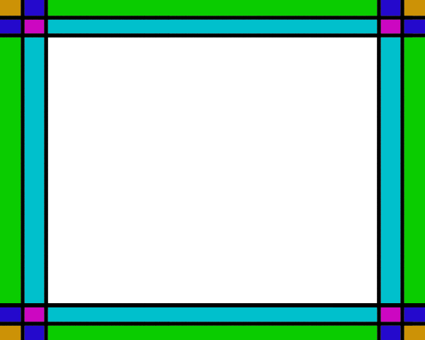

# Cocos2d-x游戏引擎

## 概述

## 内存管理机制

Cocos2d-x采用**根类** **`Ref `**，实现Cocos2d-x 类对象的**引用计数记录**。引擎中的所有类都派生自Ref。这种实现类似于`std::shared_ptr`，但是由于引擎由Objective-C发展而来，为了历史兼容性，选择通过实现不同于标准库的的内存管理方式来吸引更多Objective-C程序员。

### 引用计数

Cocos2d-x 提供引用计数管理内存。

调用 **`retain()`** 方法：令其引用计数增1，表示获取该对象的引用权。

调用 **`release()`** 方法：在引用结束的时候，令其引用计数值减1，表示释放该对象的引用权。

调用 **`autorelease()`** 方法 ：将对象放入自动释放池。

当释放池自身被释放的时候，它就会对池中的所有对象执行一次`release()`方法，实现灵活的垃圾回收。

Cocos2d-x 提供 **AutoreleasePool**，管理自动释放对象。

当释放池自身被释放的时候，它就会对池中的所有对象执行一次`release()`方法。

### 内存管理

#### 工厂方法

在Cocos2d-x中，提供了大量的工厂方法创建对象。通过工厂化方法创建以实现对象的自动释放。如 Label 的 `create()`方法实现如下：

```c++
 Label* Label::create()
 {
     auto ret = new Label();
     if (ret)
         ret->autorelease();
     return ret;
 }
```

即创建了一个Label的对象，并对该对象执行`autorelease()`。表示该对象是自动释放的。使用工厂方法创建对象时，虽然引用计数也为1，但是由于对象已经被放入了释放池，因此调用者没有对该对象的引用权，除非我们人为地调用了`retain()`来获取引用权，否则，不需要主动释放对象。

#### Node 的 addChild() / removeChild 方法

在Cocos2d-x中，所有继承自Node类，在调用 `addChild()` 方法添加子节点时，自动调用了retain。 对应的通过 `removeChild()`，移除子节点时，自动调用了`release()`。

调用`addChild()`方法添加子节点，节点对象执行`retain()`。子节点被加入到节点容器中，父节点销毁时，会销毁节点容器释放子节点。对子节点执行`release()`。如果想提前移除子节点我们可以调用`removeChild()`。

在Cocos2d-x内存管理中，大部分情况下通过调用 `addChild()`/`removeChild()` 的方式自动完成了`retain()`,`release()`调用。不需再调用`retain()`，`release()`。

## 更新调度机制

## 重要数据结构

### cocos2d::Ref类

### cocos2d::Layer类

### cocos2d::Sprite类

### cocos2d::TMXTiledMap类

### cocos2d::DrawNode类

### cocos2d::LabelBMFont类

# 战场场景

战场场景是FudanCraft游戏的核心部分，也是和用户交互的主要界面。

## 战场场景需求分析

作为一个交互性、娱乐性、竞技性较强的RTS游戏，FudanCraft的战场场景需要实现以下一些几项主要功能：

* 将战场地图和战场地图上地图单位的实时运动情况展现给用户；
* 允许用户通过鼠标移动或键盘按键移动视角，观察整个地图，并灵活切换视角，观察基地等关键位置；
* 允许用户通过鼠标的点击、拖框等操作完成选中单位、移动单位和下达攻击命令等游戏操作；
* 提供菜单，允许用户通过点击菜单创建单位；
* 显示金钱增减、单位被攻击、摧毁和最后的胜利提示等重要的游戏消息；
* 播放动感的背景音乐，给用户提供良好的视听体验


游戏场景的具体操作方法和交互模式在用户手册中有详细描述。

## 战场场景相关的数据结构

战场场景的逻辑主要在`class BattleScene`类中实现，与战场场景相关的类还有`class ControlPanel`等。

### BattleScene类

BattleScene类是战场场景的主要部分，包含战场地图、鼠标操作、金钱显示、游戏消息显示等功能部件，BattleScene类实现了这些功能部件的初始化和调度。

BattleScene直接继承自`cocos2d::Layer`，是一个完整的cocos2d图层，便于初始化、更新和场景切换。BattleScene类中重要的属性如下表所示：

| 变量名            | 类型                    | 结构   | 种类      | 初值      | 含义     |
| -------------- | --------------------- | ---- | ------- | ------- | ------ |
| player_id      | int                   | 普通变量 | private | 0       |        |
| socket_server  | SocketServer*         | 指针   | private | nullptr | 服务器套接字 |
| socket_client  | SocketClient*         | 指针   | private | nullptr | 客户端套接字 |
| battle_map     | cocos2d::TMXTiledMap* | 指针   | private | nullptr | 瓦片地图   |
| grid_map       | GridMap*              | 指针   | private | nullptr | 格点地图   |
| unit_manger    | UnitManager*          | 指针   | private | nullptr | 单位管理器  |
| control_panel_ | ControlPanel*         | 指针   | private | nullptr | 控制面板   |
| mouse_rect     | MouseRect*            | 指针   | private | nullptr | 鼠标选框   |
| money          | Money*                | 指针   | private | nullptr | 金钱     |
| notice         | Notice*               | 指针   | private | nullptr | 游戏提示   |
| msg_set        | GameMessageSet        | 类对象  | public  | 未初始化    | 游戏消息集  |

Battle类的重要方法如下：

* `static BattleScene* create(SocketClient* _socket_client, SocketServer* _socket_server);`按照cocos2d内存管理方式创建BattleScene对象，返回指向新对象的指针
* `virtual bool init(SocketClient* _socket_client, SocketServer* _socket_server);`初始化战场场景和内部的各个控件


* `void win();`通知战场场景游戏胜利结束，显示消息并禁止后续操作
* `void lose();`通知战场场景游戏以失败结束，显示消息并禁止后续操作
* `void update(float f) override;`战场场景的更新函数
* `bool onTouchBegan(cocos2d::Touch*, cocos2d::Event*)override;`触摸开始事件回调函数
* `void onTouchMoved(cocos2d::Touch*, cocos2d::Event*)override;`触摸移动事件回调函数
* `void onTouchEnded(cocos2d::Touch*, cocos2d::Event*)override;`触摸结束事件回调函数
* `void onKeyPressed(cocos2d::EventKeyboard::KeyCode, cocos2d::Event *) override;按键事件回调函数`
* `void scrollMap();`地图滚动函数
* `void focusOnBase();`将视角集中到当前用户的基地
* `void destroyReward(int destroyed_type);`获取击毁地方单位的奖励
* `void menuBackCallback(cocos2d::Ref* pSender);`

### MouseRect类

MouseRect类是用户通过触摸移动或按住拖动鼠标的操作，在地图上拖动出矩形这一功能的抽象。MouseRect需要实现在地图移动和视角变化时灵活变化形状的功能。

MouseRect继承自`cocos2d::DrawNode`，`cocos2d::DrawNode`是cocos2d引擎提供的基础绘图类，可以灵活地画出空心、实心矩形多边形等基础形状。MouseRect的主要属性有：

| 变量名         | 类型             | 结构   | 种类     | 初值   | 含义     |
| ----------- | -------------- | ---- | ------ | ---- | ------ |
| touch_start | cocos2d::Point | 类对象  | public | 未初始化 | 触摸开始点  |
| touch_end   | cocos2d::Point | 类对象  | public | 未初始化 | 触摸结束点  |
| start       | cocos2d::Point | 类对象  | public | 未初始化 | 选框开始端点 |
| end         | cocos2d::Point | 类对象  | public | 未初始化 | 选框结束端点 |

MouseRect的重要方法有：

* `void update(float f) override;`鼠标矩形的更新函数

### Money类

Money类用于存储和管理用户当前持有的金钱，并在战场场景中更新和显示金钱的数值。

Money类继承自`cocos2d::LabelBMFont`，便于金钱数值的显示和快速更新。

Money类的重要属性如下：

| 变量名     | 类型   | 结构   | 种类      | 初值                | 含义     |
| ------- | ---- | ---- | ------- | ----------------- | ------ |
| money   | int  | 普通变量 | private | 0                 | 当前金钱数值 |
| timer   | int  | 普通变量 | private | 0                 | 计时器    |
| inc_prd | int  | 普通变量 | private | 宏MONEY_INC_PERIOD | 金钱增加周期 |
| inc_amt | int  | 普通变量 | private | 宏MONEY_INC_AMOUNT | 金钱增加数量 |

Money类的重要方法如下：

* `void update(float f) override;`金钱自动更新函数，使金钱每隔一段时间增加一定数值
* `bool init() override;`金钱初始化函数，初始化金钱为某一固定数值，读取BM字体集，并进行显示
* `void updateMoneyDisplay();`更新金钱的显示
* `bool checkMoney(int cost) const;`检查金钱是否足够
* `void spendMoney(int cost);`花掉数值等于cost的金钱，即金钱数量减少cost
* `void increaseMoney(int amount);`金钱数量增加amount

### Notice类

Notice类用于显示重要的游戏提示。Notice类实现了游戏提示的更新、定时消失和固定显示。

Notice类继承自`cocos2d::LabelBMFont`，便于游戏提示的显示和快速更新。

Notice类的重要属性如下：

| 变量名      | 类型   | 结构   | 种类      | 初值   | 含义     |
| -------- | ---- | ---- | ------- | ---- | ------ |
| ntc_life | int  | 普通变量 | private | 0    | 提示显示寿命 |
| timer    | int  | 普通变量 | private | 0    | 计时器    |

Notice类的重要方法如下：

* `void update(float f) override;`游戏提示的更新函数，实现游戏提示的定时消失
* `void displayNotice(std::string ntc, int _ntc_life);`显示提示函数，显示字符串ntc对应的游戏提示，定时_ntc_life后消失
* `void displayNotice(std::string ntc);`显示提示函数的重载，显示字符串ntc对应的游戏提示，固定显示不消失
* `bool init() override;`游戏提示初始化，初始提示为"Welcome to FudanCraft!"，读取BM字体集，并进行显示

### ControlPanel类

ControlPanel类用以实现单位的生产按键，并做简单的金钱检测。

ControlPanel类继承自`cocos2d::Menu`，实现按钮功能，并方便扩充更多单位的制作。

ControlPanel的重要属性如下：

| 变量名     | 类型                      | 结构   | 种类      | 初值      | 含义     |
| ------- | ----------------------- | ---- | ------- | ------- | ------ |
| fighter | cocos2d::MenuItemImage* | 指针   | private | nullptr | 飞机生产按钮 |
| tank    | cocos2d::MenuItemImage* | 指针   | private | nullptr | 坦克生产按钮 |
| soldier | cocos2d::MenuItemImage* | 指针   | private | nullptr | 士兵生产按钮 |

ControlPanel的重要方法如下：

*   `bool init() override;`初始化按键
*   `void setFighterCallback(std::function<void(Ref*)>);`设置战斗机按键回调函数
*   `void setTankCallback(std::function<void(Ref*)>);`设置坦克按键回调函数
*   `void setSoldierCallback(std::function<void(Ref*)>);`设置士兵按键回调函数


## 战场场景相关的重要算法

### 网络模块与战场场景的初始化

### 视角移动与地图滚动的实现

视角移动非常重要，在RTS游戏中，许多精彩的操作都需要使用快速的视角移动与地图滚动来实现。

在本游戏中，实现了通过摁键盘的WSAD以及鼠标移动至屏幕边缘来移动视角，同时增加了摁空格键将主基地移动至屏幕中央的功能，方便组织防守。

#### 移动的实现

视角的移动是通过改变地图在屏幕上的坐标来实现，通过改变相对坐标来实现地图的滚动。

#### 鼠标滚动的实现

在鼠标滚动的实现中，通过`cocos2d::EventListenerMouse::onMouseMove`来获取鼠标的坐标，并将其存入`crusor_position`中。同时在`void BattleScene::update(float f)`函数中调用`void BattleScene::scrollMap()`进行屏幕的滚动。而在鼠标位置侦测中，采用了2倍速方式，即鼠标离边缘越近速度越快，同时支持八个方向的滚动。



如图，通过判断鼠标坐标和不同边的距离将屏幕划分成了25个区域。当鼠标在白色区域里时，屏幕不滚动；当鼠标在粉色和青色范围内，分别实现向相应方向的一倍速滚屏；当鼠标在绿色和橙色范围内时，实现向相应方向的二倍速移动；而在蓝色区域内时，实现相应的向一个方向一倍速移动而向另一个方向二倍速移动。

#### 空格跳转至基地的实现

空格的侦测通过`cocos2d::EventListenerKeyboard::onKeyPressed`来获取，当感知到空格键的按下后，将调用`void BattleScene::focusOnBase()`函数来将基地设为当前焦点。从而实现摁下空格跳转至基地。

### 鼠标选框的实现

鼠标选框是RTS游戏中常见的交互方式，是指用户按压鼠标或触摸板并移动时，在屏幕上拖出一个矩形框，对框中的单位进行选中操作。需要注意的是，鼠标选框应该依附在地图上，随着地图移动；当视角变化、地图滚动时，鼠标选框应随之变形，进而覆盖更大的范围。

鼠标选框的功能主要在MouseRect类中实现，接收BattleScene类传递的鼠标（触摸）消息，依附在TMXTiledMap类的对象battle_map战场地图上显示。

具体的顺序图如下所示：

```mermaid
sequenceDiagram
	User->>+BattleScene: Start Game
    BattleScene->>+MouseRect: Initialize  
    MouseRect-->>-BattleScene: Pointer to new object
    BattleScene->>TiledMap: Add child
    User->>BattleScene: Touch start
    BattleScene->>+MouseRect: Set touch start point
    User->>BattleScene: Touch move
    BattleScene->>MouseRect: Set touch end point
    MouseRect->>+TiledMap: Check battle map position
    TiledMap-->>-MouseRect: Return battle map position
    MouseRect->>MouseRect: Update
    User->>BattleScene: Touch end
    BattleScene->>MouseRect: Query select rect
    MouseRect->>BattleScene: Return select rect
    User->>-BattleScene: Quit Game
    
```

当鼠标按压移动时，BattleScene会将MouseRect添加到自动更新update队列中。cocos2d引擎的场景导演会定时调用`MouseRect::update()`更新函数，在更新函数中MouseRect会查询战场地图的位置，实现鼠标选框的变形显示，具体关系如下图所示：


当视角移动、地图滚动时，鼠标选框的端点应该是当前鼠标拖动向量和地图滚动向量的差，在update()函数中定时进行运算，就可以实现鼠标选框的连续变化。

# 地图

地图是RTS游戏的关键部分，单位的创建、移动都与地图密切相关。在FudanCraft中，实际上有两层地图：一层是用于显示的瓦片地图，直接采用了`coocos2d::TMXTiledMap`；另一层是用于运算的逻辑（格点）地图，主要由`class GridMap`类实现。两层地图结合，实现了单位运动的实时显示、碰撞检测、寻路查找等功能。

## 地图需求分析

作为一个复杂性较强的RTS游戏，FudanCraft的地图需要满足以下几项用户需求：

* 提供较大的地图，使得3到4个用户同时进行游戏时都有自由的游戏空间，可以进行大型、激烈的战斗
* 提供复杂的地形，模拟真实的战场情况，使得单位在地图上运动的方式更加复杂多变，提高游戏的挑战性和娱乐性
* 地图上要提供初始的基地、单位等信息，用于场景和单位的初始化，使得游戏初期就能进行激烈的交锋

## 地图的设计思路

由于FudanCraft游戏的地图较大，在显示层我们采用了cocos2d引擎提供的瓦片地图类`cocos2d::TMXTiledMap`。瓦片地图是将整个地图划分为若干个小块，采用小纹理图片连续贴图，这样可以大大提高显示的性能。

在逻辑层，我们设计了与瓦片地图对应的格点地图GridMap，将地图划分为128x128个大小相等的正方形，每个正方形对应瓦片地图中的一个瓦片。每个单位在移动时可以连续地平滑移动，但都会静止在一个格点的中央附近。每个格点同时只能被一个单位占据，这样就避免了单位的重叠。单位的移动、攻击、搜索敌人等操作也都是通过格点地图进行的。格点地图的实现主要在GridMap类中，将在地图的相关算法一节中详细叙述。瓦片地图与格点地图的关系如下图所示：


瓦片地图用于显示，提供了各种瓦片的信息，地形能否通过的信息以及初始化单位的信息；格点地图用于运算，储存了格点是否被占据的信息以及占据单位ID的信息。

## 地图相关的数据结构

### GridPoint类

GridPoint类是一个简单结构，用来表示格点坐标，提供加、减、相等等运算符重载，类似于`cocos2d::Point`，但Point的坐标是浮点数，而GridPoint的格点坐标用整数表示。GridPoint类的属性如下：

| 变量名  | 类型   | 结构   | 种类     | 初值   | 含义       |
| ---- | ---- | ---- | ------ | ---- | -------- |
| x    | int  | 普通变量 | public | 0    | 格点的整数横坐标 |
| y    | int  | 普通变量 | public | 0    | 格点的整数纵坐标 |

重要的方法如下：

* `bool operator==(const GridPoint& gp2) const;`相等运算符重载
* `friend GridPoint operator+(const GridPoint& gp1, const GridPoint& gp2);加运算符重载`
* `friend GridPoint operator-(const GridPoint& gp1, const GridPoint& gp2);`减运算符重载
* `GridPoint getDirectionVector();`获得方向向量

### GridPath类型

GridPath类型表示一系列格点坐标构成的格点路径，用于单位的寻路移动。实际上是`std::vector<GridPoint>`的一个重定义，即`typedef std::vector<GridPoint>  GridPath;`。

### GridSize类

GridSize类用于表示一个格点矩形的大小，类似于`cocos2d::Size`，但Size的长宽是浮点数，而GridSize的长宽用整数表示。GridSize类的属性如下：

| 变量名    | 类型   | 结构   | 种类     | 初值   | 含义      |
| ------ | ---- | ---- | ------ | ---- | ------- |
| width  | int  | 普通变量 | public | 0    | 格点矩形的宽度 |
| height | int  | 普通变量 | public | 0    | 格点矩形的高度 |

重要方法如下：

* `friend GridSize operator/(const GridSize& gz, int s);`除运算符重载，将长宽都整除系数s

### GridRect类

GridRect类用于表示一个格点矩形，类似于`cocos2d::Rect`，但GridRect的端点和大小是用GridPoint 和GridSize表示的。GridRect类的属性如下：

| 变量名  | 类型        | 结构   | 种类     | 初值              |
| ---- | --------- | ---- | ------ | --------------- |
| gp   | GridPoint | 类对象  | public | GridPoint(0, 0) |
| size | GridSize  | 类对象  | public | GridSize(0, 0)  |

重要方法如下：

* `GridRect(GridPoint _gp = GridPoint(), GridSize _size = GridSize()) : gp(_gp), size(_size) {}`构造函数，由左下角的端点和矩形大小构造一个矩形

### GridMap类

GridMap类是格点地图，用于寻路、格点占据判断、临近单位搜索、临近空位搜索等逻辑运算。GridMap类的属性如下：

| 变量名         | 类型                              | 结构   | 种类      | 初值   | 含义                |
| ----------- | ------------------------------- | ---- | ------- | ---- | ----------------- |
| gmap        | std::vector\<std::vector\<int>> | 类对象  | private | 未初始化 | 格点层，记录格点是否被占据     |
| umap        | std::vector\<std::vector\<int>> | 类对象  | private | 未初始化 | 单位ID层，记录占据格点的单位ID |
| map_width   | int                             | 普通变量 | private | 未初始化 | 地图宽度（格点数）         |
| map_height  | int                             | 普通变量 | private | 未初始化 | 地图高度（格点数）         |
| grid_width  | int                             | 普通变量 | private | 未初始化 | 格点宽度（像素）          |
| grid_height | int                             | 普通变量 | private | 未初始化 | 格点高度（像素）          |
| offset_vec  | cocos2d::Vec2                   | 类对象  | private | 未初始化 | 偏移向量              |

重要方法如下：


