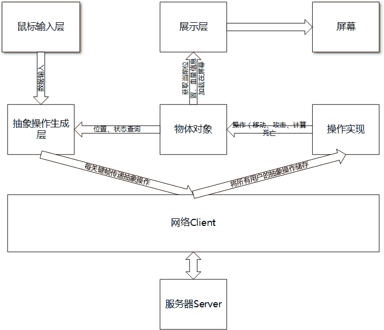
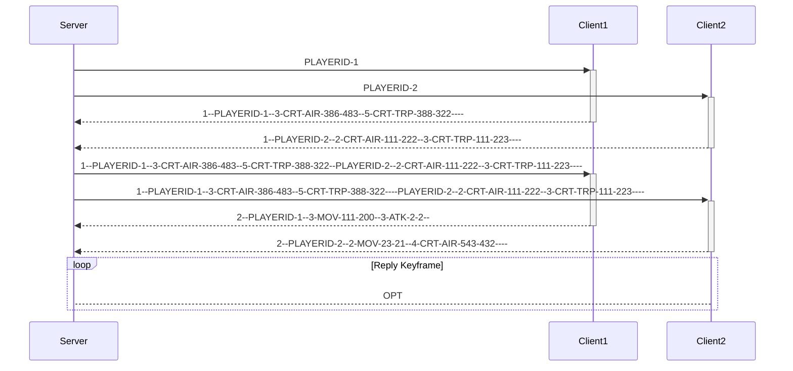
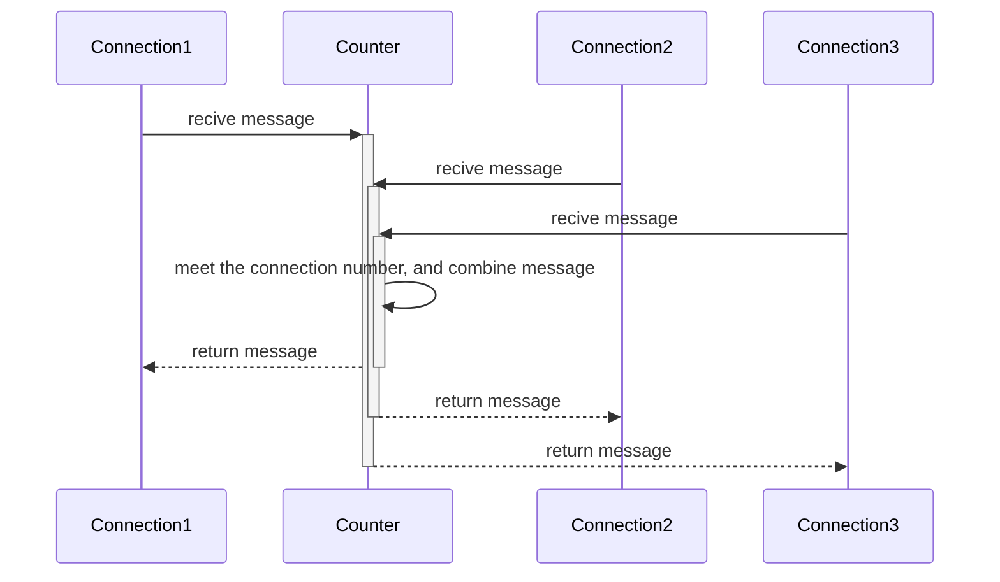

# 网络通讯策略

## 帧同步

### 策略

传统的RTS游戏许多都使用帧同步来作为游戏的同步方式，如红色警戒系列、魔兽争霸系列等。

本游戏的网络通讯使用帧同步策略，帧同步的大致方式可以这样解释：

在客户端来说，操作和执行模块是分开的，而操作指令并不会直接传给执行模块，而是首先由网络客户端传给服务端，服务端将全部指令汇总到一起后，再传回网络客户端，网络客户端再将指令传给执行模块。

通过这种策略可以保证所有客户端画面的绝对一致。而信息并不是时刻都在传递，而是每五帧（一个关键帧）传递一次。也就是说在每个关键帧时刻，游戏都在按照五帧前的命令在执行，而这五帧的命令将传到服务器，五帧后再执行。这样会导致有一个关键帧的延时，但是在帧率60的情况下，五帧的延时并不会对人造成能感知的延迟。

实现可参考下图



### 不足

帧同步有一个最大的问题就是如果有一个客户端卡顿，则全部游戏者都会卡顿，因为服务器要等到收到该帧全部数据后才会向每个客户端发送消息，所以游戏延时会以最长延时为准。

此外，由于传统的帧同步传递的是操作消息而不是状态消息，这样会导致长时间游戏时单位出现偏差。但是在这个游戏中我们进行了一定的改进，传递的是处理过的操作信息，如某单位移动到某某格点，将连续的坐标分为离散的格点，从而避免了直接传递相对坐标造成的累计误差。

此外，帧同步需要有一个游戏作为服务端，其他全部游戏都和服务端通讯，这样会对服务端带来较大的压力，而且一旦服务端掉线则全部游戏都将无法运行。而对于消息来说，我们采用了Google Protocol Buffer来作为序列化工具，大大的减少了消息传递长度。从而保证了星型结构对网络不会带来太大压力。

## 服务器端消息处理策略




如图所示，服务器端采用简单的等待接收消息，等到接收全部消息内容后，再将消息组合、发回所有客户端。之后进入循环中。


### 读策略流程图

```flow
st=>start: start
op1=>operation: handle connection
op2=>operation: read header
op3=>operation: read body
io=>inputoutput: wait for read process

st->op1->op2->op3->io->op1
```

## Google Protocol Buffer

### 简介

Google Protocol Buffer简称Protobuf，是Google公司出品的跨平台跨语言的序列化方式，用于将舒徐序列化和解序列化。相比于json或者XML可大大减小消息长度和解析时间。更多内容可以参考Google官方网站。

在此次游戏中，我们将游戏消息的数据结构序列化成`std::string`之后通过socket进行传送与接收。

### 应用

在本游戏中，我们通过Protobuf来进行游戏消息的传递，其中实现`GameMessage.pb.h`和`GameMessage.pb.cc`两个文件中。这两个文件由Protobuf工具直接生成，在项目中通过添加包含库可以直接使用。

在游戏中我们对游戏消息进行了包装，分别为GameMessageSet.GameMessage以及内部成员，其中GameMessageSet为GameMessage的集合，而GameMessage里则包含游戏每次操作的数据，分别如下：

```
 CmdCode cmd_code;
 int32 unit_0;
 int32 unit_1;
 int32 damage;
 GridPath grid_path;
 int32 camp;
 int32 unit_type;
```

cmd_code为操作命令的一个枚举量，unit为命令施加方和接收方（可为空），damage为伤害（可为空），grid_path为移动时的路径集合（可为空），camp为单位阵营，unit_type为单位种类。

## Boost::Asio

### 选择原因

游戏中需要通过Socket来进行通讯，而cocos2d中只有http库，并不能满足多种多样的网络通讯需求，于是我决定自己通过Socket编程来实现所需功能。而标准c++中并没有socket库，查资料可得，网络上大家多数推荐的c++socket库有以下几个：qtsocket、boost::asio等。经多方面权衡，最终选择了boost::asio作为socket编程模块。

### Asio简介

Boost::Asio是boost库中的跨平台socket模块，其可以脱离boost独立运行，同时支持同步、异步等socket通讯方式，采用c++11标准编写。更多信息请参见boost官方网站。

### 实现

通过asio库我实现了游戏中的server和client部分，其中server负责消息的收取、组合、转发，而client负责消息的收发。在游戏开始时有一台主机可以选择成为服务端，其他游戏以客户端身份加入然后进行游戏。具体流程图已在帧同步部分阐明。

### 包含文件

除了GameMessage相关的文件外，有：
`socket_message.h`, `SocketClient.h`,`SocketClient.cpp`,`SocketServer.h`,`SocketServer.cpp`
其中第一个文件是socket传输中一个简单的带header的协议文件，其余四个是socket通讯直接需要用到的。

在`SocketClient.h`中定义了客户端所需要的函数，其目的主要是与服务器进行通讯，基于Boost库中的Asio实现，利用异步收发、将字符串传入与传出。

在`SocketServer.h`中定义了服务端所需函数，同样是基于Asio库实现，通过异步与多个客户端进行连接，将每个客户端发出的信息组合后返回全部客户端。

#### SocketClient 接口

*注：未列出接口未网络传输内部实现所需，与应用无关*

*   `static SocketClient* create(std::string ip="127.0.0.1",int port = 8008)`: 构造函数，返回一个指向client的指针。
*   `int total()const` : 获取总玩家数量
*   `int camp()const`: 获取阵营参数
*   `void send_string(std::string s)`: 发送游戏数据
*   `std::string get_string()` :用于接收返回信息，使用此函数时应阻塞其他进程，使得如果由网络原因造成的延时现象时，游戏逻辑应为其等待
*   `void close()`:关闭当前client，在析构前调用
*   `bool started() const`:返回游戏是否开始
*   `bool error()const`:返回连接状况
*   `int camp() const`:返回当前阵营
*   `int total() const`:返回全部游戏玩家数

#### SocketServer 接口

*注：未列出接口未网络传输内部实现所需，与应用无关*

*   `static SocketServer* create(int port=8008)`: 构造函数，返回一个指向server的指针
*   `void button_start()`: 用于client连接后开始游戏。即向全部client发送开始信息
*   `void close()`:关闭server，在析构前调用
*   `std::vector<TcpConnection::pointer> get_connection() const`:获取当前全部连接（供测试用）
*   `bool error()const`:返回当前server连接状况
*   `int connection_num()`:返回连接总数

#### socket_message接口及实现

为了实现在网络传输中发送任意长度的socket信息，采用了一个简单的协议来完成。即在要发送的信息前加入一个四个字节长度的消息头来标识消息的总长度。

*   `const char* data() const`: 获取全部消息
*   `char* data()`: 获取可改变的消息
*   `size_t length() const`:获取消息长度
*   `const char* body() const`:获取消息内容
*   `char* body()`:获取可改变的消息内容
*   `size_t body_length() const`:获取内容长度
*   `void body_length(size_t new_length)`:设置内容长度
*   `bool decode_header()`:解码头，从而获取内容长度
*   `void encode_header()`:编码头（将内容长度写在消息头）

内部实现较简单，从而可以实现变长消息的收发

#### SocketClient实现

SocketClient实现主要完成了两方面：阻塞同步发送与异步接收。

##### 发送

在发送时需要保证信息的到达，故采用了Asio中的`std::size_t write(SyncWriteStream& s, const ConstBufferSequence& buffers)`函数。此函数是包装后的socket发送，可以保证发送的最终能成功到达接收端，同时阻塞发送，使得在大数据的情况下不会有发送延时问题导致的错误接收顺序。

##### 接收

接收使用了异步接收，调用了Asio库中的`async_read`函数，从而做到异步接收。

```c++
template<
    typename AsyncReadStream,
    typename MutableBufferSequence,
    typename ReadHandler>
void async_read(
    AsyncReadStream & s,
    const MutableBufferSequence & buffers,
    ReadHandler handler);
```

在异步接收时，将一次异步接收分为两次实现，首先接收前4个字节，读出整个消息长度，然后再读整个消息的内容，从而实现变长消息的接收。而在一个完整消息读取完毕后，将所读消息存入消息队列中，供外部读取所用。

在完成读取和接收消息的同步时，采用了周老师所介绍的条件变量方式，总而避免了多线程之间错误的锁定导致的死锁。

#### SocketServer的实现

SocketServer主要实现了一下方面，异步的建立连接、连接管理、分连接的收发。

而其中又有一个TcpConnection的类负责每个连接的管理，每个连接都由一个TcpConnection类来进行管理，从而实现对每个连接的收发，以及实现连接连接失败后将自身从SocketServer类中的connection_容器中除去。

##### SocketServer的功能

通过异步建立连接后，将每个连接存入一个vector中进行管理，在调用`button_start()`之后，进入消息循环，在循环中首先分别读取全部连接收到的消息，然后再将消息通过` GameMessageWrap::combine_message(const std::vector<std::string>& msg)`对消息进行合并，再分别调用连接中的发送接口将合并后的小写发送给每个连接。

##### TcpConnection的功能

TcpConnection实现的功能和[SocketClient](#SocketClient 实现)实现的功能类似，同样是利用队列进行的异步读取与同步发送。

#### SocketServer的使用

SocketServer在内部使用多线程进行消息的循环，在调用`button_start()`后即可进入自动消息接收合并转发，无需外界干预。

### 使用方式

当游戏作为客户端时，只需要初始化SocketClient即可，而当游戏作为主机端时，需要首先初始化SocketServer，再初始化SocketClient。这样保证全部游戏的数据都面向SocketClient，而SocketServer只处于一种托管状态。